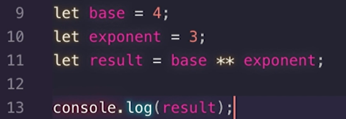
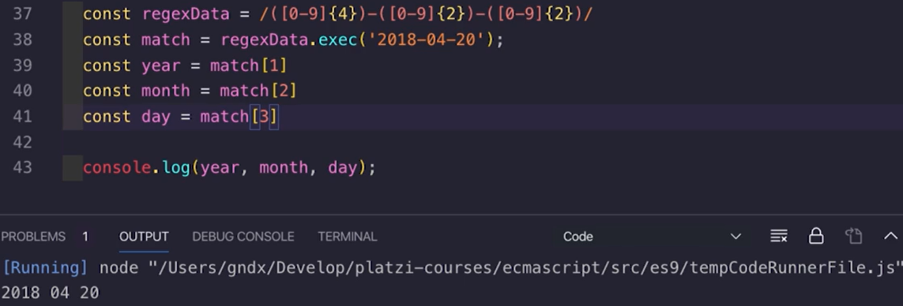

# ES6

- La diferencia es el alcance de las variables. **let** permite declarar variables limitando su alcance al bloque, declaración, o expresión donde se está usando y **var** define una variable global o local en una función sin importar el ámbito del bloque.

- le asigna el nombre de la variable como llave.

- **Resolve:** Resulta
- **Reject** es rechazada

- Clases
  
  

  

- Módulos

  
  
- Generadores
  
  

  

# ES7

- Include: sirve para saber si hay un elemento dentro de una estructura

  

- Operaciones en forma exponencial

  

# ES8

- Object.entries()

  

  

  

- Object.values()
  
  

  
 
  

- arr.padStart()

  

- Asyn Await

  

  

# ES9

- Operador de reposo

  

  

- Fusionar objetos
  
  

  

- Promise.finally : saber cuando se ha terminado el llamado y ejecutar algo

  

# ES10

- Flat: Se le ingresa la profundidad a la que se quiere aplanar una matriz de diferentes niveles.
  
  

  

- FlatMap: Aplica una operación a los datos y los aplana.
  
  

- TrimStart: Elimina espacios iniciales en cadena de texto

  

- TrimEnd: Elimina espacios finales en cadena de texto
  
  

- Actualización del **Try-catch**: El catch ya no requiere el parámetro errror como parámetro, se puede trabajar con la palabra reservada `error`.
- FromEntries: pasar de un array a un objeto
  
  

- Acceder a las descripciones de un símbolo.
  
  

## ES.next

- **TC39:** El comité técnico que agrega características a las nuevas versiones de ES
- Proceso para agregar una nueva característica:
  
  

  - idea: se identifica un problema, si lo resuelve pasa a propuesta
  - propuesta
  - borrador: se especifica cómo se preva, funciona y resuelve el problema.
  - Candidato: es probado y valorado por el comité.
  - Listo para ser incorporado.