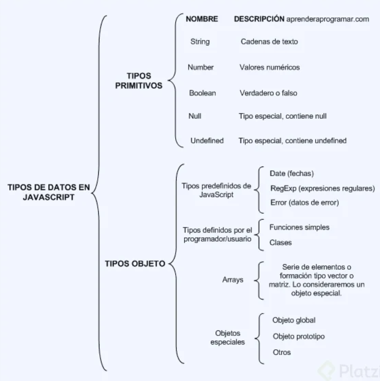
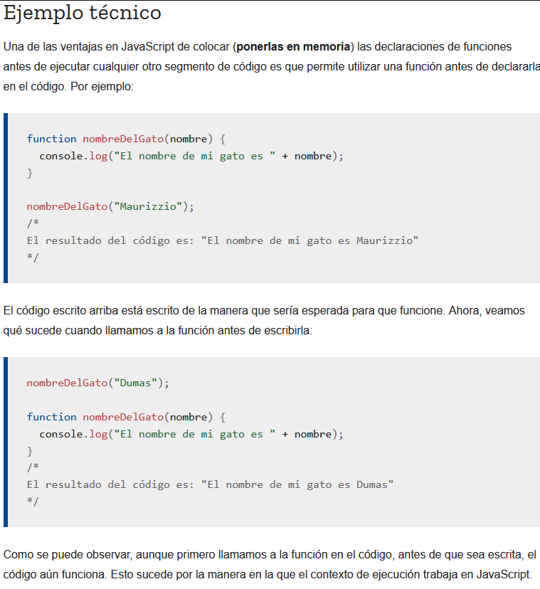
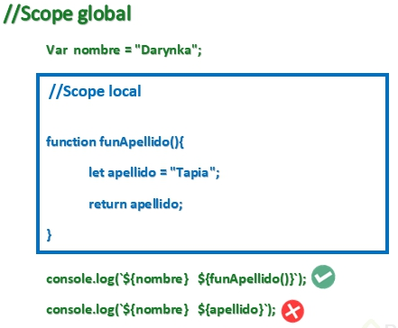
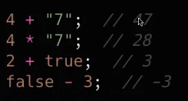
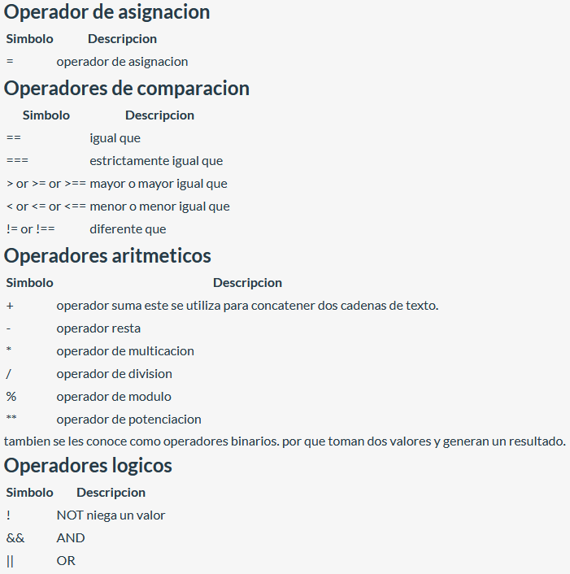
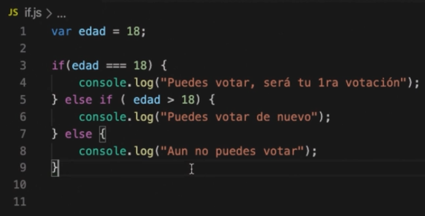
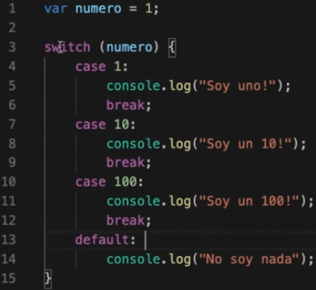

# Curso básico de JavaScript

- [Link del curso](https://platzi.com/clases/basico-javascript/)
- **Dictado por:** Diego De Granda

## Introducción

### ¿Qué es JavaScript?

- ¿Cómo nace Javascript?

  Nace con la necesidad de generar dinamismo en las páginas web y que a su vez los usuarios y las empresas pudieran interactuar unos con otros.
- ¿Qué es Javascript?

  Es un lenguaje interpretado, orientado a objetos, débilmente tipado y dinámico.

- Débilmente tipado

  Se pueden hacer operaciones entre tipos distintos de datos (enteros con strings, booleanos con enteros, etc). Ejemplo:

  ```
  4 + "7"; // 47
  4 * "7"; // 28
  2 + true; // 3
  false - 3; // -3
  ```

- Dinámico

  Corre directamente en la etapa de Runetime sin una etapa de compilación previa. Esto permite probar nuestro código inmediatamente; pero también es lo que hace que los errores se muestren hasta que se ejecuta el programa.

- ¿Realmente es Javascript un lenguaje interpretado?

  Si, y la razón es que le navegador lee linea por linea nuestro código el cuál le indica lo que tiene que hacer, sin la necesidad de compilar. Todo esto es controlado por el motor de Javascript V8 del navegador.

- Javascript es Basckwards Compatible

  Todas las funciones nuevas que salen de Javascript no dañarán el trabajo ya hecho, pero no se podrá utilizar en nuestro entorno de trabajo inmediatamente. Para solucionar esto está Babel que permite utilizar las nuevas características del lenguaje pero lo transforma a una versión que el navegador pueda entender.

### ¿Por qué JavaScript?

- JavaScript tiene una comunidad enorme de desarrolladores que te pueden ir ayudando a generar diferentes cosas.
- Si solo estuvieras interesado en trabajar aplicaciones web tienes muchos frameworks y librerías construidas en JavaScript que te van a ayudar a hacer proyectos de forma mucho mas rápida, eficiente y robusta (Angular, View, React,entre otros)
- Si no quieres trabajar solo en aplicaciones Web puedes utilizar JavaScript con un framework que se llama React Native para poder construir aplicaciones nativas como Android y IOS.
- Puedes construir aplicaciones de escritorio con JavaScript, usando un framework llamado Electron, pueden correr en Mac o Windows.
- También puedes trabajar en la parte del Back-end o IOT (Internet Od Things) es un concepto que se refiere a una interconexion digital de objetos cotidianos con Internet. Esto con un Framework llamado NodeJS, el cual es un entorno de ejecución de JavaScript que corre directamente en el Back-end.

### Elementos de un Lenguaje de Programación: Variables, Funciones y Sintaxis

- **Valores Primitivos:** son los valores básicos que se utilizan para poder generar códigos.
  - **Número:** data sólo de tipo numérico, ejem: 1 2 3 4, etc.
  - **Strig:** texto, se utiliza entre comillas dobles. “Haciendo esto”, “Diego Hernández”.
  - **Boolean o Booleano:** son valores creados por George Boolean dentro de lenguajes de programación para poder validar cosas y/o desiciones, por ello se utilizan: true (1) o false (0).
  - **Empty values:** null o undefined, se les conoce como valores “placeholders”, pero son valores reservados para un tipo de valor que queda faltante en memoria. También pueden ser tomados como valores de errores.

- No primitivos o valores tipo objetos
  - **Array:** se genera ocupando corchetes, los cuales dentro ocupan valores primitivos, ejem: `[1,2,3]` convirtiéndolos en valores tipo objeto.
  - **Valor tipo Objeto:** se generan con corchetes, los cuales dentro ocupan una data que se transforma en objeto, ejem de sintaxis: `{ nombre: “Diego”}`



### Variables

Dentro de JavaScript tenemos tres formas de declarar una variable las cuales son: var, const y let.

- **Var:** Era la forma en que se declaraban las variables hasta ECMAScript 5. Casi ya no se usa porque es de forma global y tiene las siguientes características:
  - **Se puede reinicializar:** osea todas las variables se inicializan, por ejemplo:  `var pokemonType = ‘electric’` entonces reinicializar es: `var pokemonType = ‘grass’` osea la misma variable con diferentes datos el último dato predomina.
  - **Se puede reasignar:** osea la variable ya inicializada le reasignamos otro valor por ejemplo: inicializamos la variable: `var pokemonType = ‘electric’` ahora la reasignamos `pokemonType = ‘grass’`
  - **Su alcance es función global:** osea inicializamos la variable, pero la podemos llamar desde cualquier bloque (una llave abierta y una cerrada {}) pero hay que tener mucho cuidado con ello ya que puede haber peligro, no es recomendable usar VAR. const y let es la forma en que se declaran las variables a partir de ECMAScript 6.
- **const:** sirve para declarar variables que nunca van a ser modificadas:
  - No se puede reinicilizar
  - No se pude re asignar
  - No es inmutable
- **Let:** Son variables que pueden ser modificadas, se pueden cambiar
  - No se puede reinicilizar
  - Se puede reasignar
  - Su contexto de es bloque: Solo funciona dentro de un bloque {}, fuera de ello no.

### Funciones

Son un conjunto de sentencias que nosotros podemos utilizar para generar ciertas acciones con los valores que ya guardamos antes en las variables.

Tenemos dos tipos de funciones:
- **Declarativas:** va a inicializar un valor y lo guardamos en memoria.

  ```
  function myFunction() {
  return “Mi nombre es Christian”;
  }
  ```
- **Expresión (también conocidas como funciones anónimas):** vamos a crear una variable donde guardamos la función en memoria.

  ```
  var myFunction = function () {
  return “Mi nombre es Christian”;
  }
  ```

A las funciones declarativas se les aplica **hoisting**, y a la expresión de función, no. Ya que el hoisting solo se aplica en las palabras reservadas var y function.

Lo que quiere decir que con las funciones declarativas, podemos mandar llamar la función antes de que ésta sea declarada, y con la expresión de función, no, tendríamos que declararla primero, y después mandarla llamar.



Existe un tipo de declaración en los parámetros de una función en el cual no se necesitan especificar el número de parámetros que se van a recibir, eso se hace de la siguiente manera:

```
const imprimeArgumentos = function(...args) {
    return args;
};
```
## Bases de JavaScript
### Scope

Alcance que tienen las variables en el codigo. Existen 2 tipos de scopes:

- **Global:** Puede ser llamada a lo largo de nuestro programa. Este no puede acceder a variables declaradas en scope local
- **Local:** Solo puede ser llamada dentro del bloque de codigo en el que se declaro. Puede llamar variables declaradas en el scope global



## Hoisting

En JavaScript, las declaraciones (por ejemplo, de variables o funciones) se mueven al principio de su scope o ámbito. Este comportamiento se conoce como hoisting y es muy importante tenerlo en cuenta a la hora de programar para prevenir posibles errores.

- Las funciones siempre se mueven arriba del scope. Por lo tanto, podemos elegir donde declararlas y usarlas.
- La declaración de las variables se mueven arriba del scope, pero no la asignación. Antes de usar una variable, habrá que crearla y asignarla.


### Coerción

Coerción es la forma en la que podemos cambiar un tipo de valor a otro, existen dos tipos de coerción:
- **Coerción implícita:** es cuando el lenguaje nos ayuda a cambiar el tipo de valor.

  

- **Coerción explicita:** es cuando obligamos a que cambie el tipo de valor.

  ```
  var a = 20;
  var c = String(a); //Aquí obligamos a la variable a convertirse en string (coerción explícita)
  ```

### Valores: Truthy y Falsy

Usamos la función de JS que es Boolean() dentro del paréntesis ponemos el valor y nos dice si el mismo el False o True.

- **Falsy**

  - Boolean() —> sin ningun valor es false
  - Boolean(0) —> false
  - Boolean(null) —> false
  - Boolean(NaN) —> false // NaN es Not and Number
  - Boolean(Undefined) —> false
  - Boolean(false) —> false
  - Boolean("") —> false

- **Truthy**

  - Boolean(1) —> true //cualquier numero que no sea igual a cero es true
  - Boolean(“a”) —> true
  - Boolean(" ") —> true // siendo un espacio el valor es true
  - Boolean([]) —> true // un array nos da un true
  - Boolean({}) —> true // un objeto nos da el valor de true
  - Boolean(function() {}) —> true //una funcion tambien es true
  - Boolean(true) —> true

Todo esto lo vamos a usar en condiciones esto valida si es verdadero o falso para ejecutar cierta acción.

### Operadores: Asignación, Comparación y Aritméticos



- [Operadores JS](https://developer.mozilla.org/en-US/docs/Web/JavaScript/Guide/Expressions_and_Operators)

## Condicionales

### Condicionales: If, Else, else if



### Switch



## Arrays

Un Array es un tipo de estructura de datos, objeto. Puede guardar datos distintos dentro, guarda los datos en forma de lista.
- **.lenght** devuelve la longitud del array.
- **.push(<value>)** agrega elementos al final de array.
- **.pop()** elimina el último elemento del array.
- **.unshift()** agrega un elemento al array, pero lo agrega en primer lugar.
- **.shift()** elimina el elemento que está en el inicio del array.
- **.indexOf(<value>)** devuelve la posición de un elemento del array.

## Loops

### Loops: For y For...of

Hay que tener clara la utilidad de cada tipo de for, ya que he visto algunos comentarios que pueden generar confusión.

- forEach… es un método de los arrays y requiere que se le pase como parámetro una función (estudiantes.forEach(miFuncion)).

- for of… no trabaja con índices sino con los valores que están ubicados en cada posición del array, por eso trae directamente el nombre sin tener que usar la notación de [índice].

- for in… sí trabaja con índices, simplemente repetirá el ciclo por cada elemento que haya en el array, pero habrá que usar la notación de [índice].

```
var frutas = ["Manzana", "Pera", "Naranja", "Platano", "Uva"];

for (i = 0; i < frutas.length; i++) {
    console.log(`Indice ${i}: ${frutas[i]}`);
}

for (e of frutas) {
    console.log(`Elemento ${e}`);
}
```

### While

```
var estudiantes = ["Maria", "Sergio", "Rosa", "Daniel"];

function saludarEstudiante(estudiante) {
    console.log(`Hola ${estudiante}`);
}

var i = 0;

//do-while
do {
    saludarEstudiante(estudiantes[i]);
    i++;
} while (i < estudiantes.length)

//while
while (estudiantes.length > 0) {
    var estudiante = estudiantes.shift();
    saludarEstudiante(estudiante);
}
```

## Objects

Un objeto en programación es una representación abstracta de un objeto en la vida real, sin embargo también puede entenderse como un contenedor de datos.

```
var miAuto = {
  marca: "Toyota",
  modelo: "Corolla",
  año: 2020
}
```

Acceder a una propiedad del objeto:

```
miAuto.marca
// "Toyota"
```

Se pueden agregar propiedades que van a ser una función, se les llama métodos de objetos

```
var miAuto = {
  marca: "Toyota",
  modelo: "Corolla",
  año: 2020, 
  detallesDelAuto: function () {
    console.log(`Auto ${this.modelo} ${this.año}`);
}

// miAuto.detallesDelAuto();
//Auto Corolla 2020
```

¿Quién es this?
Es una variable que hace referencia al objeto. En este caso: this = miAuto.

### Función constructora

```
var brands = ['Toyota', 'Mazda', 'Renault']
var cars = []

function Car(brand, model, year) {
    this.brand = brand
    this.model = model
    this.year = year
}

for (var i = 0; i < 30; i++)
    cars.push(new Car(brands[Math.floor(i/10)], `Serie ${i % 10}`, 1999 + i % 10))

console.log(cars)
```

## Métodos de Arrays

### Métodos de recorridos de Arrays

- **.filter:** nos permite filtrar solo los elementos que deseamos (según ciertos criterios) y devolverlos en un nuevo array.
- **.map:** crea un nuevo array con los resultados de la llamada a la función indicada aplicados a cada uno de sus elementos.

```
var articulos = [
	{ nombre: '📱', precio: 1000 },
	{ nombre: '💻', precio: 1500 },
	{ nombre: '🖥', precio: 2000 },
	{ nombre: '⌨️', precio: 100 },
	{ nombre: '🖱', precio: 70 },
	{ nombre: '🚗', precio: 30000 },
];

// Método Filter
var articulosFiltrados = articulos.filter(function(articulo) {
	return articulo.precio <= 500;
});

// Método Map
var nombreArticulos = articulos.map(function(articulo) {
	return articulo.nombre;
});

articulosFiltrados;
// (2) [{…}, {…}]
//   0: {nombre: "⌨️", precio: 100}
//   1: {nombre: "🖱", precio: 70}

nombreArticulos; // (5) ["📱", "💻", "🖥", "⌨️", "🚗"]
```

### Recorriendo Arrays con .find(), .forEach() y .some()

- **find():** devuelve el valor del primer elemento del array que cumple la función de prueba proporcionada.

  ```
  const array1 = [5, 12, 8, 130, 44];

  const found = array1.find(element => element > 10);

  console.log(found);
  // expected output: 12
  ```
- **forEach():** ejecuta la función indicada una vez por cada elemento del array.

  ```
  const array1 = ['a', 'b', 'c'];

  array1.forEach(element => console.log(element));

  // expected output: "a"
  // expected output: "b"
  // expected output: "c"
  ```
- **some():** comprueba si al menos un elemento del array cumple con la condición implementada por la función proporcionada.

  ```
  const array = [1, 2, 3, 4, 5];

  // checks whether an element is even
  const even = (element) => element % 2 === 0;

  console.log(array.some(even));
  // expected output: true
  ```