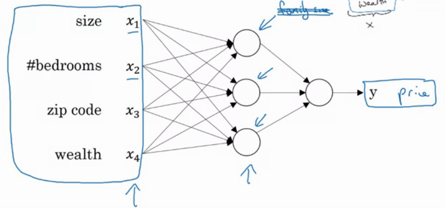

# Qué es una red neuronal?

Aprendizaje profundo -> entrenamiento de redes neuronales

- La neurona recibe la entrada y computa la función lineal
- Función RELU: Unidades Lineales rectificadas

- Recibe 4 entradas
- Solo es encesario tener los datos de entrada y salida por el número de ejemplos de entrenamiento, los parámetros intermedios serán calculado por la red
- los nodos intermedios son unidades ocultas

# Aprendizaje Supervisado con Redes Neuronales
