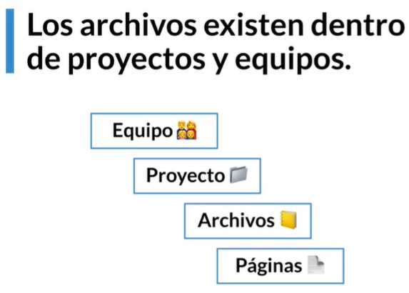
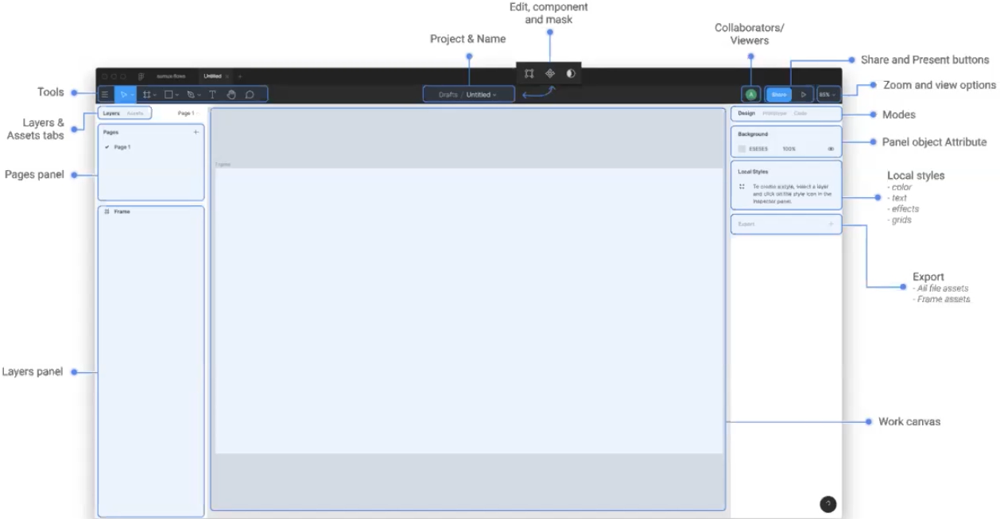

# Interfáz de Figma

- Estructura de archivos

  

- Mover archivos:
  - Traer archivos `.sketch`.
  - Drag and drop
  - Exportando en `.fig`

- Interfáz del programa

  

- Modos:
  - Diseño
  - Prototipado
  - Código
- En una página pueden existir en el módulo de capas:
  - Frames
  - Grupos
  - Elementos solos:
    - Texto
    - Formas / Vectores
    - Imágenes
    - Gifs
  - Componentes
    - Instancias
- Drafts: borradores de los proyectos