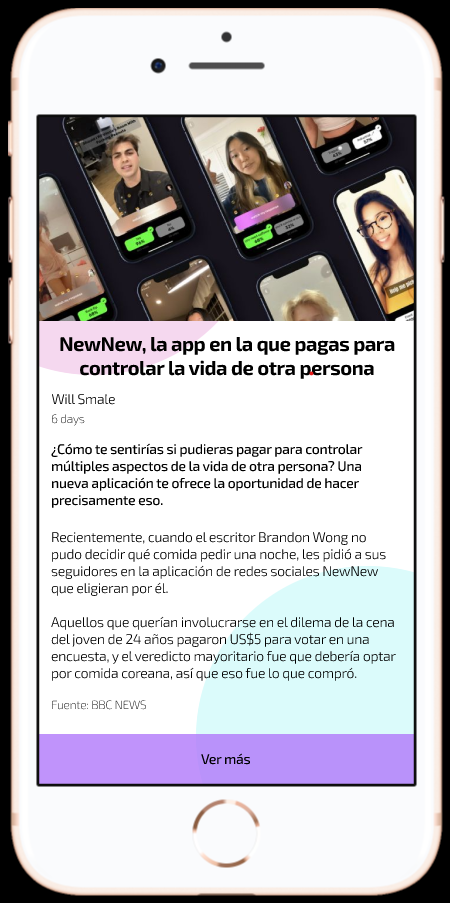

# Herramienta de Texto

| Descripciòn | Tecla de atajo |
| :---: | :---: |
| Agregar texto | `t` |
| Bold | `Ctrl + b` |
| Subrayar | `Ctrl + u` |
| Italizar | `Ctrl + i` |

- **Estilo:** Propiedades globales de los elementos que pueden ser re-utilizables.
- **Ejercicio:** Crear una noticia:
  - Tìtulo
  - Autor
  - Resumen
  - Texto Contenido
  - Referencias

 

# Objetos y efectos

| Descripción | Tecla de atajo |
| :---: | :---: |
| Rectángulo | r |
| Óvalo | o |
| Línea | l |
| Clonar objeto | Ctrl + d |

Con la tecla `shift` se crean los objetoc proporciones iguales, o las lìneas rectas.

# Comandos útiles

| Descripción | Tecla de atajo |
| :---: | :---: |
| Crear un frame  | `f` |
| Mostrar guías (reglas) | `Shift + r` |
Al seleccionar un frame