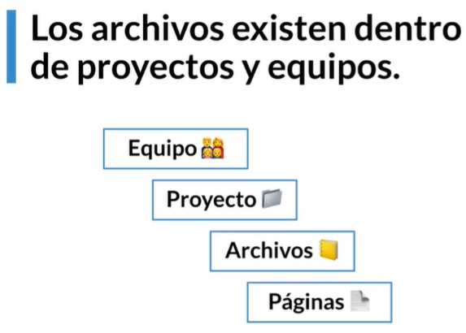
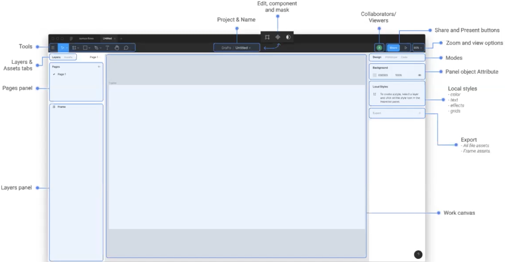
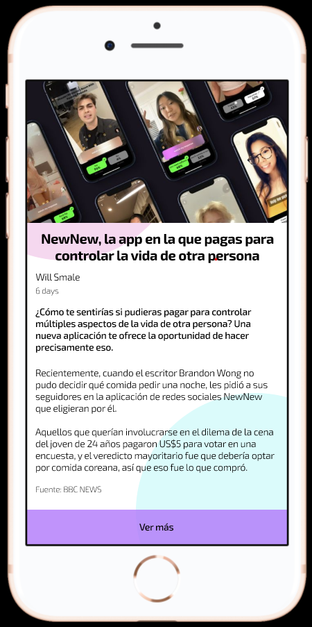

# Figma

- Se puede acceder desde cualquier explorador.
- Herramienta de edición de vectores online.
- Enfocado en el diseño de interfases.
- Se puuede trabajar con mùltiples personas en un mismo archivo.

## Objetivos

- Entender funcionalidades.
- Prototipar conceptos.
- Crear componetes para optimizar flujo de trbajo.

## Planes de Figma

1. Starter Team

- Gratis.
- Puede tener hasta 2 editores.
- Usuarios ilimitados con permisos para: visualizar, comentar, exportar y ver guías.
- Se pueden agregar hasta 3 proyectos simultáneos.
- El versionamiento se limitará a los últimos 30 días.

2. Professional

- $12 dólares por editor con pago anual, $15 dólares si se paga mensual.
- Usuarios ilimitados con permisos para: visualizar, comentar, exportar y ver guías.
- Proyectos ilimitados.
- Versionamiento ilimitado.
- Team library con estilos y componentes ilimitados.
- Integración automatizada con Slack.
- Permisos avanzados por proyecto.

3. Educación

Si eres un estudiante o profesor, puedes calificar para un plan de Figma Education. Hay varios [criterios específicos](https://help.figma.com/hc/en-us/articles/360039829674#Criteria) que se deben cumplir para ser parte del programa, y puedes aplicar [aquí](https://www.figma.com/education/apply/).

Los equipos en el plan de Education permiten acceso a todas las funcionalidades del plan Professional de manera gratuita, a la vez que también se accede a comunidades y recursos para las aulas de clase.

Los planes de Education son válidos por hasta 2 años consecutivos. Si todavía eres estudiante o profesor luego de esos dos años, puedes volver a aplicar para reactivar tu status de Education.

## Interfáz de Figma

- Estructura de archivos

  

- Mover archivos:
  - Traer archivos `.sketch`.
  - Drag and drop
  - Exportando en `.fig`

- Interfáz del programa

  

- Modos:
  - Diseño
  - Prototipado
  - Código
- En una página pueden existir en el módulo de capas:
  - Frames
  - Grupos
  - Elementos solos:
    - Texto
    - Formas / Vectores
    - Imágenes
    - Gifs
  - Componentes
    - Instancias
- Drafts: borradores de los proyectos
- [View layers, pages and components (left sidebar)](https://help.figma.com/hc/en-us/articles/360039831974)

## Herramienta de Texto

| Descripciòn | Tecla de atajo |
| :---: | :---: |
| Agregar texto | `t` |
| Bold | `Ctrl + b` |
| Subrayar | `Ctrl + u` |
| Italizar | `Ctrl + i` |

- **Estilo:** Propiedades globales de los elementos que pueden ser re-utilizables.
- **Ejercicio:** Crear una noticia:
  - Tìtulo
  - Autor
  - Resumen
  - Texto Contenido
  - Referencias

 

## Objetos y efectos

| Descripción | Tecla de atajo |
| :---: | :---: |
| Rectángulo | r |
| Óvalo | o |
| Línea | l |
| Clonar objeto | Ctrl + d |

Con la tecla `shift` se crean los objetoc proporciones iguales, o las lìneas rectas.

## Comandos útiles

| Descripción | Tecla de atajo |
| :---: | :---: |
| Crear un frame  | `f` |
| Mostrar guías (reglas) | `Shift + r` |
Al seleccionar un frame