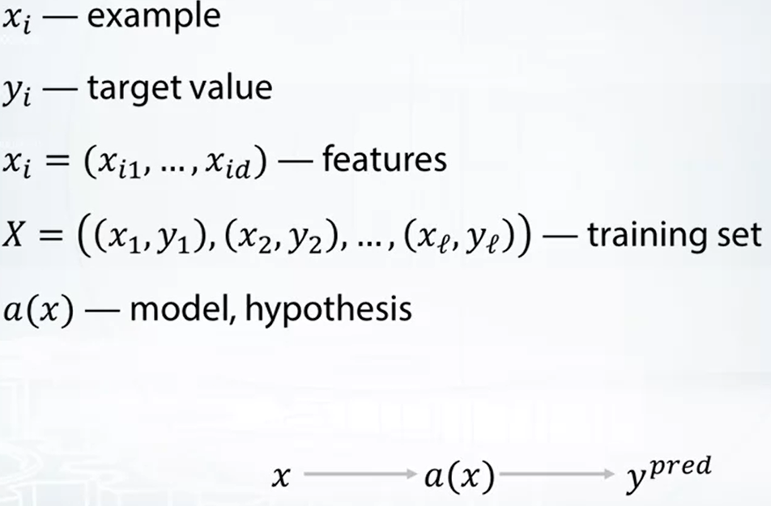
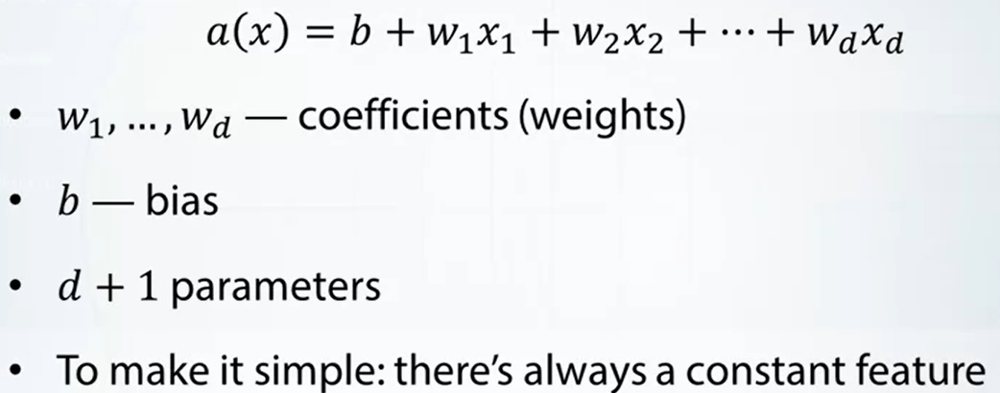
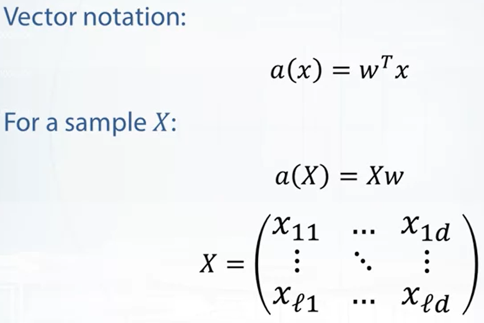
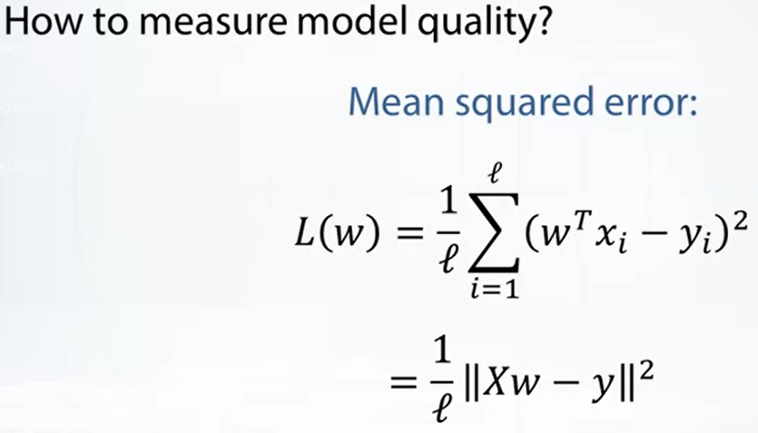

## Aprendizaje supervisado

- **Ejemplo:** cualquier objeto a analizar en aprendizaje automático.
- **Ejemplo de entrenamiento:** ejemplo que se desea modelar.
- **Características:** Caracteristicas profundas de un ejemplo.

tipos de problemas de aprendizaje supervisado:
- Regresión
  - valor objetivo: Valor real
- Clasificación
  - valor objetivo: conjunto finito

