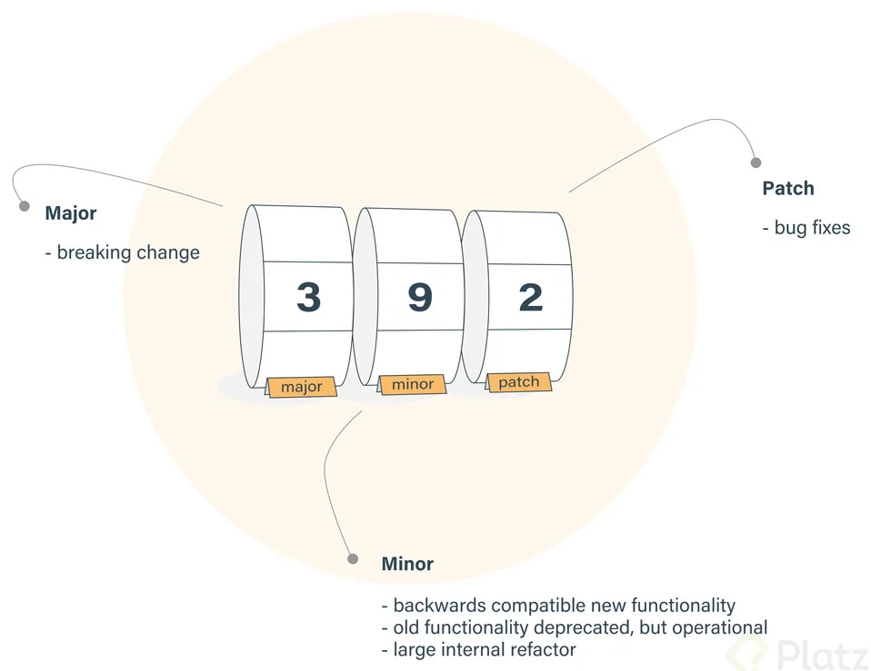
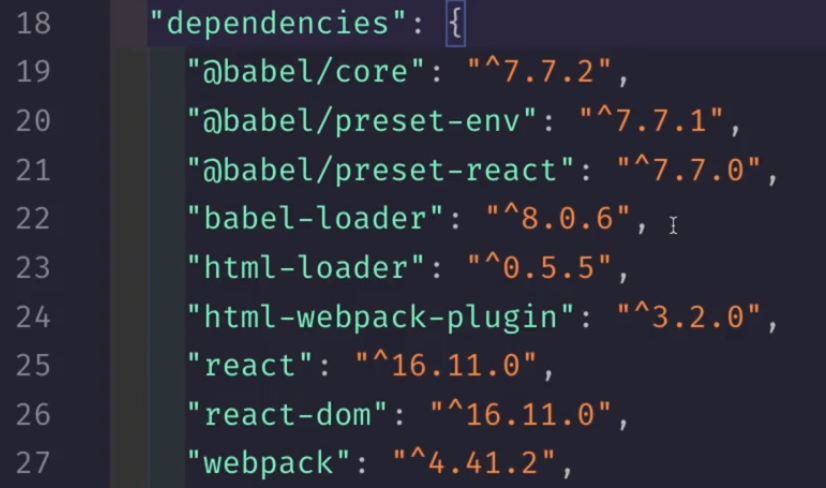
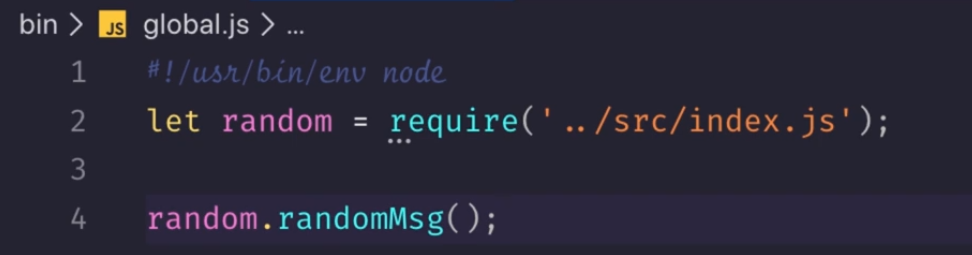
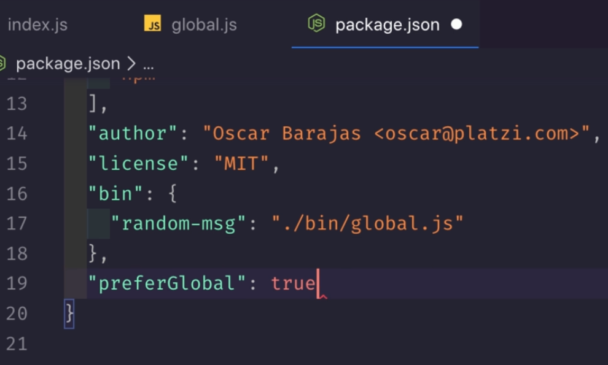

# NPM

## Introducción

- Node Package Manager
- gestor de paquetes de JS
- Se pueden crear paquetes propios
- [npm](https://www.npmjs.com/)

## Instalación

- [Link instalación](https://nodejs.org/es/)
- LTS: entornos dedesarrollo y producción, más soporte.
- Actualizar npm

  ```
  npm install -g npm@latest
  ```

## Configuración

- iniciar proyecto

  ```
  mkdir project
  cd project
  git init
  npm init
  ```

  - agregar decripción
  - agregar punto de partida
  - authot: Pepita Alcachofa <palcachofa@gmail.com>
  - [Licencias de software](https://es.wikipedia.org/wiki/Licencia_de_software)
  - `package.json` documento de configuraciones y recursos informativos

- Generar documento automático

  ```
  npm init -y
  ```

  ```
  npm init -yes
  ```

- Inicialización de datos

  ```
  npm set init.author.email "palcachofa@gmail.com"
  npm set init.author.name "Pepita"
  npm set init.license "MIT"
  npm init -y
  ```
- Instalación de dependencias

  ```
  npm install <pkg>
  ```

  ```
  npm i <pkg>
  ```

  - Por defecto le agrega la bandera `--save` o `-S`, significa que el paquete es necesario para vivir en producción
  - La bandera `--save-dev` o `-D` indica que el paquete solo es necesario en el entorno local o en el entorno de desarrollo.
  - La bandera `-g` instala un paquete de forma global, lo que permite usarlo en diferentes proyectos.
  - La bandera `-O` indica que se instalará un paquete de forma opcional
  - La carpeta `node_modules` no debe ser enviada a ningún repositorio.
  - El paquete `nodemon` escucha los cambios
  - Listar los paquetes globales instalados. La bandera `--depth` señala la profundidad de la búsqueda.

    ```
    npm list -g --depth 0
    ```
  - Listar los paquetes de un proyecto específico

    ```
    npm list
    ```
- Instalación de dependencias con Force
  - la bandera `--dry-rub` indica que la dependencia **no** va a ser instalada en el proyecto, pero se desea conocer lo que retorna
  - La bandera `-f` o `--force` indica que se instalará un paquete de forma forzada desde el último recurso del servidor de NPM.
  - Instalar dependencias del archivo `package.json`

    ```
    npm install
    ```
  - Instalar un paquete en una versión específica

    ```
    npm i <pkg>@<version>
    ```

- Actualizar paquetes

  - Revisar que paquetes disponen de nuevas versiones

    ```
    npm outdate
    ```
  - Para ver un output más detallado

    ```
    npm outdate --dd
    ```
  - Actualizar los paquetes que no están en la ultima versión

    ```
    npm update
    ```
  - Actualizar un paquete especifico

    ```
    npm install <pkg>@latest
    ```

- Eliminar paquetes
  - Eliminar un paquete de node_modules y del archivo package.json

    ```
    npm uninstall json-server
    ```
  - Desinstalar un paquete de todo node_modules pero no del archivo package.json

    ```
    npm uninstall webpack --no-save
    ```
- Package lock y el uso los símbolos ^ y ~

  

  - **Primer valor:** Cambio mayor
  - **Segundo Valor:** Cambios menores, añaden funcionalidades
  - **Tercer Valor:** Parches o cambios menores realizados.
  - Al mantener el caret (`^`) al inicio, se indica que se recibirán solamente cambios menores y parches.
  - Al poner la tilde (`~`) al inicio, se indica que se recibirán solamente actualizaciones de parches.
  - Si no se pone nada al inicio, significa que no se acepta ningún tipo de actualización del paquete.

    

- Ejecutar tareas
  - Comandos por defecto:
    - Correr los test

      ```
      npm test
      ```

      ```
      npm  run test
      ```
    - Iniciar el proyecto:

      ```
      npm start
      ```

      ```
      npm  run start
      ```
- Solución de problemas
  - Agregar el verbose para debuggear con la bandera `-dd`
  - Eliminar caché:

      ```
      npm cache clean --force
      ```
  - Rectificar caché:

      ```
      npm cache verify
      ```
- Seguridad
  - Auditar el proyecto y ver si hay cambios que puedan afectar el proyecto

      ```
      npm audit
      ```
  - Generar un json con la información de vulnerabilidades encontradas

      ```
      npm audit --json
      ```
  - Actualizar un paquete y sus dependencias, para ello se agrega la bandera `--depth <level>`

      ```
      npm update <package> --depth <level>
      ```
  - Corregir todos los errores o problemas de seguridad:

      ```
      npm audit fix
      ```

## Crear un paquete para NPM

- Se crea una carpeta llamada `bin/`, en esta hay un archivo que importa todas las funcionalidades que contendrá el paquete.
- Se debe colocar en la primera línea del archivo dentro de `bin/`

  ```
  #! /usr/bin/env node
  ```

  

- En el archivo `package.json` se crea un nuevo apartado llamado `bin` y se le añade la funcionalidad necesaria. Y se configura el paquete de forma global

  


- Publicar un paquete
  - Hacer referencia al paquete creado, para añadirlo a la configuración del equipo.

    ```
    npm link
    ```
  - Instalar desde el path

    ```
    sudo npm i -g <path>
    ```
  - crear cuenta en NPM
  - Localmente:

    ```
    npm adduser
    npm pubish
    ```
- Paquetes privados
  - Agregar README (inglés)
  - Vincular repositorio
  - Versionamiento

    ```
    npm version <major|minor|patch>
    ```
  - Publicar

    ```
    npm publish
    ```

  ```
  ```
