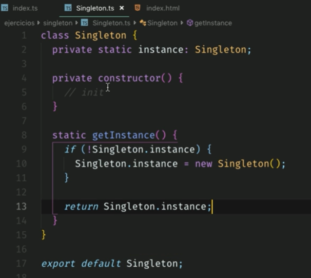

- [Curso profesional de JavaScript](#curso-profesional-de-javascript)
  - [Introducción](#introducción)
    - [¿Qué significa ser un profesional de JavaScript?](#qué-significa-ser-un-profesional-de-javascript)
    - [Inicio del proyecto](#inicio-del-proyecto)
  - [Fundamentales](#fundamentales)
    - [Cómo llega un script al navegador](#cómo-llega-un-script-al-navegador)
    - [Scope - ámbito de una variable](#scope---ámbito-de-una-variable)
    - [Closures](#closures)
    - [El primer Plugin](#el-primer-plugin)
    - [This](#this)
    - [Los métodos call, apply y bind](#los-métodos-call-apply-y-bind)
    - [Prototype](#prototype)
    - [Herencia prototipal](#herencia-prototipal)
  - [Cómo funciona JavaScript](#cómo-funciona-javascript)
    - [Parsers y el Abstract Syntax Tree](#parsers-y-el-abstract-syntax-tree)
    - [Abstract Syntax Tree en Práctica](#abstract-syntax-tree-en-práctica)
    - [Cómo funciona el JavaScript Engine](#cómo-funciona-el-javascript-engine)
    - [Event Loop](#event-loop)
  - [Fundamentos intermedios](#fundamentos-intermedios)
    - [Promesas](#promesas)
    - [Getters y setters](#getters-y-setters)
    - [Proxy](#proxy)
    - [Generators](#generators)
  - [APIs del DOM](#apis-del-dom)
    - [Fetch - Cómo cancelar peticiones](#fetch---cómo-cancelar-peticiones)
    - [IntersectionObserver](#intersectionobserver)
    - [VisibilityChange](#visibilitychange)
    - [Service Workers](#service-workers)
  - [TypeScript](#typescript)
    - [Introducción](#introducción-1)
    - [Tipos básicos](#tipos-básicos)
    - [Funciones](#funciones)
    - [Interfaces](#interfaces)
    - [Clases](#clases)
    - [Convertir el proyecto a typescript](#convertir-el-proyecto-a-typescript)
  - [Patrones de diseño](#patrones-de-diseño)
    - [Qué es un patrón de diseño](#qué-es-un-patrón-de-diseño)
    - [Categorías de patrones de diseño](#categorías-de-patrones-de-diseño)
      - [Creacionales](#creacionales)
      - [Estructurales](#estructurales)
      - [Comportamentales](#comportamentales)
    - [Patrón Singleton y Casos de Uso](#patrón-singleton-y-casos-de-uso)
    - [Implementación del patrón Singleton](#implementación-del-patrón-singleton)
    - [¿Cómo funciona el Patrón Observer?](#cómo-funciona-el-patrón-observer)
    - [Implementación del patrón Observer](#implementación-del-patrón-observer)
    - [Casos de Uso del patrón Observer: Redux](#casos-de-uso-del-patrón-observer-redux)
    - [Patrón Decorator y Casos de Uso](#patrón-decorator-y-casos-de-uso)
    - [Implementación del patrón Decorator](#implementación-del-patrón-decorator)
  - [Proyecto: MediaPlayer](#proyecto-mediaplayer)
    - [Publicar en npm](#publicar-en-npm)

# Curso profesional de JavaScript

- [Link del curso - Platzi](https://platzi.com/clases/javascript-profesional/)
- **Dictado por:** Richard Kaufman

## Introducción

### ¿Qué significa ser un profesional de JavaScript?

- ¿Qué forma a un profesional?
  - Conocimiento del lenguaje.
  - Conocimiento de entornos de programación.
  - Mejores prácticas.
  - Versado en código.
  - Herramientas.
  - Ética / Profesionalismo.
  - Experiencia.
- El lenguaje: JavaScript

  Debemos tener muy claro cuales son los fundamentos de JavaScript antes de comenzar con esto. Existen features muy raros y hay que estudiarlos. Tenemos que saber cómo funcionan las cosas en JavaScript.

- No fundamentos‌ Los no fundamentos" representan las siguientes características del lenguaje:
  - Promesas (nivel pro).
  - Getters, setters: son formas de obtener valor de una variable sin tener que poner this.name.
  - Proxies: es un feature muy raro, pero que más adelante veremos a profundidad. Sirve para interceptar a una función antes de que se ejecute.
  - Generadores: esto es raro, pero vamos a ver que sí es eficiente.

- ¿Cómo funciona?

  Este lenguaje corre sobre un motor. JavaScript no contiene clases como otros lenguajes de programación, esto es algo que vuela mucho la cabeza, es muy difícil de entender. Otro feature muy cool que vamos a aprender es **event loop**, es lo que permite que pueda correr muchos procesos a la vez.

- Entornos de programación
  Cuando estamos desarrollando lo hacemos para la WEB, para un celular, para seguidores. Existen diferentes entornos que nos ofrecen APIS, tenemos que conocer todo esto.
- Versado en código

  Esto quiere decir que tenemos que leer mucho código, un lugar hermoso para ponernos a leer código es GitHub. Debemos leer mucho y hacerlo de forma muy constante.

- Mejores prácticas
  No vamos a reinventar la rueda, hay muchas personas que ya han solucionado los problemas más comunes, tenemos que usar estas soluciones, a estas soluciones se les llama: patrones de diseño.

- Ética
  Esta es la parte más importante de ser un profesional. Un buen profesional cumple con los siguientes valores:
  - Es responsable.
  - Entrega a tiempo sus trabajos.
  - Sabe decir que no.
  - No hace daño.

### Inicio del proyecto

[Código del proyecto](https://github.com/platzi/javascript-profesional.git)

En este curso vamos a estar desarrollando una aplicación llamada: Platzi Video. En toda plataforma de video hay un componente especial en el desarrollo, tenemos que saber implementar el MediPlayer, en este curso vamos a estar desarrollando este feature de forma modular, esto quiere decir que vamos a desarrollar plugins que vamos a implementar a nuestro reproductor, extendiéndole sus funcionalidades.

- Primer paso
  - Crearemos nuestros primeros archivos usando `npm init -y`, donde `-y` es una bandera que le dicta a npm que le diga sí a todas las preguntas que haga.

    ```
    npm init -y
    ```
  - Esto nos creará un archivo package.json que lo sustituiremos por el siguiente:

    ```js
    {
      "name":  "platzi-media-player",
      "version":  "1.0.0",
      "description":  "Proyecto del Curso Profesional de JavaScript de la Escuela de JavaScript de Platzi.",
      "license":  "MIT",
      "author":  "César Augusto Barco <augustopayza@gmail.com>",
      "keywords":  [
      "platzi"
      ],
      "scripts":  {
      "start":  "live-server"
      },
      "devDependencies":  {
          "live-server":  "^1.2.1"
        }
    }
    ```
- Instalar `live-server` en modo desarrollo

    ```js
    npm i -D live-server
    ```
- Actualizar scripts del `package.json`

  

- En el `index.html` creamos 2 etiquetas de `<script>` donde se escribirá el código.
- ‌Tenemos un botón que no funciona, lo vamos a poner a funcionar con un media query. Abrimos nuestras etiquetas de script. Tenemos un vídeo que debemos manipular, lo vamos a hacer con querySelector(""), a este tenemos que pasarlo un elemento, en este caso será video, es el único elemento video en nuestro HTML. Tambien debemos traer nuestro botón con `querySelector``.

  ```js
  const  video = document.querySelector("video")
  const  button = document.querySelector("button")
  ```
- Cuando le demos click a nuestro botón queremos que el vídeo se reproduzca. Lo hacemos de la siguiente manera:

  ```js
  button.onclick = ()=>  video.play()
  ```
- **DOM:** Document Object Model o DOM es esencialmente una interfaz de plataforma que proporciona un conjunto estándar de objetos para representar documentos HTML, XHTML y XML, ​ un modelo estándar sobre cómo pueden combinarse dichos objetos, y una interfaz estándar para acceder a ellos y manipularlos.
- El video.play() se saca de la API que trae el navegador, todos los elementos del DOM traen un API. Para saber cuales son las opciones de esta API podemos ir a [MDN](https://developer.mozilla.org/es/docs/Web/API/HTMLMediaElement) a ver toda la documentación. No podemos darle play de una vez a penas se entre en la página, esto pasa por que los navegadores tienen una seguridad que no permite que esto pase, solo se puede dar play si el usuario tiene la libertad de hacerlo. <br> Ahora nuestro código no es muy extensible, vamos a lograr esto usando prototipado. Para hacerlo extensible se pueden usar clases, pero en este caso usaremos protitype, usaremos el siguiente código para lograrlo.

  ```js
  const  video = document.querySelector("video");

  const  button = document.querySelector("button");

  function  MediaPlayer(){}

  MediaPlayer.prototype.play = function() {
    video.play()
  }

  const  player = new  MediaPlayer()

  button.onclick = () =>  player.play();
  ```

- Acá no podemos usar arrow function por que el valor de `this` es global. Más adelante se verá con más detalle.
- Mejora del código para que el video no esté embebido

  

- Para agregarle la funcionalidad de pausa y play con el mismo botón, debemos condicionar la función play de MediaPlayer de la siguiente manera:

  ```js
  MediaPlayer.prototype.play = function() {
    if(this.media.paused){
      this.media.play();
    } else {
      this.media.pause()
    }

    // o podemos usar lo siguiente:
    // this.media.paused ? this.media.play() : this.media.pause()
  };
  ```

## Fundamentales

### Cómo llega un script al navegador

[Infografía](images/00.webp)


- DOM (Documnet Object Model), es la representación que hace el navegador de un documento HTML

  

- Estructura que el computador entiende:

  

- Cuando termina el navegador de convertirlo al DOM ocurre el evento **DOMContentLoaded**. A partir de este punto tenemos la garantía de que todo nuestro documento se ha cargado
- Cuando el DOM se esté procesando, se va a detener cuando encuentra la etiqueta `<script>`. Por este motivo es importante el lugar donde colocamos los scripts.
- El mejor lugar en donde colocarlo es al final del body
- Tipos de scripts:
  - Externos: con src
  - Embebidos: el códgo está entre las etiquetas
- **async y deffer** para scripts externos
  - async: se puede hacer la petición de forma asíncrona y no se detiene la carga del DOM hasta que se haga la ejecución del código
    - Los scripts pequeños se ejecutan primero

    

    

  - defer: es igual de asíncrona como el async pero va a deferir la ejecución del JS, la va a ejecutar al final cuando termine de cargar el HTML

### Scope - ámbito de una variable

[Infografía](images/01.webp)

Representa el tiempo de vida en el que esta exista.
- Imprime 10 veces el valor de i, ya que la variable alcanza ese valor al momento de ejecutarse la función.

    

- Para resolverlo se crea una fución, donde se agregará el código central, esta tendrá su propio scope

    

- Tipos de scope:
  - **Globales:** Disponible en todo el código, alto riesgo de sobre-escritura con el Var.
  - **Function Scope:** va dentro de una función. Var, puede sobre escribirse en esa función, hay que tener cuidado con esta.
  - **Block Scope:** Let y const, te ayudan a que solo sea útil en un bloque especifico.
  - **Module Scope:** Modulares se limita a su archivo y no sale de ahí.

    Es probable que lo hayamos usado en Node o en React usando herramientas como Babel. Lo que hace es que el scope de esa variable se limite al archivo donde está definido.

    ```jsx
    <script  type="module"  src="./assets/index.js"></script>
    ```

    El `type="module"` declara que el archivo es un módulo. Esto no está en todos los navegadores pero sí en los más modernos. Ya no podemos acceder a las variables globales de este archivo desde la consola.
- Temas vistos:
  - clallStack: pila LIFO, donde se apilan los registros de funciones llamadas
  - framses o registros, contiene información de la función que se llamó.
  - anonymous, es laprimera función que se agrega a la pila, cuando se saca -> se termina la ejecución del programa
  - StackTrace: Secuencia de llamadas hasta que ocurrión un error.
‌
### Closures

[Infografía](images/02.webp)

- **IIFE:** Immediately-invoked function expressions. Se usaba para la privacidad de los datos. Ya no es necesario usarlo porque ya es posible declarár ámbitos a nivel de bloque.

  

- Un **Closure** es una función interna que tiene acceso al alcance de su función externa, incluso después de que la función externa ejecute un return

  

- Funciones que retornan funciones. Con los closures se pueden crear variables privadas

  


### El primer Plugin

- Index.js

  En el index.js se obtienen los elementos y se importa de otros archivos js la logica o codigo, en este caso de los prototipos de los objetos que usaremos.

  Creamos una constante donde se guardara la instancia del prototipo MediaPLayer. Este Prototipo recive un objeto como argumento: un elemento video y un array de Plugins, que en este caso contiene una instancia de un nuevo Prototipo llamando Autoplay.

  Por ultimo los botones mediante los eventos click llamaran a ciertas funcionalidades que tiene este objeto player.

  ```js
  import MediaPlayer from "./MediaPlayer.js";
  import AutoPlay from './plugins/AutoPlay.js';

  const video = document.querySelector("video");
  const playButton = document.getElementById('playButton');
  const muteButton = document.getElementById('muteButton');

  const player = new MediaPlayer({el: video, plugins:[new AutoPlay()]});


  playButton.onclick = () => player.togglePlay();
  muteButton.onclick = () => player.toggleMute();
  ```

- Prototipo MediaPlayer

  Este prototipo recive como argumento un objeto configuracion, al momento de crear una instancia enviamos en ese objeto un elemento video y una nueva instancia de otro prototipo.

  Al momento de crearse player se ejecuta el metodo inicializarPlugins que recorre el array de instancias y ejecuta en este caso el metodo run que afectara a la propia instancia player.

  Finalmente se exporta el codigo al index.js para que sea leido el codigo.

  ```js
  function MediaPlayer(config){
    this.media = config.el
    this.plugins = config.plugins || [];


    this._initPlugins();
  }
  //---------------plugins initializing method----------------//
  MediaPlayer.prototype._initPlugins = function (){
      this.plugins.forEach(plugin =>{
          plugin.run(this);
      })
  };

  //------------------play and pause method---------------//
  MediaPlayer.prototype.play = function(){
    this.media.play();
  };
  MediaPlayer.prototype.pause = function(){
    this.media.pause();
  };
  MediaPlayer.prototype.togglePlay = function(){
      if(this.media.paused){
          this.play();
      }else{
          this.pause();
      }
  };

  //-------------------Mute method-------------------//
  MediaPlayer.prototype.mute = function(){
      this.media.muted = true;
  };
  MediaPlayer.prototype.unmute = function(){
      this.media.muted = false;
  };
  MediaPlayer.prototype.toggleMute = function (){
      if(this.media.muted === true){
          this.media.muted = false;
      }else{
          this.media.muted = true;
      }
  };
  ```

- Prototipo Autoplay

  La instancia de este prototipo se crea en MediaPlayer al momento de crearse player y no recive ningun parametro, de momento.

  En mediaPlayer se llama al metodo run de esta instancia, que lo que hace es llamar a los metodos de MediaPlayer “mute()” y “unmute()” para que sean ejecutados al momento de crearse player.

  ```js
  function AutoPlay(){

  }
    //----------------run method-------------------//
  AutoPlay.prototype.run = function (player){
      player.mute(); .
      player.play();
  };
  ```

### This

[Infografía](images/03.webp)

- Modo estricto `'use strict'`
- this: contexto de un objeto

### Los métodos call, apply y bind

[Infografía](images/04.webp)

- call: cambia el this y recibe argumentos separados por coma
- apply: cambia el this y recibe argumentos en lista.
- bind: retorna una función donde sus argumentos se pueden encolar


### Prototype

[Infografía](images/05.webp)

- Object literal: objeto común y corriente.
- Herencia prototipal
- Object.create
  - Retorna un objeto con las propiedades del objeto recibido como parámetro
- prototypeObject
  - Al inicio prototype es un objeto vacío sin propiedades
  - se pueden añadir propiedades
- new object
  - Ejecuta el comando `this = Object.create(nameObject.prototpe);`

    

    

- herencia
- prototype chain: todos los objetos heredan de un prototype, que a su vez hereda de otro...

### Herencia prototipal

[Infografía](images/06.webp)

- `Object` es el punto de partida de todos los objetos de JS
- Hay propiedades que se heredan desde `Object` -> `toString()`
- El método `hasOwnProperty()` viene de `Object`. Retorna un booleano que indica si el valor de entrada es una propiedad o una referencia.
- La forma correcta de obtener el `prototype` de un objeto, es por medio del método `getPrototypeOf`
- Al modificar el `prototype` de un objeto, sus isntancias pueden aceder a las referencias de estas modificaciones.

  

- `SomeObject.prototype` es un objeto donde definimos el prototipo de las instancias de `SomeObject`
- `SomeObject.[[Prototype]]` hace referencia al prototipo del prototipo, el `__prototype__`, se refiere al encadenamiento de búsqueda de prototipos de los objetos.

## Cómo funciona JavaScript

### Parsers y el Abstract Syntax Tree

[Infografía](images/07.webp)

- Google chrome reconstruye el motor de JS
  - Recibe el código fuente
  - Parsea el código y produce un abstract Syntax Tree (AST)
  - Se compila a bytecode y se ejecuta
  - se optimiza a machine code y se reemplaza el código base.
- El parser toma el código fuente y lo descompone en tokens, con ello se construlle el AST
  - es dónde se arroja un Syntax error
  - 15% - 20% del proceso de ejecución
  - la mayoría de JS no se ejcuta
  - bundling: empaquetar
  - code splitting: es la división de código en varios paquetes o componentes que luego se pueden cargar a pedido o en paralelo. ... Si bien la cantidad total de código es la misma (y quizás incluso algunos bytes más grandes), la cantidad de código necesaria durante la carga inicial se puede reducir.
- Motor de google chrome y node V8
- [astexplorer](https://astexplorer.net/): muestra los tokens y los árboles generados del código ingresado.
- [esprima](https://esprima.org/): Librería que arroja los tokens de js.

### Abstract Syntax Tree en Práctica

- **ESLint:** es una herramienta de análisis de código estático para identificar patrones problemáticos encontrados en el código JavaScript. Fue creado por Nicholas C. Zakas en 2013.
- Vamos a usar el AST para crear una regla de eslint, este analizará estéticamente nuestro código a ver si hay que levantar un warning por violar la sintaxis. Muchas de estas reglas ya viene con e eslint, pero podemos agregar nuestras propias reglas. Vamos a usar la herramienta AST | Explorer para experimentar. Usaremos la configuración por defecto, veremos en la parte superior izquierda el código que vamos a ingresar, a la derecha el tree creado, en la parte inferior izquierda las funciones de las reglas y a la derecha de eso la salida de nuestro código.

  

- Context.report, recibe un objeto donde se puede declarar el error y su posición.

  

- Código completo de la regla definida:

  ```js
  export default function(context) {
    return {
      VariableDeclaration(node) {
          // tipo de variable const
            if (node.kind === "const") {
            const declaration = node.declarations[0];

            // asegurarnos que el valor es un numero
            if (typeof declaration.init.value === "number") {
              if (declaration.id.name !== declaration.id.name.toUpperCase()) {
                context.report({
                  node: declaration.id,
                  message: "El nombre de la constante debe estar en mayúsculas",
                  // retorna el error corregido
                  fix: function(fixer) {
                    return fixer.replaceText(declaration.id, declaration.id.name.toUpperCase())
                  }
                })
              }
            }
          }
      }
    };
  };
  ```

  

### Cómo funciona el JavaScript Engine

[Infografía](images/08.webp)

Una vez tenemos el AST ahora hay que convertirlo a Bytecode.

- Bytecode es como el código assembler pero en lugar de operar en el procesador opera en la máquina virtual V8 del navegador.
- Machine code es el más bajo nivel, es código binario que va directo al procesador.
- El profiler se sitúa en medio del bytecode y el optimizador
- Cada máquina virtual tiene sus particularidades, por ejemplo V8 tiene algo llamado Hot Functions.
- Cuando una sentencia función es ejecutada muy frecuentemente, V8 la denomina como una hot function y hace una optimización que consiste en convertirla a machine code para no tener que interpretarla de nuevo y agilizar su ejecución.
- Cada navegador tiene su implementación de JavaScript Engine:
  - SpiderMonkey - Firefox
  - Chackra - Edge
  - JavaScriptCore - Safari
  - V8 - Chrome, node
- Capas de optimización
  - V8: google chrome, node

    

  - SpiderMonkey: firefox. 2 capas de optimización

    

  - Chakra

    

  - JavaScriptCore

    

### Event Loop

[Infografía](images/09.webp)

El Event Loop hace que Javascript parezca ser multihilo a pesar de que corre en un solo proceso.

Javascript se organiza usando las siguientes estructuras de datos:

- **Stack:** Va apilando de forma organizada las diferentes instrucciones que se llaman. Lleva así un rastro de dónde está el programa, en que punto de ejecución nos encontramos.
  - Apunta a variables como el scope, que indica que partes del código tienen acceso a los diferentes scopes o entornos.

    

- **Memory Heap:** De forma desorganizada se guarda información de las variables y del scope.
- **Schedule Tasks:** Aquí se agregan a la cola, las tareas programadas para su ejecución.
- **Task Queue** Aquí se agregan las tares que ya están listas para pasar al stack y ser ejecutadas. El stack debe estar vacío para que esto suceda.
- **MicroTask Queue** Aquí se agregan las promesas. Esta Queue es la que tiene mayor prioridad.

El Event Loop es un loop que está ejecutando todo el tiempo y pasa periódicamente revisando las queues y el stack moviendo tareas entre estas dos estructuras.


## Fundamentos intermedios

### Promesas

[Infografía](images/0A.webp)

### Getters y setters

[Infografía](images/0B.webp)

### Proxy

[Infografía](images/0C.webp)

El proxy sirve para interceptar la lectura de propiedades de un objeto (los get, y set) entre muchas otras funciones. Así, antes de que la llamada llegue al objeto podemos manipularla con una lógica que nosotros definamos.

- window.Levenshtein.get(): Indica la distancia entre 2 cadenas, esa distancia es la cantidad de caracteres en las que se diferencian. diferencia entre `Java` y `JavaScript` = 6
- Un proxy recibe:
  - target: objeto a interceptar
  - handler: objetoq que contiene funciones trampa. Todas las trampas son opcionales. Si no se ha definido una trampa, el comportamiento predeterminado es reenviar la operación al objetivo.
  - [Lista de funciones trampa](https://developer.mozilla.org/en-US/docs/Web/JavaScript/Reference/Global_Objects/Proxy/Proxy)
- Operador in
- Propiedades heredadas
- Object.keys

### Generators

[Infografía](images/0D.webp)

Los generadores son funciones especiales, pueden pausar su ejecución y luego volver al punto donde se quedaron recordando su scope.

Algunas de sus características:
- Los generadores regresan una función.
- Empiezan suspendidos y se tiene que llamar next para que ejecuten.
- Regresan un value y un boolean done que define si ya terminaron.
- `yield` es la instrucción que regresa un valor cada vez que llamamos a next y detiene la ejecución del generador.


## APIs del DOM

### Fetch - Cómo cancelar peticiones

[Infografía](images/0E.webp)

La peticiones AJAX permitieron en su tiempo hacer peticiones asíncronas al servidor sin tener que detener la carga de la página. Hoy en día se utiliza la función fetch para esto.

Con fetch tenemos algo llamado AbortController que nos permite enviar una señal a una petición en plena ejecución para detenerla.

- createObjectURL
- DOMString
- Blob: binario de la petición
- AbortController.abort

### IntersectionObserver

[Infografía](images/0F.webp)

- Sirve para observar elementos y si cruzan un umbral que nosotros definimos nos lo va a notificar para tomar acción.
- El umbral se define por el porcentaje que tiene intersección con el viewport, con la parte visible de nuestra página.
- Sirve para observar elementos de forma asíncronna
- Viewport: parte del documento que el usuario ve en la ventana


### VisibilityChange

[Infografía](images/10.webp)

El visibilityChange forma parte del API del DOM llamado Page Visibility y nos deja saber si el elemento es visible, pude ser usado para ejecutar una acción cuando cambiamos de pestaña. Así podemos ahorrar batería y mejorar la UX.


### Service Workers

Sirven para hacer que nuestras aplicaciones funcionen Offline.

Muy usados en las Progressive Web Apps (PWA) los ServiceWorkers son una capa que vive entre el navegador y el Internet.

Parecido a como lo hacen los proxys van a interceptar peticiones para guardar el resultado en cache y la próxima vez que se haga la petición tomar del cache ese resultado.

Los [Service workers](https://developer.mozilla.org/es/docs/Web/API/Service_Worker_API#Descarga_instalaci%C3%B3n_y_activaci%C3%B3n) actúan esencialmente como proxy servers asentados entre las aplicaciones web, el navegador y la red (cuando está accesible). Están destinados, entre otras cosas, a permitir la creación de experiencias offline efectivas, interceptando peticiones de red y realizando la acción apropiada si la conexión de red está disponible y hay disponibles contenidos actualizados en el servidor. También permitirán el acceso a notificaciones tipo push y APIs de sincronización en segundo plano.


En este punto, su service worker observará el siguiente ciclo de vida:
- Descarga
- Instalación
- Activación

El service worker se descaga inmediatamente cuando un usuario accede por primera vez a un sitio controlado por el mismo.

Después de esto se descarga cada 24 horas aproximadamente. Se puede descargar con más frecuencia, pero debe ser descargado cada 24 horas para prevenir que una mala programación sea molesta durante mucho tiempo.

- Cada vez que se hace un cambio hay que reinstalarlo
- `self` es como un `this` para los service workers
- se usará un `addEventListener`
  - Escuchará cuando se instale el service workers
  - el callback a llamar recivirá un evento
  - se creará un pre-caché
  - al precaché se le dará una lista de recursos que se deseen mantener en caché
  - Se debe esperar a que el caché se complete
  - `waitUntil` espera a que la promesa se resuelva o se rechace
  - para el SW (service Worked) `/` y `/index.html` son diferentes, por ello hay que poner ambas

    

- En el debuggeador de chrome, en la pestaña `aplication`, en la parte izquierda  opción `Cache > Chache Storage` se encontrarán los assets declarados, con el nombre `v1` pasado como parámetro previamente.
- Se agregará un `addEventListener` para los `fetch`, este interceptará las peticiones
- Se trabajarán con las peticiones get.
- event puede responder con una respuesta cacheada
- `await cache.match(request)`, pregunta si tiene una copia correspondiente al request, si no hay, responde `undifined`

  

  

  

- Si se actualizan los archivos, se debe tener una función que actualicé el caché

  

  


## TypeScript

### Introducción

[Infografía](images/11.webp)

- El servidor `LiveServer` no transpila código TypeScript a JS, se instalará `parcel-blunder`

  ```js
  npm i -D parcel-bundler
  ```
- Actualizar `package.json`

  

  

- Indicar que parcel transpile el código para el navegador que se está utilizando

  

- Eliminar `live-server`

  ```js
  npm rm live-server
  ```
- se debe renderizar el html en la url: `localhost:23/index.html`
- Se creará una carpeta para typescript `Typescript`
- Se creará un archivo de typescript `index.ts`
- Se creará un archivo de html `index.html`
- Al ejecutarlo con `npm start` puede que no funcione, para solucionarlo se puede usar

  ```js
  rm -rf .cache dist
  ```

  

### Tipos básicos

[Infografía](images/12.webp)

- Hace análisis estático de los tipos, es un análisis que se realiza sin ejecutar el programa.
- **Boolean:** El tipo de datos más básico es el valor verdadero / falso simple, que JavaScript y TypeScript llaman un booleanvalor.

  ```js
  let isDone: boolean = false;
  ```
- **Number:** Como en JavaScript, todos los números en TypeScript son valores de coma flotante. Estos números de coma flotante obtienen el tipo number. Además de los literales hexadecimales y decimales, TypeScript también admite literales binarios y octales introducidos en ECMAScript 2015.

  ```js
  let decimal: number = 6;
  let hex: number = 0xf00d;
  let binary: number = 0b1010;
  let octal: number = 0o744;
  ```
- **String:** Otra parte fundamental de la creación de programas en JavaScript para páginas web y servidores es trabajar con datos textuales. Como en otros idiomas, usamos el tipo stringpara referirnos a estos tipos de datos textuales. Al igual que JavaScript, TypeScript también utiliza comillas dobles ( ") o comillas simples ( ') para rodear los datos de cadena.

  ```js
  let color: string = "blue";
  color = 'red';
  ```

  También puede usar cadenas de plantillas , que pueden abarcar varias líneas y tener expresiones incrustadas. Estas cadenas están rodeadas por el carácter backtick / backquote ( `), y las expresiones incrustadas son de la forma ${ expr }.


  ```js
  let fullName: string = `Bob Bobbington`;
  let age: number = 37;
  let sentence: string = `Hello, my name is ${ fullName }.

  I'll be ${ age + 1 } years old next month.`;
  ```
- **Array:** TypeScript, como JavaScript, le permite trabajar con matrices de valores. Los tipos de matriz se pueden escribir de una de dos maneras. En el primero, usa el tipo de elementos seguido de []para denotar una matriz de ese tipo de elemento:

  ```js
  let list: number[] = [1, 2, 3];
  ```

  La segunda forma usa un tipo de matriz genérico Array<elemType>:

  ```js
  let list: Array<number> = [1, 2, 3];
  ```
- **Tuple:** Los tipos de tupla le permiten expresar una matriz con un número fijo de elementos cuyos tipos son conocidos, pero no necesitan ser los mismos. Por ejemplo, es posible que desee representar un valor como un par de tring y number:

  ```js
  // Declare a tuple type
  let x: [string, number];
  // Initialize it
  x = ["hello", 10]; // OK
  // Initialize it incorrectly
  x = [10, "hello"]; // Error
  ```

  Al acceder a un elemento con un índice conocido, se recupera el tipo correcto:

  ```js
  console.log(x[0].substring(1)); // OK
  console.log(x[1].substring(1)); // Error, 'number' does not have 'substring'
  ```
- **Enum:** Una adición útil al conjunto estándar de tipos de datos de JavaScript es enum. Como en lenguajes como C #, una enumeración es una forma de dar nombres más amigables a conjuntos de valores numéricos.

  ```js
  enum Color {Red, Green, Blue}
  let c: Color = Color.Green;
  ```

  Por defecto, las enumeraciones comienzan a numerar a sus miembros a partir de 0. Puede cambiar esto configurando manualmente el valor de uno de sus miembros. Por ejemplo, podemos comenzar el ejemplo anterior en 1lugar de 0:

  ```js
  enum Color {Red = 1, Green, Blue}
  let c: Color = Color.Green;
  ```

  O, incluso establezca manualmente todos los valores en la enumeración:

  ```js
  enum Color {Red = 1, Green = 2, Blue = 4}
  let c: Color = Color.Green;
  ```
  Una característica útil de las enumeraciones es que también puede pasar de un valor numérico al nombre de ese valor en la enumeración. Por ejemplo, si tuviéramos el valor 2pero no estuviéramos seguros de a qué se asignó en la Colorenumeración anterior, podríamos buscar el nombre correspondiente:

  ```js
  enum Color {Red = 1, Green, Blue}
  let colorName: string = Color[2];

  console.log(colorName); // Displays 'Green' as its value is 2 above
  ```

  

- **Any:** Es posible que necesitemos describir el tipo de variables que no sabemos cuando estamos escribiendo una solicitud. Estos valores pueden provenir de contenido dinámico, por ejemplo, del usuario o de una biblioteca de terceros. En estos casos, queremos inhabilitar la verificación de tipos y dejar que los valores pasen por las comprobaciones en tiempo de compilación. Para hacerlo, los etiquetamos con el any

  ```js
  let notSure: any = 4;
  notSure = "maybe a string instead";
  notSure = false; // okay, definitely a boolean
  ```
  es una forma poderosa de trabajar con JavaScript existente, lo que le permite activar y desactivar gradualmente la verificación de tipos durante la compilación. Puede esperar Objectjugar un papel similar, como lo hace en otros idiomas. Sin embargo, las variables de tipo Objectsolo le permiten asignarles cualquier valor. No puede invocar métodos arbitrarios en ellos, incluso los que realmente existen:

  ```js
  let notSure: any = 4;
  notSure.ifItExists(); // okay, ifItExists might exist at runtime
  notSure.toFixed(); // okay, toFixed exists (but the compiler doesn't check)

  let prettySure: Object = 4;
  prettySure.toFixed(); // Error: Property 'toFixed' doesn't exist on type 'Object'.
  ```
  también es útil si conoce alguna parte del tipo, pero quizás no toda. Por ejemplo, puede tener una matriz, pero la matriz tiene una combinación de diferentes tipos:

  ```js
  let list: any[] = [1, true, "free"];
  list[1] = 100;
  ```

- **Object:** es un tipo que representa el tipo no primitivo, es decir, todo lo que no es number, string, boolean, symbol, null, o undefined. Con el objecttipo, las API como Object.createse pueden representar mejor. Por ejemplo:

  ```js
  declare function create(o: object | null): void;

  create({ prop: 0 }); // OK
  create(null); // OK

  create(42); // Error
  create("string"); // Error
  create(false); // Error
  create(undefined); // Error
  ```
### Funciones

[Infografía](images/13.webp)

- tipo de valor de los parámetros de una función
- tipo de valor que retorna una función
- función que no retorna nada, void
- funciones que retornan funciones
- parámetros opcionales
- parámetros con valores por defecto

### Interfaces

[Infografía](images/28.png)

Nos permiten declarar la forma exacta de un objeto, definiendo los tipos de sus propiedades y si son opcionales o no.

### Clases

En las clases en TypeScript sí existen las propiedades privadas.

- Introducción

  JavaScript tradicional utiliza funciones y herencia basada en prototipos para construir componentes reutilizables, pero esto puede resultar un poco incómodo para los programadores más cómodos con un enfoque orientado a objetos, donde las clases heredan la funcionalidad y los objetos se crean a partir de estas clases. A partir de ECMAScript 2015, también conocido como ECMAScript 6, los programadores de JavaScript podrán construir sus aplicaciones utilizando este enfoque basado en clases orientado a objetos. En TypeScript, permitimos que los desarrolladores usen estas técnicas ahora y las compilen en JavaScript que funcione en todos los principales navegadores y plataformas, sin tener que esperar a la próxima versión de JavaScript.

- Clases

  Echemos un vistazo a un ejemplo simple basado en clases:

  ```js
  class Greeter {
      greeting: string;
      constructor(message: string) {
          this.greeting = message;
      }
      greet() {
          return "Hello, " + this.greeting;
      }
  }

  let greeter = new Greeter("world");
  ```

  La sintaxis debería resultarle familiar si ha usado C # o Java anteriormente. Declaramos una nueva clase Greeter. Esta clase tiene tres miembros: una propiedad llamada greeting, un constructor y un método greet.

  Notarás que en la clase cuando nos referimos a uno de los miembros de la clase que anteponemos this.. Esto denota que es un acceso de miembro.

  En la última línea construimos una instancia de la Greeterclase usando new. Esto llama al constructor que definimos anteriormente, creando un nuevo objeto con la Greeterforma y ejecutando el constructor para inicializarlo.

- Herencia

  En TypeScript, podemos usar patrones comunes orientados a objetos. Uno de los patrones más fundamentales en la programación basada en clases es poder extender las clases existentes para crear otras nuevas usando la herencia.

  Echemos un vistazo a un ejemplo:

  ```js
  class Animal {
      move(distanceInMeters: number = 0) {
          console.log(`Animal moved ${distanceInMeters}m.`);
      }
  }

  class Dog extends Animal {
      bark() {
          console.log('Woof! Woof!');
      }
  }

  const dog = new Dog();
  dog.bark();
  dog.move(10);
  dog.bark();
  ```

  Este ejemplo muestra la característica de herencia más básica: las clases heredan propiedades y métodos de las clases base. Aquí, Doghay una clase derivada que deriva de la clase Animal base usando la extendspalabra clave. Las clases derivadas a menudo se denominan subclases, y las clases base a menudo se denominan superclases.

  Debido a que Dogextiende la funcionalidad desde Animal, pudimos crear una instancia de Dog que podría ambos bark() y move().

- Modificadores públicos, privados y protegidos.

  - Public

    Las variables son públicas por defecto. Aún puede marcar un miembro publicexplícitamente. Podríamos haber escrito la clase Animal de la sección anterior de la siguiente manera:

    ```js
    class Animal {
        public name: string;
        public constructor(theName: string) { this.name = theName; }
        public move(distanceInMeters: number) {
            console.log(`${this.name} moved ${distanceInMeters}m.`);
        }
    }
    ```
  - Private

    Cuando se marca un miembro private, no se puede acceder desde fuera de su clase que lo contiene. Por ejemplo:

    ```js
    class Animal {
        private name: string;
        constructor(theName: string) { this.name = theName; }
    }

    new Animal("Cat").name; // Error: 'name' is private;
    ```
  - Protected

    El modificador `protected` actúa de manera muy similar al privated con la excepción de que los miembros declarados protected también pueden accederse dentro de las clases derivadas. Por ejemplo,

    ```js
    class Person {
        protected name: string;
        constructor(name: string) { this.name = name; }
    }

    class Employee extends Person {
        private department: string;

        constructor(name: string, department: string) {
            super(name);
            this.department = department;
        }

        public getElevatorPitch() {
            return `Hello, my name is ${this.name} and I work in ${this.department}.`;
        }
    }

    let howard = new Employee("Howard", "Sales");
    console.log(howard.getElevatorPitch());
    console.log(howard.name); // error
    ```

    Tenga en cuenta que si bien no podemos usarlo namedesde fuera Person, aún podemos usarlo desde un método de instancia de Employeeporque Employeederiva dePerson .

    Un constructor también puede estar marcado protected. Esto significa que la clase no se puede instanciar fuera de su clase que contiene, sino que se puede extender. Por ejemplo,


    ```js
    class Person {
        protected name: string;
        protected constructor(theName: string) { this.name = theName; }
    }

    // Employee can extend Person
    class Employee extends Person {
        private department: string;

        constructor(name: string, department: string) {
            super(name);
            this.department = department;
        }

        public getElevatorPitch() {
            return `Hello, my name is ${this.name} and I work in ${this.department}.`;
        }
    }

    let howard = new Employee("Howard", "Sales");
    let john = new Person("John"); // Error: The 'Person' constructor is protected
    ```

### Convertir el proyecto a typescript

La refactorización del código fuente puede mejorar la calidad y la facilidad de mantenimiento de su proyecto al reestructurar su código sin modificar el comportamiento del tiempo de ejecución. Visual Studio Code admite operaciones de refactorización (refactorizaciones) como el Método de extracción y la Variable de extracción para mejorar su base de código desde su editor.

La refactorización de código es el proceso de reestructurar el código de computadora existente, cambiar la factorización, sin cambiar su comportamiento externo. La refactorización está destinada a mejorar los atributos no funcionales del software . Las ventajas incluyen legibilidad mejorada del código y complejidad reducida ; Estos pueden mejorar el mantenimiento del código fuente y crear una arquitectura interna más expresiva o un modelo de objeto para mejorar la extensibilidad .

## Patrones de diseño

### Qué es un patrón de diseño

Son soluciones generales ya probadas dentro de un contexto que las limita a problemas frecuentes que nos encontramos en el desarrollo de software.

Los patrones de diseño son unas técnicas para resolver problemas comunes en el desarrollo de software y otros ámbitos referentes al diseño de interacción o interfaces.

Un patrón de diseño resulta ser una solución a un problema de diseño. Para que una solución sea considerada un patrón debe poseer ciertas características. Una de ellas es que debe haber comprobado su efectividad resolviendo problemas similares en ocasiones anteriores. Otra es que debe ser reutilizable, lo que significa que es aplicable a diferentes problemas de diseño en distintas circunstancias.

- Objetivos
  - Proporcionar catálogos de elementos reusables en el diseño de sistemas software.
  - Evitar la reiteración en la búsqueda de soluciones a problemas ya conocidos y solucionados anteriormente.
  - Formalizar un vocabulario común entre diseñadores.
  - Estandarizar el modo en que se realiza el diseño.
  - Facilitar el aprendizaje de las nuevas generaciones de diseñadores condensando conocimiento ya existente.
- Asimismo, no pretenden:
  - Imponer ciertas alternativas de diseño frente a otras.
  - Eliminar la creatividad inherente al proceso de diseño.

- Abusar o forzar el uso de los patrones puede ser un error
- Al agregar parones de diseño se agrega complejidad
- **Historia**

  En 1979 el arquitecto Christopher Alexander aportó al mundo de la arquitectura el libro **The Timeless Way of Building**; en él proponía el aprendizaje y uso de una serie de patrones para la construcción de edificios de una mayor calidad, en la que esa mayor calidad se refería a la arquitectura antigua y la menor calidad correspondía a la arquitectura moderna, que el romper con la arquitectura antigua había perdido esa conexión con lo que las personas consideraban que era calidad.

  En palabras de este autor, "Cada patrón describe un problema que ocurre infinidad de veces en nuestro entorno, así como la solución al mismo, de tal modo que podemos utilizar esta solución un millón de veces más adelante sin tener que volver a pensarla otra vez."
  Los patrones que Christopher Alexander y sus colegas definieron, publicados en un volumen denominado **A Pattern Language**, son un intento de formalizar y plasmar de una forma práctica generaciones de conocimiento arquitectónico.

  Más tarde, en 1987, Ward Cunningham y Kent Beck, sobrepasados por el pobre entrenamiento que recibían los nuevos programadores en orientación a objetos, se preguntaban cómo se podían capturar las buenas ideas para, luego de alguna manera, traspasarlas a los nuevos programadores recién instruidos en herencia y polimorfismo. Leyendo a Alexander se dieron cuenta del paralelo que existía entre la buena arquitectura propuesta por Alexander y la buena arquitectura OO, de modo que usaron varias ideas de Alexander para desarrollar cinco patrones de interacción hombre-ordenador (HCI) y publicaron un artículo en OOPSLA-87 titulado **Using Pattern Languages for OO Programs**.

  No obstante, no fue hasta principios de la década de 1990 cuando los patrones de diseño tuvieron un gran éxito en el mundo de la informática a partir de la publicación del libro **Design Patterns** escrito por el grupo Gang of Four (GoF) compuesto por Erich Gamma, Richard Helm, Ralph Johnson y John Vlissides, en el que se recogían 23 patrones de diseño comunes.

### Categorías de patrones de diseño

#### Creacionales

Corresponden a patrones de diseño de software que solucionan problemas de creación de instancias. Nos ayudan a encapsular y abstraer dicha creación:


- [Object Pool](https://es.wikipedia.org/wiki/Object_Pool_(patr%C3%B3n_de_dise%C3%B1o)) (no pertenece a los patrones especificados por GoF): se obtienen objetos nuevos a través de la clonación. Utilizado cuando el costo de crear una clase es mayor que el de clonarla. Especialmente con objetos muy complejos. Se especifica un tipo de objeto a crear y se utiliza una interfaz del prototipo para crear un nuevo objeto por clonación. El proceso de clonación se inicia instanciando un tipo de objeto de la clase que queremos clonar.
- [Abstract Factory](https://es.wikipedia.org/wiki/Abstract_Factory_(patr%C3%B3n_de_dise%C3%B1o)) (fábrica abstracta): permite trabajar con objetos de distintas familias de manera que las familias no se mezclen entre sí y haciendo transparente el tipo de familia concreta que se esté usando. El problema a solucionar por este patrón es el de crear diferentes familias de objetos, como por ejemplo, la creación de interfaces gráficas de distintos tipos (ventana, menú, botón, etc.).
- [Builder](https://es.wikipedia.org/wiki/Builder_(patr%C3%B3n_de_dise%C3%B1o)) (constructor virtual): abstrae el proceso de creación de un objeto complejo, centralizando dicho proceso en un único punto.
- [Factory Method](https://es.wikipedia.org/wiki/Factory_Method_(patr%C3%B3n_de_dise%C3%B1o)) (método de fabricación): centraliza en una clase constructora la creación de objetos de un subtipo de un tipo determinado, ocultando al usuario la casuística, es decir, la diversidad de casos particulares que se pueden prever, para elegir el subtipo que crear. Parte del principio de que las subclases determinan la clase a implementar.
- [Prototype](https://es.wikipedia.org/wiki/Prototype_(patr%C3%B3n_de_dise%C3%B1o)) (prototipo): crea nuevos objetos clonándolos de una instancia ya existente.
- [Singleton](https://es.wikipedia.org/wiki/Patr%C3%B3n_de_dise%C3%B1o_Singleton) (instancia única): garantiza la existencia de una única instancia para una clase y la creación de un mecanismo de acceso global a dicha instancia. Restringe la instanciación de una clase o valor de un tipo a un solo objeto.
- [Model View Controller (MVC)](https://es.wikipedia.org/wiki/Modelo_Vista_Controlador) ♙En español: Modelo Vista Controlador. Es un patrón de arquitectura de software que separa los datos y la lógica de negocio de una aplicación de la interfaz de usuario y el módulo encargado de gestionar los eventos y las comunicaciones. Este patrón plantea la separación del problema en tres capas: la capa model, que representa la realidad; la capa controller , que conoce los métodos y atributos del modelo, recibe y realiza lo que el usuario quiere hacer; y la capa vista, que muestra un aspecto del modelo y es utilizada por la capa anterior para interactuar con el usuario.

#### Estructurales

Son los patrones de diseño software que solucionan problemas de composición (agregación) de clases y objetos:


- [Adapter o Wrapper](https://es.wikipedia.org/wiki/Adapter_(patr%C3%B3n_de_dise%C3%B1o)) (Adaptador o Envoltorio): Adapta una interfaz para que pueda ser utilizada por una clase que de otro modo no podría utilizarla.
- [Bridge](https://es.wikipedia.org/wiki/Bridge_(patr%C3%B3n_de_dise%C3%B1o)) (Puente): Desacopla una abstracción de su implementación.
- [Composite](https://es.wikipedia.org/wiki/Composite_(patr%C3%B3n_de_dise%C3%B1o)) (Objeto compuesto): Permite tratar objetos compuestos como si de uno simple se tratase.
- [Decorator](https://es.wikipedia.org/wiki/Decorator_(patr%C3%B3n_de_dise%C3%B1o)) (Decorador): Añade funcionalidad a una clase dinámicamente.
- [Facade](https://es.wikipedia.org/wiki/Facade_(patr%C3%B3n_de_dise%C3%B1o)) (Fachada): Provee de una interfaz unificada simple para acceder a una interfaz o grupo de interfaces de un subsistema.
- [Flyweight](https://es.wikipedia.org/wiki/Flyweight_(patr%C3%B3n_de_dise%C3%B1o)) (Peso ligero): Reduce la redundancia cuando gran cantidad de objetos poseen idéntica información.
- [Proxy](https://es.wikipedia.org/wiki/Proxy_(patr%C3%B3n_de_dise%C3%B1o)): Proporciona un intermediario de un objeto para controlar su acceso.
- [Module](https://es.wikipedia.org/wiki/Module_(patr%C3%B3n_de_dise%C3%B1o)): Agrupa varios elementos relacionados, como clases, singletons, y métodos, utilizados globalmente, en una entidad única.

#### Comportamentales

Se definen como patrones de diseño software que ofrecen soluciones respecto a la interacción y responsabilidades entre clases y objetos, así como los algoritmos que encapsulan:


- [Chain of Responsibility](https://es.wikipedia.org/wiki/Chain_of_Responsibility_(patr%C3%B3n_de_dise%C3%B1o)) (Cadena de responsabilidad): Permite establecer la línea que deben llevar los mensajes para que los objetos realicen la tarea indicada.
- [Command](https://es.wikipedia.org/wiki/Command_(patr%C3%B3n_de_dise%C3%B1o)) (Orden): Encapsula una operación en un objeto, permitiendo ejecutar dicha operación sin necesidad de conocer el contenido de la misma.
- [Interpreter] (Intérprete): Dado un lenguaje, define una gramática para dicho lenguaje, así como las herramientas necesarias para interpretarlo.
- [Iterator](https://es.wikipedia.org/wiki/Iterator_(patr%C3%B3n_de_dise%C3%B1o)) (Iterador): Permite realizar recorridos sobre objetos compuestos independientemente de la implementación de estos.
- [Mediator](https://es.wikipedia.org/wiki/Mediator_(patr%C3%B3n_de_dise%C3%B1o)) (Mediador): Define un objeto que coordine la comunicación entre objetos de distintas clases, pero que funcionan como un conjunto.
- [Memento](https://es.wikipedia.org/wiki/Memento_(patr%C3%B3n_de_dise%C3%B1o)) (Recuerdo): Permite volver a estados anteriores del sistema.
- [Observer](https://es.wikipedia.org/wiki/Observer_(patr%C3%B3n_de_dise%C3%B1o)) (Observador): Define una dependencia de uno-a-muchos entre objetos, de forma que cuando un objeto cambie de estado se notifique y actualicen automáticamente todos los objetos que dependen de él.
- [State](https://es.wikipedia.org/wiki/State_(patr%C3%B3n_de_dise%C3%B1o)) (Estado): Permite que un objeto modifique su comportamiento cada vez que cambie su estado interno.
- [Strategy](https://es.wikipedia.org/wiki/Strategy_(patr%C3%B3n_de_dise%C3%B1o)) (Estrategia): Permite disponer de varios métodos para resolver un problema y elegir cuál utilizar en tiempo de ejecución.
- [Template Method](https://es.wikipedia.org/wiki/Template_Method_(patr%C3%B3n_de_dise%C3%B1o)) (Método plantilla): Define en una operación el esqueleto de un algoritmo, delegando en las subclases algunos de sus pasos, esto permite que las subclases redefinan ciertos pasos de un algoritmo sin cambiar su estructura.
- [Visitor](https://es.wikipedia.org/wiki/Visitor_(patr%C3%B3n_de_dise%C3%B1o)) (Visitante): Permite definir nuevas operaciones sobre una jerarquía de clases sin modificar las clases sobre las que opera.

### Patrón Singleton y Casos de Uso


- Es un patrón que te asegura que una clase solo tiene una instancia. Esta única instancia puede ser consumida por cualquier otro objeto.
- El constructor es privado
- `getInstance()` revisa si hay una instancia, si no la hay la crea y si ya la ha creado, la retorna.

### Implementación del patrón Singleton



### ¿Cómo funciona el Patrón Observer?

El patrón observer se compone de un sujeto que ofrece mecanismos de suscripción y desuscripción a múltiples observadores que quieren ser notificados de los cambios en dicho sujeto. Cada observador expone un método de update que es usado por el sujeto para notificar cualquier cambio a todos los suscritos.

Es uno de los patrones más utilizados, algunos ejemplos típicos son:
- Newsletter
- Sockets
- Listeners en páginas web

### Implementación del patrón Observer

- En el html existen 2 entidades
  - output: muestra el precio del bitcoin -> `id="price"`
  - input: permite ingresar el precio del bitcoin -> `id="value"`
- El objetivo es que al ingresar algo en el input, se actualice en el output
- código typescript

  ```js
  interface Observer {
      update: (data: any) => void
  }

  interface Subject {
      subscribe: (observer: Observer) => void
      unsubscribe: (observer: Observer) => void
  }


  // va a recibir los cambios del precio del BC y les va a informar a sus observadores
  class BitcoinPrice implements Subject {
      observers: Observer[] = []

      constructor(){
          const el: HTMLInputElement = document.querySelector("#value")
          el.addEventListener("input", () => {
              this.notify(el.value) // cuando cambie el input notificamos al los observadores
          })
      }

      subscribe (observer: Observer) {
          this.observers.push(observer)
      }

      unsubscribe(observer: Observer) {
          const index = this.observers.findIndex((obs) => {
              return obs === observer
          })
          this.observers.splice(index, 1)
      }

      // cuando el precio cambie queremos notificar a los observadores 
      notify(data: any) {
          this.observers.forEach(observer => observer.update(data))
      }
  }

  class PriceDisplay implements Observer {
      private el: HTMLElement

      constructor(){
          this.el = document.querySelector("#price")
      }

      // cada vez que el sujeto notifica a este observador modificamos el valor
      update(data: any) {
          this.el.innerText = data
      }
  }

  // instancias para suscribirnos al sujeto
  const value = new BitcoinPrice()
  const display = new PriceDisplay()

  value.subscribe(display) // display esta suscrito a todos los cambios que notifica el sujeto (input)
  setTimeout(
      () => value.unsubscribe(display),
      5000
  )
  ```
### Casos de Uso del patrón Observer: Redux

Redux es un contenedor predecible del estado de aplicaciones JavaScript.

Te ayuda a escribir aplicaciones que se comportan de manera consistente, corren en distintos ambientes (cliente, servidor y nativo), y son fáciles de probar.

- Es una librería de manejo de estado
- Inicializas un `store` con un estado y un `reducer`
- Despachas acciones que modifican el estado
- el `store` **notifica** que el estado cambió

EventEmitter es una librería de node
- emitter.on = subscribe
- emitter.off = unsubscribe
- emitter.emit = notify

Hay una propuesta para añadir observables al standard library de ECMAScript -> Stage1

### Patrón Decorator y Casos de Uso

- Añade nuevas responsabilidades a un objeto de forma dinámica permitiendo así extender su funcionalidad sin tener que usar subclases. 
- Responde a la necesidad de añadir dinámicamente funcionalidad a un Objeto. Esto nos permite no tener que crear sucesivas clases que hereden de la primera incorporando la nueva funcionalidad, sino otras que la implementan y se asocian a la primera.

  

  

  

- Otras formas de implementar:
  - Closures
  - Herencia prototipal
  - Middleware
  - ECMAScript Decorators (Stage 2)

### Implementación del patrón Decorator

- Se realizará para un campo de texto al que se le quiere proveer validación
- La clase inicial de los campos de texto, no tienen una validación especificada

  ```js
  /*
    Trabajando con decorator pattern
  */

  class Field {
    errors:string[];
    input:HTMLInputElement;

    constructor(input:HTMLInputElement){
      this.input = input;
      this.errors = [];

      let errorMessage = document.createElement('p');
      errorMessage.className = 'text-danger';
      this.input.parentNode.insertBefore(errorMessage, this.input.nextSibling);

      this.input.addEventListener('input', () => {
        this.errors = [];
        this.validate();
        errorMessage.innerText = this.errors[0] || '';
      });
    }

    validate(){}
  }

  /*
    Funcion decoradora, se guardan los valores que necesitemos en
    variables dentro de la funcion para no tocar las originales de la
    clase y poder extenderla
  */
  function RequiredFieldDecorator(field: Field):Field{
    /*
      Se guarda una referencia a la funcion en una variable para posteriormente trabajar con ella
    */
    let validate = field.validate;

    /* Se asigna un valor, en este caso una funcion a la propiedad de la instancia de la clase */
    field.validate = function(){
      /* Se ejecutan validaciones anteriores, en caso de que hayan */
      validate();
      /* Se ejcuta la logica pertiente a la accion que queramos hacer */
      let value = field.input.value;
      if(!value){
        field.errors.push("Requerido");
      }
    }
    /* Se retorna la instancia con la funcion validate ya definida, para su posterior ejecucion */
    return field;
  }

  function EmailFieldDecorator(field: Field):Field{
    let validate = field.validate;

    field.validate = function(){
      //debugger;
      validate();
      let value = field.input.value;
      if(value.indexOf("@") === -1){
        field.errors.push("Debe ser un email");
      }
    }
    return field;
  }

  let field = new Field(document.querySelector('#email'));
  /* requiredFieldDecorator retorna una instancia la cual se pasa como parametro al siguiente decorador
    para que trabaje con ella y así sucesivamente conforme agreguemos mas decoradores
  */
  field = RequiredFieldDecorator(field);
  field = EmailFieldDecorator(field);
  ```

## Proyecto: MediaPlayer

### Publicar en npm

- npm actualizado. Tener npm instalado y actualizado en tu sistema. Si no está actualizado ejecuta:

  ```js
  npm install npm@latest -g
  ```
- Tener cuenta en github
-  package.json. Tu proyecto debe tener un archivo package.json en el directorio raíz. Si no lo tuviera, ejecuta npm init desde la consola y sigue los pasos.
- Instalar el paquete typescript

  ```js
  npm i -D typescript
  ```
- Actualizar scripts del `package.json`

  

- Actualizar archivo principal `index.js` -> `lib/MediaPlayer.js` en el `package.json`

  

- crear archivo `.gitignore` y agregar `node_modules` y `lib`
-  Crear cuenta en [npmjs](https://www.npmjs.com/)
-  Publicar proyecto

  ```js
  npm login
  // ingresa tus datos de usuario y contraseña de npmjs.com
  npm publish --access=public
  ```
- Saber si estoy logueado en npm

  ```js
  npm whoami
  ```
