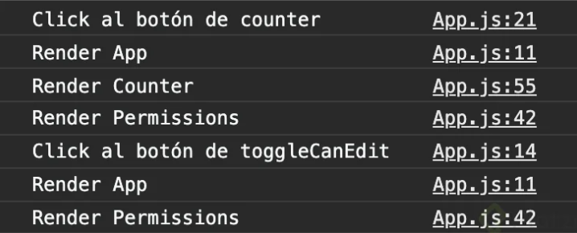
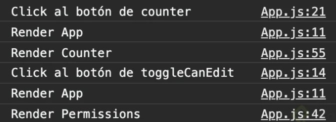

# React Hooks

Es una característica que salió en la versión 16.8 en febrero de 2019.
⠀
Vienen a resolver problemas ligados a React, como la complejidad de los componentes, no se podía compartir la lógica de estado entre componentes, Component Hell, etc.

Los Hooks presentan una alternativa al desarrollo con clases, ya que estos vienen a trabajar con funciones.

Son compatibles con versiones anteriores
⠀
### ¿Qué es un Hook?

Un Hook es una función especial que nos permitirá conectarnos a características de React, para trabajar con métodos especiales, los cuales nos permitirán manejar el estado de mejor forma sin depender de clases.

Crear proyecto:

- npx permite ejecutar desde la nube un programa, en este caso el script de `react-app` por lo que no es necesario tenerlo instalado, sino realizar el llamado

  ```JS
  npx create-react-app react-hooks
  ```
- En la carpeta `react-hooks`

  ```JS
  npm run start
  ```

## Hooks
### useState: estado en componentes creados como funciones

- En la carpeta `src` se crea la carpeta `components` y en esta se crea el archivo `Header.jsx`
- Se una constante que desestructurará 2 elementos, un estado y una función que cambiará el estado, al `useState()` se le pasa el estado inicial.

  ```JS
  const [darkMode, setDarkMode] = useState(false);
  ```
- Nuestro estado puede ser de los siguente tipos:

  - String
  - Boolean
  - Number
  - Float
  - Null
  - Undefined
  - Object
  - Array

  ```JS
  import React, { useState } from 'react';

  const Header = () => {
    const [darkMode, setDarkMode] = useState(false);

    const handleClick = () => {
      setDarkMode(!darkMode);
    }

    return (
      <div className="Header">
        <h1>ReactHooks</h1>
        <button type="button" onClick={handleClick}>{darkMode ? 'Dark Mode' : 'Light Mode'}</button>
        <button type="button" onClick={() => setDarkMode
          (!darkMode)}>{darkMode ? 'Dark Mode 2' : 'Light Mode 2'}</button>
      </div>
    );
  }

  export default Header;
  ```
### useEffect: olvida el ciclo de vida, ahora piensa en efectos

[Blog explicativo de useEffect()](https://dartiles.dev/blog/useeffect-react-hooks-ciclos-de-vida)

Permite manejar efectos que serán transmitidos en los componentes

- `useEffect()` recibe 2 parámetros:
  - función anónima
  - Variable que estará escuchando si hay un cambio
- Cuando no se tiene algoq ue va a estar escuchando se pasará en el 2do parámetro un arreglo vacío, así solo hará `render` la primera vez
- EN el componente
  - Se hace la petición fetch, luego el `response` se convierte en un json
  - Luego la información que se tiene en json se le va a pasar a la función `setCharacters()`

```JS
import React, { useState, useEffect } from 'react';

const Characters = () => {
  const [characters, setCharacters] = useState([]);

  useEffect(() => {
    fetch('https://rickandmortyapi.com/api/character/')
      .then(response => response.json())
      .then(data => setCharacters(data.results));
  }, []);

  return (
    <div className="Characters">
      {characters.map(character => (
        <h2>{character.name}</h2>
      ))}
    </div>
  );
}

export default Characters;
```
### useContext: la fusión de React Hooks y React Context

Permite compartir información entre componentes, se pueden interconectar sin necesidad de usar los props
-  Se debe crear un Contexto del cuál se van a traer datos, o la información del contexto, para que algún componente lo consuma.
-  Se debe crear un Contexto de dónde poder obtener esa información. EL archivo está en la ruta `src/contex/ThemeColor.js`

  ```JS
  import React from 'react'

  const ThemeContext = React.createContext(null);

  export default ThemeContext;
  ```
-  Definir la data que va a entregar el Provider dentro del contexto. En el `index.js`

  ```JS
  //src/index.js
  import React from 'react';
  import ReactDOM from 'react-dom';
  import './index.css';
  import App from './App';
  import * as serviceWorker from './serviceWorker';
  import ThemeContext from './context/ThemeContext';

  ReactDOM.render(
    <React.StrictMode>
      // value es la información que se compatirá
      // si se modifica value, en el Header.jsx se verá reflejado
      <ThemeContext.Provider value="blue">
        <App />
      </ThemeContext.Provider>
    </React.StrictMode>,
    document.getElementById('root')
  );

  // If you want your app to work offline and load faster, you can change
  // unregister() to register() below. Note this comes with some pitfalls.
  // Learn more about service workers: https://bit.ly/CRA-PWA
  serviceWorker.unregister();
  ```

- Conectar la información del Provider (contexto) con el componente.

  ```JS
  // src/components/Header.jsx
  import React, { useState, useContext } from 'react';
  import ThemeContext from '../context/ThemeContext';

  const Header = () => {
    const [darkMode, setDarkMode] = useState(false);
    const color = useContext(ThemeContext); //

    const handleClick = () => {
      setDarkMode(!darkMode);
    }

    return (
      <div className="Header">
        // Uso de la variable compartida por el themeContext
        <h1 style={{ color }}>ReactHooks</h1>
        <button type="button" onClick={handleClick}>{darkMode ? 'Dark Mode' : 'Light Mode'}</button>
        <button type="button" onClick={() => setDarkMode
          (!darkMode)}>{darkMode ? 'Dark Mode 2' : 'Light Mode 2'}</button>
      </div>
    );
  }

  export default Header;
  ```

- [Redux no está muerto](https://platzi.com/blog/redux-no-esta-muerto/)

### useReducer: como useState, pero más escalable

- `initialState` -> `reducer()` -> `dispatch`
- Se importa `useReducer` de `react`
- Se debe crear un estado inicial
- Se crea el `reducer` que agrega a favoritos los personajes, en este caso se llama `favoriteReducer`
- Se llama el `useReducer()`, este recibe 2 parámetros:
  - El reducer -> `favoriteReducer`
  - El estado inicial -> `initialState`
- El `useReducer` retorna una constante que se puede deconstruir como una lista que contiene:
  - Retorna el `state` procesado por las acciones definidas en cada caso establecido
  - El `dispatch` que ejecuta las acciones


```JS
// src/components/Characters.jsx

import React, { useState, useEffect, useReducer } from 'react';

// Se crea el estado inicial
const initialState = {
  favorites: []
}

// Se declara el reducer
// Este se encarga de agregar a la lista `favorites` el nuevo personaje
// el personaje es pasado por medio de action.payload
const favoriteReducer = (state, action) => {
  switch (action.type) {
    case 'ADD_TO_FAVORITE':
      // Retorna el state, pero en el elemento favorites agrega un nuevo item
      return {
        ...state,
        favorites: [...state.favorites, action.payload]
      };
    default:
      return state;
  }
}

const Characters = () => {
  const [characters, setCharacters] = useState([]);

  // Generación del state actualizado con los personajes favoritos y del
  // dispatch que desencadena el cambio de estado
  const [state, dispatch] = useReducer(favoriteReducer, initialState);

  useEffect(() => {
    fetch('https://rickandmortyapi.com/api/character/')
      .then(response => response.json())
      .then(data => setCharacters(data.results));
  }, []);

  const handleClick = favorite => {
    // Se cambia el estado, actualizando la lista de favoritos
    dispatch({ type: 'ADD_TO_FAVORITE', payload: favorite })
  }

  return (
    <div className="Characters">
      {state.favorites.map(favorite => (
        <li key={favorite.id}>
          {favorite.name}
        </li>
      ))}

      {characters.map(character => (
        <div className="item" key={character.id}>
          <h2>{character.name}</h2>
          <button type="button" onClick={() => handleClick(character)}>Agregar a Favoritos</button>
        </div>
      ))}
    </div>
  );
}

export default Characters;
```

### ¿Qué es memoization? Técnicas de optimización en programación funcional

[Currying en JavaScript](https://yeisondaza.com/currying-en-javascript-funciones-con-superpoderes)

La memoria de JavaScript no es infinita, existe un máximo de funciones y cálculos que podemos hacer. Incluso si no la usamos toda, gastarla excesivamente causará que nuestras aplicaciones corran lento, con mucho lag o sencillamente briden una muy mala experiencia a los usuarios.

Nuestro código puede parecer pequeño cuando utilizamos técnicas de programación funcional como currying y recursividad. Pero no te dejes engañar. Así estemos llamando a la misma función una y otra vez recursivamente, cada cálculo o llamado a esta función genera nuevos “bloques” en la pila de ejecuciones que debe hacer JavaScript. Esto afecta a la memoria de JavaScript y puede estropear nuestra aplicación.

La buena noticia es que muy seguramente no tienes de qué preocuparte. Este “problema” no será realmente un problema a menos que construyas aplicaciones muy, muy grandes (por ejemplo, videojuegos en el navegador) donde la optimización de memoria es vital.

¡Pero tampoco te relajes! Tu responsabilidad como desarrolladora web profesional es siempre prepararte para resolver cualquier problema de programación, incluso si requieren técnicas “avanzadas” de optimización para que nuestro programa funcione a la perfección y para todos nuestros usuarios.

Aplica memoization para 

### useMemo: evita cálculos innecesarios en componentes

Nos ayudan a evitar cálculos innecesarios dentro de nuestros componentes, guardando los resultados en memoria de tal forma que solo se necesite realizar una solución para un problema y esa solución guardarlo en memoria, para que en una próxima ocación se acceda a este resultado


```JS
// src/components/Characters.jsx

import React, { useState, useEffect, useReducer, useMemo } from 'react';

const initialState = {
  favorites: []
}

const favoriteReducer = (state, action) => {
  switch (action.type) {
    case 'ADD_TO_FAVORITE':
      return {
        ...state,
        favorites: [...state.favorites, action.payload]
      };
    default:
      return state;
  }
}

const Characters = () => {
  const [characters, setCharacters] = useState([]);
  const [favorites, dispatch] = useReducer(favoriteReducer, initialState);

  // Cuando se le ingrese un valor a setSearch(), la variable search, se actualizará con este
  const [search, setSearch] = useState('');

  useEffect(() => {
    fetch('https://rickandmortyapi.com/api/character/')
      .then(response => response.json())
      .then(data => setCharacters(data.results));
  }, []);

  const handleClick = favorite => {
    dispatch({ type: 'ADD_TO_FAVORITE', payload: favorite })
  }

  const handleSearch = (event) => {
    setSearch(event.target.value)
  }

  // const filteredUsers = characters.filter((user) => {
  //   return user.name.toLowerCase().includes(search.toLowerCase());
  // })

  const filteredUsers = useMemo(() =>
    characters.filter((character) => {
      return character.name.toLowerCase().includes(search.toLowerCase());
    }),
    // La lista indica sobre cuales elementos estará
    [characters, search]
  )

  return (
    <div className="Characters">

      {favorites.favorites.map(favorite => (
        <li key={favorite.id}>
          {favorite.name}
        </li>
      ))}

      <div className="Search">
        <input type="text" value={search} onChange={handleSearch} />
      </div>

      {filteredUsers.map(character => (
        <div className="item" key={character.id}>
          <h2>{character.name}</h2>
          <button type="button" onClick={() => handleClick(character)}>Agregar a Favoritos</button>
        </div>
      ))}
    </div>
  );
}

export default Characters;
```

### useRef: manejo profesional de inputs y formularios

Básicamente, useRef es como una "caja" que puede contener un valor mutable en su propiedad .current.

Es posible que esté familiarizado con las referencias principalmente como una forma de acceder al DOM. Si pasa un objeto ref a React con <div ref = {myRef} />, React establecerá su propiedad .current en el nodo DOM correspondiente siempre que ese nodo cambie.

Sin embargo, useRef () es útil para más que el atributo ref. Es útil para mantener cualquier valor mutable similar a cómo usarías los campos de instancia en las clases.

Esto funciona porque useRef () crea un objeto JavaScript simple. La única diferencia entre useRef () y crear un objeto {current: ...} usted mismo es que useRef le dará el mismo objeto ref en cada render.

Tenga en cuenta que useRef no le notifica cuando cambia su contenido. La mutación de la propiedad .current no provoca una nueva renderización. Si desea ejecutar algún código cuando React adjunta o separa una referencia a un nodo DOM, es posible que desee utilizar una referencia de devolución de llamada en su lugar.

- [React Hook Form](https://react-hook-form.com/)
- Se hará una referencia a `searchInput` el valor que se tiene para buscar los personajes
- [Documentación useRef](https://reactjs.org/docs/hooks-reference.html#useref)

```JS
// src/components/Characters.jsx

import React, { useState, useEffect, useReducer, useMemo, useRef } from 'react';

const initialState = {
  favorites: []
}

const favoriteReducer = (state, action) => {
  switch (action.type) {
    case 'ADD_TO_FAVORITE':
      return {
        ...state,
        favorites: [...state.favorites, action.payload]
      };
    default:
      return state;
  }
}

const Characters = () => {
  const [characters, setCharacters] = useState([]);
  const [favorites, dispatch] = useReducer(favoriteReducer, initialState);
  const [search, setSearch] = useState('');

  // useRed recibe como parámetro el valor inicial
  const searchInput = useRef(null);

  useEffect(() => {
    fetch('https://rickandmortyapi.com/api/character/')
      .then(response => response.json())
      .then(data => setCharacters(data.results));
  }, []);

  const handleClick = favorite => {
    dispatch({ type: 'ADD_TO_FAVORITE', payload: favorite })
  }

  // Ya no se accede al valor del input por event.target.value
  // Esto porque si se tiene un formulario o múltiples inputs se vuelve complejo
  const handleSearch = () => {
    setSearch(searchInput.current.value);
  }

  // const filteredUsers = characters.filter((user) => {
  //   return user.name.toLowerCase().includes(search.toLowerCase());
  // })

  const filteredUsers = useMemo(() =>
    characters.filter((user) => {
      return user.name.toLowerCase().includes(search.toLowerCase());
    }),
    [characters, search]
  )

  return (
    <div className="Characters">

      {favorites.favorites.map(favorite => (
        <li key={favorite.id}>
          {favorite.name}
        </li>
      ))}

      <div className="Search">
        <input type="text" value={search} ref={searchInput} onChange={handleSearch} />
      </div>

      {filteredUsers.map(character => (
        <div className="item" key={character.id}>
          <h2>{character.name}</h2>
          <button type="button" onClick={() => handleClick(character)}>Agregar a Favoritos</button>
        </div>
      ))}
    </div>
  );
}

export default Characters;
```

### useCallback: evita cálculos innecesarios en funciones

- En este se manejará la lógica del buscador
- Se crea un nuevo componente `Search.js`
- El `useCallback()` recibe 2 parámetros:
  - Una función
  - Una lista de dependencias, si un elemento cambia, hará un cambio a la referencia de la función

  ```JS
  // Sin useCallback
  const handleSearch = () => {
    setSearch(searchInput.current.value);
  }

  ```

  ```JS
  const handleSearch = useCallback(() => {
    setSearch(searchInput.current.value)
  })
  ```

### Optimización de componentes en React con React.memo

**¿Qué significa optimización en React?**

No existe una sola forma de optimizar componentes. Hay muchísimas formas de crear componentes y aún así podemos mostrar el “mismo” resultado en pantalla. Pero la forma en que lo hacemos puede afectar notoriamente el rendimiento del proyecto para nuestros usuarios.

Optimizar no es una sola técnica o fórmula secreta. Optimizar significa analizar los componentes de nuestro proyecto para mejorar el tiempo que tardamos en ejecutar cierto proceso o identificar procesos que estamos ejecutando en momentos innecesarios y le cuestan trabajo a la aplicación.

En esta lectura vamos a utilizar 2 herramientas oficiales de React para optimizar nuestros componentes. Pero ¿para qué tipo de optimización podemos utilizarlas? Vamos a evitar que nuestros componentes se rendericen innecesariamente.

#### React.memo vs. React.PureComponent

**PureComponent** es una clase de React muy similar a React.Component, pero por defecto el método shouldComponentUpdate compara las props nuevas y viejas, si no han cambiado, evita volver a llamar el método render del componente. Esta comparación se llama Shallow Comparison.

Esta lectura te ayudará si quieres profundizar en cómo funcionan los objetos en JavaScript y por qué es necesario implementar shallow comparison en vez de una comparación “normal”: [Aprende a Copiar Objetos en JavaScript sin morir en el intento](https://platzi.com/blog/como-copiar-objetos-en-javascript-sin-morir-en-el-intento/).

#### ¿Cuándo debo usar React.PureComponent?

En este ejemplo práctico crearemos 3 componentes, un papá y dos hijos. El componente padre tiene un estado con dos elementos, count y canEdit. El padre tiene dos funciones que actualizan cada elemento del estado. Y cada elemento del estado se envía a un componente hijo diferente.

Componente padre (App):

```JS
class App extends React.Component {
  constructor(props) {
      super(props);

      this.state = { count: 1, canEdit: true };
    }
    render() {
        console.log("Render App");

        const toggleCanEdit = () => {
            console.log("Click al botón de toggleCanEdit");
            this.setState(({ canEdit: oldCanEdit }) => {
              return { canEdit: !oldCanEdit };
            });
        };

        const countPlusPlus = () => {
          console.log("Click al botón de counter");
          this.setState((prevState) => {
            return { count: prevState.count + 1 };
          });
        };

        return (
            <>
              <button onClick={countPlusPlus}>Counter +1</button>
              <Counter count={this.state.count} />

              <button onClick={toggleCanEdit}>Toggle Can Edit</button>
              <Permissions canEdit={this.state.canEdit} />
            </>
        );
    }
}
```

Componente hijo (counter):


```JS
class Counter extends React.Component {
    render() {
        console.log("Render Counter")
        const { count } = this.props;

        return (
            <form>
                <p>Counter: {count}</p>
            </form>
        );
    }
}
```

Componente hijo (permisos):

```JS
class Permissions extends React.Component {
    render() {
        console.log("Render Permissions")
        const { canEdit } = this.props;

        return (
            <form>
                <p>El usuario {canEdit ? "" : "no"} tiene permisos de editar...</p>
            </form>
        );
    }
}
```

Si pruebas este código en el navegador, podrás darte cuenta de que, sin importar en qué botón demos clic, todos los componentes se vuelven a renderizar.



Este error puede ser muy grave. La prop `canEdit` no tiene ninguna conexión con el componente `Counter` ni la prop `count` con el componente `Permissions`, pero, aún así, si cualquiera de las dos cambia, los 3 componentes se vuelven a renderizar.

Afortunadamente podemos arreglarlo/optimizarlo cambiando `React.Component` por `React.PureComponent.`

```JS
class App extends React.PureComponent { /* … */ }
class Counter extends React.PureComponent { /* … */ }
class Permissions extends React.PureComponent { /* … */ }
```



#### ¿Cómo funciona y cuándo debo usar React.memo?

Si `useEffect` es el “reemplazo” del ciclo de vida en componentes creados como funciones con React Hooks, `React.memo` es el “reemplazo” de `PureComponent`.

Convirtamos el ejemplo anterior a funciones con React Hooks:

```JS
const App = function() {
  console.log("Render App");

  const [count, setCount] = React.useState(1);
  const [canEdit, setCanEdit] = React.useState(true);

  const countPlusPlus = () => {
    console.log("Click al botón de counter");
    setCount(count + 1);
  };

  const toggleCanEdit = () => {
      console.log("Click al botón de toggleCanEdit");
      setCanEdit(!canEdit);
  };

  return (
    <>
      <button onClick={countPlusPlus}>Counter +1</button>
      <Counter count={count} />

      <button onClick={toggleCanEdit}>Toggle Can Edit</button>
      <Permissions canEdit={canEdit} />
    </>
  );
}

const Permissions = function({ canEdit }) {
  console.log("Render Permissions")

  return (
      <form>
          <p>Can Edit es {canEdit ? "verdadero" : "falso"}</p>
      </form>
  );
}

const Counter = function({ count }) {
  console.log("Render Counter")

  return (
      <form>
          <p>Counter: {count}</p>
      </form>
  );
}
```

El resultado va a ser exactamente igual que al usar React.Component


Ahora usemos React.memo para que nuestro componente no se renderice si las props que recibe siguen igual que en el render anterior.

```JS
const App = React.memo(function() {
    /* … */
});

const Permissions = React.memo(function({ canEdit }) {
    /* … */
});

const Counter = React.memo(function({ count }) {
    /* … */
});
```


#### ¿Cómo crear una comparación personalizada con React.memo o shouldComponentUpdate?

En algunos casos puede que no necesitemos shallow comparison, sino una comparación o validación personalizada. En estos casos lo único que debemos hacer es reescribir el método shouldComponentUpdate o enviar un segundo argumento a React.memo (casi siempre incluimos los keywords are equal al nombre de esta función).

Esta nueva comparación la necesitaremos, por ejemplo, cuando nuestro componente recibe varias props, pero solo necesita su valor inicial, es decir, sin importar si cambian, a nuestro componente le da igual y solo utilizará la primera versión de las props.


```JS
```

  ```JS
  ```

    ```JS
    ```


  

    
