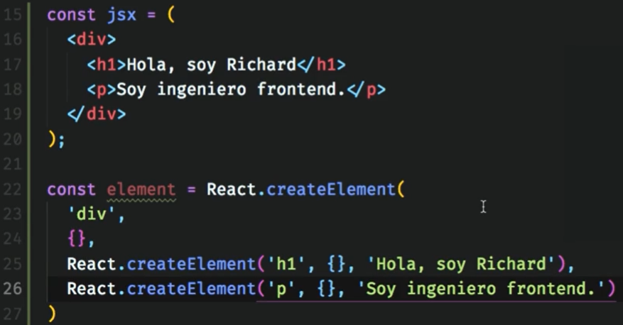
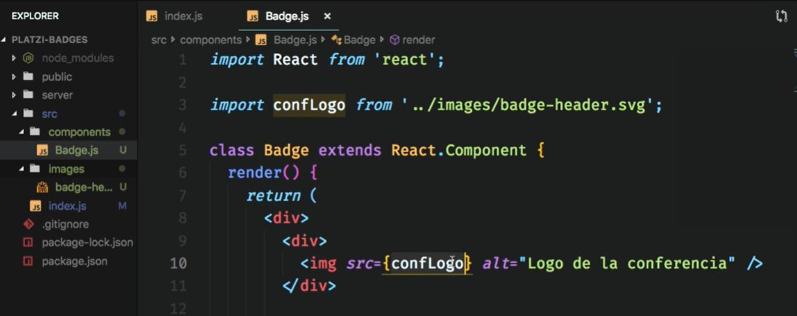
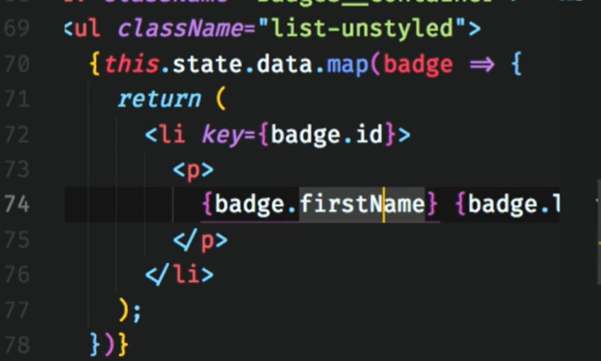
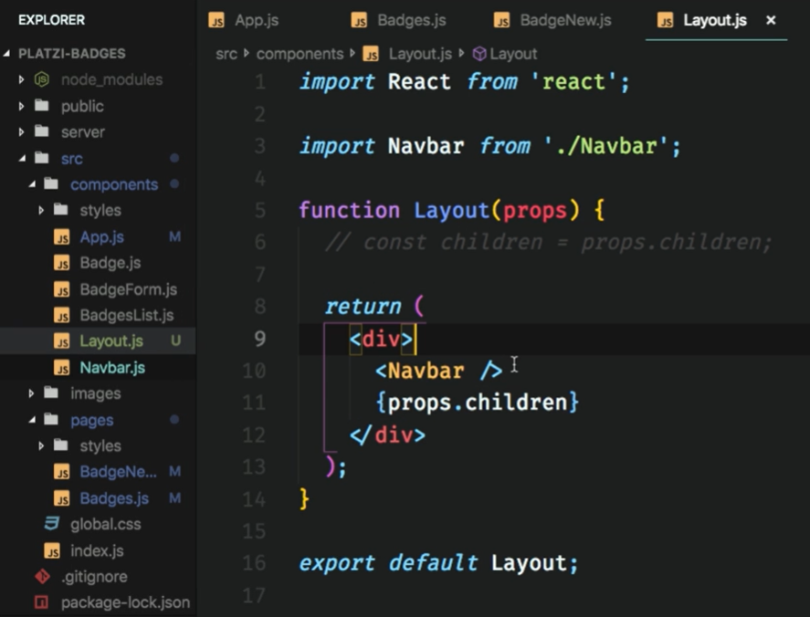
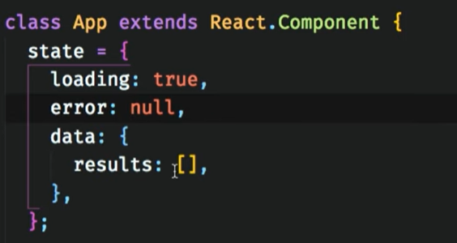
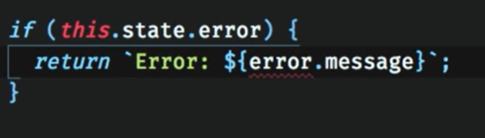
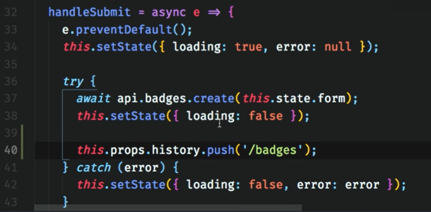

- [React.js](#reactjs)
  - [Introducción](#introducción)
    - [¡Qué es?](#qué-es)
    - [Pre-requisitos](#pre-requisitos)
    - [Herramientas que usaremos](#herramientas-que-usaremos)
    - [Create-react-app](#create-react-app)
  - [Fundamentos](#fundamentos)
    - [Clonar el código de GitHub](#clonar-el-código-de-github)
    - [ReactDOM.render](#reactdomrender)
    - [JSX](#jsx)
  - [Creación y Diseño de Componentes](#creación-y-diseño-de-componentes)
    - [¿Qué es un componente?](#qué-es-un-componente)
    - [Qué es y cómo funciona un componente en React.js](#qué-es-y-cómo-funciona-un-componente-en-reactjs)
    - [Nuestro primer componente](#nuestro-primer-componente)
    - [Cómo aplicar estilos](#cómo-aplicar-estilos)
    - [Props](#props)
    - [Nuestra primera página](#nuestra-primera-página)
    - [Enlazando eventos](#enlazando-eventos)
    - [Manejo de Estado](#manejo-de-estado)
    - [Levantamiento del estado](#levantamiento-del-estado)
    - [Listas de componentes](#listas-de-componentes)
  - [React Router](#react-router)
    - [Introducción a React Router](#introducción-a-react-router)
    - [División de la aplicación en rutas](#división-de-la-aplicación-en-rutas)
    - [Mejorando la User Interface con un Layout](#mejorando-la-user-interface-con-un-layout)
  - [Component Lifecycle](#component-lifecycle)
    - [Práctica del ciclo de vida](#práctica-del-ciclo-de-vida)
  - [Llamadas a un API](#llamadas-a-un-api)
    - [Introducción llamadas a un API](#introducción-llamadas-a-un-api)
    - [React.js: Cómo traer datos de un API en React](#reactjs-cómo-traer-datos-de-un-api-en-react)
    - [Solicitando datos (GET)](#solicitando-datos-get)
    - [Mejorando la Experiencia de Usuario durante una petición](#mejorando-la-experiencia-de-usuario-durante-una-petición)
    - [Enviando datos (POST)](#enviando-datos-post)
    - [Manejando los estados de la petición durante el POST](#manejando-los-estados-de-la-petición-durante-el-post)
    - [Actualizando datos (PUT)](#actualizando-datos-put)
    - [Actualizaciones automáticas](#actualizaciones-automáticas)
  - [Mejorando la UI](#mejorando-la-ui)
    - [Los detalles de un Badge](#los-detalles-de-un-badge)
    - [Portales](#portales)
    - [Modales](#modales)
    - [Hooks](#hooks)
    - [Search Filter](#search-filter)

# React.js

## Introducción

### ¡Qué es?

- React JS: Libreria o framework de Javascript que ayuda y facilitar el desarrollo de interfaces de usuario.
- Es declarativo, no se le dice cómo hacer las cosas, solo se le pide qué hacer.
- JSX: Es una extensión sintáctica de ECMAScript que ayuda a re formular la idea de escribir “HTML” dentro de JS; Su fin es el de proveer una sintaxis familiar y concisa (tipo HTML/XML) para definir estructuras de nodos con propiedades y atributos. Fue creado con la intención de que los preprocesadores (ej. Babel.js) lo transformen en ECMAScript estándar. Se desarrolla modular mente como bloques de lego.
- JSX no es ni HTML, ni XML; solo se asemeja para ayudar a la legibilidad, es un simple patrón de composición de funciones pero con una sintaxis similar al HTML/XML; es un HTML pero con superpoderes.
-  se pueden desarrollar componentes que conforman la app
-  React permite escribir en muchas plataformas

### Pre-requisitos

Estos son los conocimientos que deberás tener antes de comenzar con este curso:
- Desarrollo web online: Esto implica tener familiaridad y fortaleza en el uso de HTML y CSS.
- Javascript: React es Javascript. Es importante saber usar Javascript en el navegador. Es deseable conocer JQuery y saber sobre promesas, clases y tener conocimientos sobre asincronía.
- Terminal: La línea de comandos es indispensable para instalar herramientas, correr servidores y hacer diversas tareas.

### Herramientas que usaremos

Estas son las herramientas que usaremos en el curso:
- Navegador: Especialmente Chrome ya que cuenta con óptimas herramientas de desarrollo.
- React Developer Tools: Es una herramienta Open Source creada por Facebook y tiene instalación para Chrome o Firefox. Nos dejará ver el código de React inspeccionando elementos.
- Editor de texto: Puedes usar cualquiera, en este curso sugerimos Visual Studio Code. Tiene muchos plugins útiles para el desarrollo.
- Prettier: Es un plugin que hace que el código se vea bien sin importar cómo esta escrito.

### Create-react-app

**Create-react-app** es una aplicación moderna que se usa desde una línea de comando. Antes de ella se configuraba todo el entorno manualmente lo cual tomaba mucho tiempo.

Pasos para obtenerlo:
- Se debe instalar desde la línea de comando usando

  ```
  npm install -g create-react-app
  ```
- Una vez instalado se crea la carpeta del proyecto con

  ```
  create-react-app -nombre del proyecto-
  ```

  En este punto se estará instalando React y otras herramientas, también se configurará el entorno usando Webpack.

- Una vez se instala todo entra a la carpeta src donde estará todo el código fuente de la aplicación, siendo el más importante index.js que es el punto de entrada a la aplicación.
- Finalmente para correr la aplicación se usa el comando

  ```
  npm run start
  ```

Otras herramientas:
- Babel: Traduce Javascript moderno (JSX) a un Javascript que todos los navegadores puedan interpretar.
- Eslint: Lee el código y avisa de errores.

## Fundamentos

### Clonar el código de GitHub

- clonar

  ```
  git clone https://github.com/Sparragus/platzi-badges.git
  ```
- moverse a la carpeta

  ```
  cd platzi-badges
  ```
- instalar todas las dependencias necesarias para poder correr el proyecto

  ```
  npm install
  ```
- Correr servidor

  ```
  npm run start
  ```

### ReactDOM.render

- `documnet.createElement()` es una herramienta que ya viene en el navegador y necesita como argumento el objeto que se desea crear.

  

  

- Crear lo mismo pero con react:
  - Importamos el módulo `react` y `react-dom`
    - react: análogo al `createElement`
    - react-dom: análogo a `appendChild`
  - `ReactDOM.render()` recibe 2 argumentos:
    - qué se quiere renderizar.
    - dónde se quiere renderizar

  

- Siempre que escribas JSX es requisito importar React.

### JSX

JSX es una extensión de JavaScript creada por Facebook para el uso con la biblioteca React. Sirve de preprocesador (como Sass o Stylus a CSS) y transforma el código generado con React a JavaScript.

JSX tiene su alternativa que es React.createElement pero es preferible JSX porque es mucho más legible y expresivo. Ambos tienen el mismo poder y la misma capacidad.

React.createElement recibe 3 argumentos:
- El tipo de elemento que estamos creando
- sus atributos o props
- y el children que es el contenido.

Ejemplo:

```JSX
React.createElement(‘a’, { href: ‘https://platzi.com’ }, ‘Ir a Platzi’);
```

En JSX se utilizan las llaves para introducir variables o expresiones de Javascript. Lo que sea que esté adentro se va a evaluar y su resultado se mostrará en pantalla.

Las expresiones pueden ser llamadas a otras funciones, cálculos matemáticos, etc. Si las expresiones son false, 0, null, undefined, entre otros, no se verán.

Analogía de códigos con JSX y `React.createElement()`:
- h1

  

- Variables

  

- JSX permite introducir expresiones de JS

  

- Cuando son expresiones más robustas, JSX resulta más amigable

  

## Creación y Diseño de Componentes

### ¿Qué es un componente?

Los componentes en React son bloques de construcción.

Las aplicaciones hechas con React son como figuras de Lego. Junta varias piezas (componentes) y puedes construir un website tan pequeño o tan grande como quieras.

Los componentes serán barras de búsquedas, enlaces, encabezados, el header, etc.

”Componente” vs “elemento"

Un elemento es a un objeto como un componente es a una clase. Si el elemento fuera una casa, el componente serían los planos para hacer esa casa.

Identificación de componentes
Para identificarlos debes hacerte las siguientes preguntas:
- ¿Qué elementos se repiten? Estos son los elementos en una lista o los que comparten aspecto visual y su funcionalidad
- ¿Qué elementos cumplen una función muy específica? Estos sirven para encapsular la lógica y permiten juntar muchos comportamientos y aspectos visuales en un solo lugar.
- Identificar componentes es una habilidad esencial para poder desarrollar aplicaciones de React.

### Qué es y cómo funciona un componente en React.js

El ciclo de vida de los componentes tiene 3 fases :
- **El Montaje:** es cuando los usuarios llegan a nuestra aplicación, cuando tienen su 1era interacción con él.
- **La Actualización:** es cuando se ejecuta el render, generando el nuevo DOM, es cuando React manda una señal de actualización `componentDidUpdate()`.
- **Eliminación de los componentes:** al entrar a otra página, varios componentes no estarán en ella, React manda la señal `componentWIllUnmount()`, seguido de la eliminación del código en el DOM.

### Nuestro primer componente

- Es una buena práctica que los componentes vivan en su propio archivo y para ello se les crea una carpeta `components`.
- Todos los componentes requieren por lo menos el método render que define cuál será el resultado que aparecerá en pantalla.
- El source de las imágenes en React puede contener direcciones en la web o se le puede hacer una referencia directa importándola. Si se importa deben usarse llaves para que sea evaluado.
- Se importa React
- Los componentes son clases por lo que extienden a la clase `React.Component`
- Todos los componentes requieren al menos un método que es obligatorio el `render()`, este define el resultado que se verá en pantalla.
- Se debe exportar el componente

  

- En el método `ReactDOM.render()` hay que pasarle en el primer parámetro un elemento, puesto que se creó un componente, hay que agregarle a este `<NameComponent/>` para asegurarnos de pasar un elemento.

  

- Las imagenes pueden ser importadas como un objeto y llamadas utilizando llaves `{}`

  

- En el navegador la imagen es renderizada de forma automática. Además le agrega un hash que le permite optimizar el cargar la imagen

  

- [Gravatar](https://es.gravatar.com/)

### Cómo aplicar estilos

- Para los estilos crearemos una carpeta llamada Styles y allí vivirán todos los archivos de estilos que tienen que ver con los componentes.
- Para usar los estilos es necesario importarlos con import
- Los estilos pueden ser importados, estos no se guardan en ninguna variable.

  

- React funciona ligeramente diferente y para los atributos de clases no se utiliza class sino className

  

- Es posible utilizar Bootstrap con React, sólo debe ser instalado con npm install bootstrap y debe ser importado en el index.js

  ```
  npm i bootstrap
  ```

  Se importa desde la carpeta `node_modules/`

  

- Existen estilos que son usados de manera global o en varios componentes, así que deben ser importados en el index.js

  

  

### Props

- Los props que es la forma corta de properties son argumentos de una función y en este caso serán los atributos de nuestro componente como class, src, etc.
- Estos props salen de una variable de la clase que se llama this.props y los valores son asignados directamente en el ReactDOM.render().

  

  

### Nuestra primera página

- Las páginas en React son componentes y conseguir distinguirlas nos servirá para saber que es un componente que adentro lleva otros componentes.
- Al escribir los props no importa el orden en el que lo hagas, únicamente importa el nombre.
- Una página es un componente que contendrá más componentes
- Se creará una carpeta para los componentes "página" -> `src/pages/`

### Enlazando eventos

- React dispone de eventos. Cada vez que se recibe información en un input se obtiene un evento `onChange` y se maneja con un método de la clase `this.handleChange`.

  

  

- `this.handleChange()` es una función que puede ser definida de la siguieren forma para:
  - Recibir un evento como parámetro `e`
  - imprimir el `name` del componente desde donde es llamado
  - imprimir el valor ingresado por el usuario

  

- Los elementos button también tienen un evento que es `onClick`.

  

  

- Cuando hay un botón dentro de un formulario, este automáticamente será de tipo `submit`. Si no queremos que pase así hay dos maneras de evitarlo:
  - especificando que su valor es de tipo `button`

    

  - manejándolo desde el formulario cuando ocurre el evento `onSubmit`.

    

    Si no se desea que el formulario se envíe hay que utilizar `e.preventDefault()`

    

### Manejo de Estado

Hasta esta clase todos los componentes han obtenido su información a través de `props` que vienen desde afuera (otros componentes) pero hay otra manera en la que los componentes pueden producir su propia información y guardarla para ser consumida o pasada a otros componentes a través de sus props. La clave está en que la información del `state` a otros componentes pasará en una sola dirección y podrá ser consumida pero no modificada.

- Para guardar la información en el estado se usa una función de la clase component llamada `setState` a la cual se le debe pasar un **objeto** con la información que se quiere guardar.

  

- Aunque no se ve, la información está siendo guardada en dos sitios. Cada `input` guarda su propio valor y al tiempo la está guardando en `setState`, lo cual no es ideal. Para solucionarlo hay que modificar los inputs de un estado de no controlados a controlados.
  - inputs actuales

    

  - le pasamos un `prop` adicional, el `value` es lo que va a tener y desplegar cada uno de los inputs.
  - Para leer el estado `this.state`
  - Para escribir el estado `this.setState`
  - para evitar errores el `state` debe ser inicializado. Basta hacerlo con un objeto vacío.

    

    También se pueden inicializar las entradas que tendrá el formulario

    

  - Si se quiere leer el `firstName` se pone `value = {this.state.firstName}`

    

### Levantamiento del estado

Levantar el estado es una técnica de React que pone el estado en una localización donde se le pueda pasar como props a los componentes. Lo ideal es poner el estado en el lugar más cercano a todos los componentes que quieren compartir esa información.

Algo interesante que le da el nombre a React es su parte de “reactivo” ya que cada vez que hay un cambio en el estado o en los props que recibe un componente se vuelve a renderizar todo el componente y todos sus descendientes.

- Para compartir el estado este puede ser inicializado en el componente que engloble los componentes interesados en compartir información.
- En el componente más grande se inicializa el estado con un objeto que a su vez engloba un objeto del formulario `form`

  

- Se crea una función llamada `handleChange` que recibe un evento y va a poblar el objeto `form` del `state`

  

- Al componente que va a recibir estos datos, se le va a pasar la función `handleChange` por medio de sus `props`, este cuando lance el evento `onChange`, es decir cuando este componente sufra un cambio

  

- Ahora en el componente de formulario, el que recibe los datos, sus inputs serán modificados, en el atributo de estado `onChange` se le asignará la función externa que fue pasada entre sus `props`

  

  

- En el componente externo, el objeto `state.form` en  el `handleChange`, se sobreescribirá la información ingresada, es decir, no almacena todos los atributos del formulario, sino que mantiene un dato que se sobreescribe.
- Para solucionarlo hay varias alternativas, 2 de ellas son:
  - En un `const` hacer una copia del estado del `form`, luego se le van a ir agregando los valores a medida que se actualice.

    

  - Se crea una copia de todos los valores del `form` que tenía anteriormente y se le añade uno nuevo

    

- Hay que actualizar los valores del formulario, ya que estos eran obtenidos del `state` local, sin embargo ahora son almacenados de forma externa por el compoente que lo encapsula.
- Hay qua pasarle los valores del formulario desde el componente global al local

  

- Luego en el compoente del formulario, en los inputs, el atributo `value` es actualizado

  

  

- En el navegador se muestra un `warning` que indica que un `input` paso de no controlado a controlado, para solucionarlo, se deben inicializar los elementos que conforman el objeto `state.form`

  

- Ahora en el componente que debe recibir la información del componente del formulario es actualizado, pues algunos de sus `props` serán aquellos que fueron ingresados en el otro componente pero que son almacenados en el componente global

  

  

### Listas de componentes

- Inicializamos el state, en `state.data` agregamos la lista de elementos que deseamos mostrar en la lista.

  


- secrea una lista y por cada elemento de `state.data` se quieren convertir de un objeto a un elemento
- Para hacer eso, se utilizará el método `.map()` que trabaja sobre arreglos, esta recibe una función como argumento y regresa otro valor, procesando cada uno de los items del array. En este caso de un objeto a un elemento.

  

- Cada hijo de una lista debe tener un `prop` llamado `key` único para cada elemento

  

- Este elemento de las listas puede ser exportado como un componente

  

- Luego este componente es importado y utilizado usando:

  ```JSX
  <BadgesList badges={this.state.data}/>
  ```

## React Router

### Introducción a React Router

Las aplicaciones que se trabajan en React son llamadas single page apps. Esto es posible gracias a React Router que es una librería Open Source.

**Multi Page Apps:** Cada página implica una petición al servidor. La respuesta usualmente tiene todo el contenido de la página.

**Single Page Apps (SPA):** Aplicaciones que cargan una sola página de HTML y cualquier actualización la hacen re-escribiendo el HTML que ya tenían.

**React Router (v4):** Nos da las herramientas para poder hacer SPA fácilmente. Usaremos 4 componentes:
- BrowserRouter: es un componente que debe estar siempre lo más arriba de la aplicación. Todo lo que esté adentro funcionará como una SPA.

  

- Route: Representa una dirección, sus propiedades principales son el `path` (donde se renderizará) y `component` (que es lo que se renderizará)
  - Cuando hay un match con el path, se hace render del component.
  - El component va a recibir tres props: match, history, location.
- Switch: Dentro de Switch solamente van elementos de Route. Switch se asegura que solamente un Route se renderize.
- Link: Toma el lugar del elemento `<a>`, evita que se recargue la página completamente y actualiza la URL.

### División de la aplicación en rutas

Para instalar React Router lo hacemos desde la terminal con `npm install react-router-dom`. Como es importante usar exactamente la misma versión, del package.json en “dependencies” se quita lo que está delante del 4.

Link internamente tiene un elemento `<a>` pero va a interceptar el clic para navegar de manera interna sin refrescar toda la página.

- Se creará un nuevo componente `App.js` el cuál será el único que se importe en el `index.js`, en este se importarán todas las páginas

  

- El componente `App` no utiliza una clase sino una función.
- se importará `BrowserRouter`, este solo admite **un** hijo, así que se deben colocar las rutas en un `<div/>` o en un `<switch></switch>`
- El `<switch></switch>` solo renderiza una de las rutas que estén en su interior

  

- Si los paths de las rutas coinciden al inicio, por ejemplo `/badges` y `/badges/new`, renderizará ambas páginas. Para solucionarlo hay que modificar el `path` de `Route`, cambiandolo por `exact path`

  

- Para evitar que la página se recargue completamente, debemos cambiar el link `<a/>` por `<link/>`

  

  


- El `Link` a diferencia del `<a/>` utiliza la propiedad `to=""` en vez de `href=""`
- No olvidar importar `Link` desde el paquete `react-router-dom`

### Mejorando la User Interface con un Layout

- `React.Fragment` es la herramienta que te ayudará a renderizar varios componentes y/o elementos sin necesidad de colocar un div o cualquier otro elemento de HTML para renderizar sus hijos. Al usar esta característica de React podremos renderizar un código más limpio y legible, ya que `React.Fragment` no se renderiza en el navegador.
- El 404 es la ruta que se renderizará cuando ninguna otra coincida con la dirección ingresada.
  - Una forma de renderizar las rutas que no existen al `/404` es crear un componente de la página que se vería e importarlo y utilizar `<Route component={NotFound}/>`

    

  - Otra forma de hacer que todas tus URL’s que no existan sean redirigidas a tu componente de 404 sería de la siguiente forma:

    ```JSX
    import { Redirect, Route } from "react-router-dom";

    <Route path="/404" component={MiComponente404} />
    <Redirect from="*" to="/404" />
    ```

    Como podemos observar llamamos a nuestro componente 404 y luego utilizamos `Redirect`, el cual es un componente de **React Router** para hacer redirecciones; en este caso hacemos que todas las URL’s que no correspondan a alguna que hayamos declarado, sean redirigidas a MiComponente404.

- el `navbar` se repite en todas las páginas, para solucionar esto se generará una plantilla, un `Layout` que será común para todas las páginas.
- El Layout es un compoente, este recibe una propiedad llamada `children`, este puede ser otro componente, layout sería una especie de marco para este.

  

  

- Usualmente se utilizan los `<div></div>` para devolver varios elementos encampsulados, sin embargo este no aporta mucho a la pagina final, para solucionar esto se puede utilizar `React.Fragment` que permite regresar más de un elemento pero parece que solo se reguresa uno

  

## Component Lifecycle

Cuando React renderiza los componentes decimos que entran en escena, cuando su estado cambia o recibe unos props diferentes se actualizan y cuando cambiamos de página se dice que se desmontan.

**Montaje:**
- Representa el momento donde se inserta el código del componente en el DOM.
- Se llaman tres métodos:
  - `constructor` inicializar estados o valores
  - `render` Es el momento preciso donde React introducirá componentes en el código
  - `componentDidMount` cuando se llama, el componente ya es visible en pantalla.

**Actualización:**
- Ocurre cuando los props o el estado del componente cambian.
- Se llaman dos métodos:
  - `render`
  - `componentDidUpdate` recibe 2 argumentos
    - los `props` que tenía anteriormente
    - el `state` que tenía anteriormente. sirve para comparar con la versión previa del componente y la actual.

**Desmontaje:**
- Sucede cuando un componente 'sale de escena'.
- Nos da la oportunidad de hacer limpieza de nuestro componente.
- Se llama un método: `componentWillUnmount`. Es el lugar perfecto para limpiar memoria

### Práctica del ciclo de vida

- En los componentes se crean las funciones del ciclo de vida `constructor`, `render` , `componentDidMount`, `render`, `componentDidUpdate`, `componentWillUnmount`

  

- El constructor recibe `props`, estos se usan para inicializar la superclase `Component`

  

- El constructor es donde se inicializa el `state`, usando `this.state`

  

- Para simular una petición a un API
  - Se inicializará el `state.data` con una lista vacía
  - En el `componentDidMount` se simulará la petición donde se obtendrá resultados en algún momento
  - Para simularlo se usará la función asincrona `setTimeOut`

  
- `componentDidUpdate()` recibe los `props` que se tenían antes y el `state` que se tenía antes

  

- El método `componentWillUnmount()` es llamado en el momento antes de que se vaya el componente del DOM
- Qué pasa si se busca actualizar un componente que ya ha sido desmontado? -> warning.
- En el caso del `setTimeOut` este retorna un ID, este puede ser almacenado como `this.timeOutId`

  

- Existe una función llamada `clearTimeOut()`, esta recibe un id, si existe el id y ese trabajo está pendiente lo cancela. Esa llamada se hace en el `componentWillUnmount()`

  

## Llamadas a un API

### Introducción llamadas a un API

Las llamadas a una API siguen un patrón similar siempre que las hacemos, cada llamada consta de tres estados:
- **Loading:** cuando la petición se envía y estamos esperando.
- **Error:** se debe dejar un mensaje para el usuario para arreglar el error o volver a intentarlo.
- **Data:** los datos nos pueden llegar de dos formas
  - Datos vacios
  - Múltiples datos

### React.js: Cómo traer datos de un API en React

Una llamada a una API es un proceso asíncrono, es decir que lo comenzamos pero no sabemos cuándo acabará. Por lo mismo la función a escribir debe ser asíncrona.

La llamada se hará usando fetch que es una función de JavaScript que al pasarle una dirección de internet, hará una petición GET y lo que sea que exista ahí será devuelto.

- En la función `componentDidMount`, se llama al método `this.fetchChracters()`

  

- Una llamada a una API es un proceso asincrono, la función es asincrona
- La llamada se hará usando `fetch` que traen los navegadores y el lenguaje, donde si se le pasa una dirección de internet, se hará una petición GET
- El resultado de la llamada se almacenará en el estado del componente.

  

- en el `state`, no solo se almacenarán los datos sino la información de los 3 posibles resultados (loading, error y data), para ello se actualiza el `this.state`

  

- cuando se llama la función `fetchCharacters` significa que se están pidiendo los datos, por lo que el atributo `loading` es `true` y no hay ningún error.
- La petición se introduce en un `try catch` y el `state` es actualizado según el caso

  

### Solicitando datos (GET)

- Se actualizará el `state` del componente
  - los datos no están definidos
  - loading es true porque al cargar la página es lo primero que va a hacer.
  - error: null.

  

- en el estado `render()` hay que manejar el evento donde `loading` sea cierto

  

- El mejor lugar para realizar una petición a una API, es el `componentDidMount()`, ya que asegura que el código del componente ya está listo.

  

- En la función `fetchData`, se hace lo siguiente:
  - Se actualiza el estado con `loading = true, error = null`, esto porque se pudieron hacer otro tipo de peticiones previas y estos estados cambiaron.
  - la petición se maneja deforma asincrona, por lo que hay que agregar `async` a la función y `await` a la petición.
  - La petición se maneja por medio de un `try catch`, a su vez en cada caso el estado es actualizado

  

- Manejar el caso donde no se reciben datos en `render()`

  

- Manejar el caso donde se recibe un error en la petición, se maneja en `render()`

  

### Mejorando la Experiencia de Usuario durante una petición

Creamos un componente para cada caso adicional (error y loading)

  

### Enviando datos (POST)

- Puesto que los datos son ingresados en un componente hijo, en el componente padre, o el componente de página hay que pasarle al componente hijo un método que maneje el POST, este se hace con `onSubmit={this.handleSubmit}`

  

- En el formulario se actualiza la llamada a la función cuando ocurre el evento `onSubmit`

  

- En la función `handleSubmit` hacemos lo siguiente:
  - Es una función asincrona que recibe un evento
  - El evento debemos detenerlo para que el navegador no reenvíe los datos a una página no especificada, esto se hace con `e.preventSubmit()`
  - Manejamos la petición POST con un `try catch`
  - Manejamos los estados involucrados (loading y error)

  

### Manejando los estados de la petición durante el POST

De la misma manera en la que se manejan los estados cuando se solicitan datos, deben ser manejados cuando los datos son enviados.

Existe un tiempo entre que se da clic y los datos son enviados. Ese tiempo de espera es necesario visualizarlo. Igual hay que mostrar mensajes de error cuando no funcionan las cosas.

- Actualizamos el state del componente padre o el componente página, en este caso el `loading` es `false` ya que cuando el usuario interactúa con el componente, este no está enviando ningún dato, por lo que no está esperando nada, el `loading` será `true` cuando el usuario envíe los datos y es el lapso de espera mientras se envían estos donde hay que manejar este caso.

  

- Manejamos el `loadign = true`, todo en el componente padre

  

- Para el manejo del error, recordemos que este es almacenado en el estado del componente padre cuando hacemos la petición

  

- La idea es mostrar los errores en el componente hijo, para ello hay que pasarle estos cuando lo llamamos utilizando sus `props`

  

- Luego en el formulario se desplegará el error solamente si este existe, utilizando la siguiente sentencia

  

- Completamos las acciones que se realicen cuando los datos son enviados correctamente, esto redirigiendo al usuario a otra página con ayuda de `this.props.push('/next-route')`. todo esto desde el componente padre

  

### Actualizando datos (PUT)

- Para la edición de los datos se creará una página adicional, esta recibe en su dirección el `badgeId`, por lo que su dirección se especifica usando `/badges/:badgesId/edit`

  

- A cada badge se le generará un link donde se podrá editar este en específico

  

- Para poblar la página se hace una petición pra traer los datos de ese sujeto en específico, para acceder a la variable especificada en la url se usa `this.props.match.params.badgeId`

  

- La petición UPDATE se ve así:

  

### Actualizaciones automáticas

Polling consiste en que cada cierto tiempo que es definido por nosotros se buscan los datos y se actualizan automáticamente. Esto se hará constantemente hasta que el usuario se vaya de la página.

  ```JSX
  setInterval(this.fetchData, 5000);
  ```

  

## Mejorando la UI

### Los detalles de un Badge

CRUD es el acrónimo de “Crear, Leer, Actualizar y Borrar” (del original en inglés: Create, Read, Update and Delete) Adicional todas las operaciones de tipo CRUD son aplicadas a la base de datos, es decir, creamos elementos de la base de dato, leemos y actualizamos.

En la programación es bueno separar las tareas en diferentes funciones y en React sucede lo mismo. Cuando un componente hace demasiado, probablemente es mejor dividirlo en dos.

Esta técnica de componentes presentacionales y componentes container es común, útil y hace parte de las buenas prácticas.

En este caso la lógica se hizo en un componente y la presentación de los datos en otra, donde esta era retornada por la más grande, pasandole los datos para mostrar la información al usuario.

  

- `BadgeDetailsContainer`: contiene la parte lógica
- `BadgeDetails`: Contiene la estructura que se le muestra al usuario

Otra buena práctica es dividir los imports en `Dependences`, `Components`, `Assets`

```JSX
import React, {Component} from 'react'
import {Link} from 'react-router-dom'

import api from '../api'
import BadgeList from '../components/BadgeList'
import Loading from '../components/Loading'
import MiniLoading from '../components/MiniLoading'
import Error from '../components/Error'
import DeleteBadgeModal from '../components/DeleteBadgeModal'

import './styles/Badges.css'
import logo from '../res/badge-header.svg'
```

### Portales

Hay momentos en los que queremos renderizar un modal, un tooltip, etc. Esto puede volverse algo complicado ya sea por la presencia de un z-index o un overflow hidden.

En estos casos lo ideal será renderizar en un nodo completamente aparte y para esto React tiene una herramienta llamada Portales que funcionan parecido a ReactDOM.render; se les dice qué se desea renderizar y dónde, con la diferencia de que ese dónde puede ser fuera de la aplicación.

Un portal es un contenido HTML que está fuera del contenedor (el div id="app") de tu aplicación principal

Nos resulta especialmente relevante para crear Modales sin complicaciones extremas en el diseño ya que el nodo se encuentra a la misma altura que el de la App

¿Cómo lo implemementamos?

- Crea el contenedor de tu modal en tu archivo `index.html`

  ```JSX
  <div id="modal"> </div>
  ```

  

- En el componente donde lo vayas a utilizar importa el ReactDOM ya que a través de su método createPortal() invocaremos el contenedor externo que acabamos de crear
- Crea el Portal al componente a través de `ReactDOM.createPortal()`
- Pasa por parametro Qué renderizara y donde lo hará

  ```JSX
  ReactDOM.createPortal(
    <h1> El titulo más bonito del mundo </h1> ,
    document.getElementById("modal")
  )
  ```

  

### Modales

La técnica de usar componentes genéricos para crear uno nuevo especializado se llama composición y es una herramienta que todo buen programador debe saber utilizar.

- El Archivo `Mmodal.js` es un componente genèrico que recibe una propiedad `props.children` que usa para especializar su funcionalidad

  

- Al llamar al componente `<Modal/>`, el tecto que está en el medio sería interpretado como el `props.children`

  

### Hooks

Las funciones no tienen un estado propio que manejar como ciclos de vida a los que deben suscribirse, mientras tanto las clases sí cuentan con ello.

React tiene un feature llamado Hooks que permite que las funciones también tengan features que solamente tienen las clases.

Hooks: Permiten a los componentes funcionales tener características que solo las clases tienen:
- `useState`: Para manejo de estado.
- useEffect: Para suscribir el componente a su ciclo de vida.
- useReducer: Ejecutar un efecto basado en una acción.
**Custom Hooks:** Usamos los hooks fundamentales para crear nuevos hooks custom. Estos hooks irán en su propia función y su nombre comenzará con la palabra `use`. Otra de sus características es que **NO** pueden ser ejecutados condicionalmente (if).
- useState regresa un arreglo de dos argumentos.

### Search Filter

- Los hooks solo funcionan en componentes funcionales