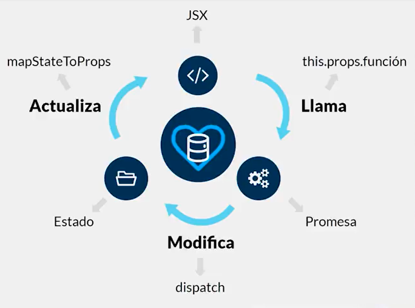
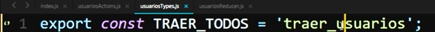
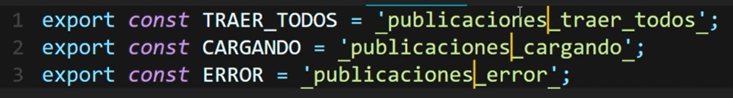

# Redux

- Conferencista: Rodolfo Saldívar Hernández

## Repaso

### ¿Qué es React y cómo funciona?

React es uno de los frameworks web de JavaScript más comentados en años. Junto con Angular, y más recientemente Vue, React es una herramienta que ha tenido un gran impacto en la forma en que construimos aplicaciones web. En su página lo definen de una manera rápida y sencilla:

Una biblioteca de JavaScript para construir interfaces de usuario.

React generalmente se considera la capa de vista en una aplicación. Es posible que hayamos utilizado bibliotecas como Handlebars o jQuery en el pasado. Al igual que jQuery, React manipula los elementos de la interfaz de usuario que se insertan en la página, los componentes de React cambian lo que el usuario ve.

- Librería: Facil desarrollo de una tarea en específico
- Interfaces: Lo que se ve en pantalla
- Componentes: Hazlo una vez, úsalo cuantas veces quieras

React:
- Ligero
- Rendimiento alto
- Mantenimiento constante

JSX: sintaxis con la que se escribe código dentro de react. Se le puede ver como una fusión de JS y HTML pero no es ninguna de ellas.

- Antes de React, se tenía una abstacción del código de html **Browser dom** y cada vez que se buscaba cambiar algo, se devía buscar en la copia para modificarlo
- Se tienen 2 copias el **Browser dom** y el **virtual dom**, con jsx se sabe donde están las etiquetas html en el código de JS, por lo que no se tiene que buscar. Solo se hace una diferencia entre la abstracción y la copia y se hace el **re-render**


### Creación de la app con react

- Instalar el paquete `create-react-app`

  ```JS
  npm i -g create-react-app
  ```

- Crear proyecto

  ```JS
  create-react-app blog_platzi
  ```

- En la carpeta `src` solo se dejan los archivos
- index.js
- index.css
- App.js -> Se crea la carpeta `components` y se mueve allí
- Configurar rutas y dependencias

  

### Stateful vs Stateless

Los componentes no funcionales no manejan estado, solo manejan información y funciones.

Los componentes de clases manejan un estado interno, información y funciones, no hace falta definir las funciones con const simplemente con el nombre de la función ya lo detecta.

- [Presentando Hooks](https://es.reactjs.org/docs/hooks-intro.html)
- [¿Cuándo crear un Componente? Estructura, Organización y Tipos de Componentes en React](https://platzi.com/blog/estructura-organizacion-y-tipos-de-componentes-en-react/)

- Stateless: Componente funcional

  

  

- Stateful: Componente clase.
  - Se importa `Component`
  - No es necesario definir las funciones usando `const`

    

  - Como es una clase componente, el contenido del `return` se pone en un `render()`

    

  - El llamado a la función ya no se hacer de forma directa `ponerFilas()`, sino que se hace referencia al estado `this.ponerFilas()`
  - El estado se crea con el constructor, se usa `super()` para que se vaya a la clase `Component` y se define un estado con `this.state`

    

- Se modifica la función `ponerFilas`para que itere sobre la lista del estado

  

### Ciclo de Vida de react


Tenemos 4 fases por los que un componente pasa:

- Initialization: Declaramos nuestro estado o propiedades, esto se hace en el constructor
- Mounting: Todo componente debe tener render. Es obligatorio. El render desplega todo a la interfaz.
  - `componentWillMount` siempre se ejecuta antes del `render`
  - `ComponentDidMount` se ejecuta después del `render`.
- Updation
- Unmounting: Solo hay una función en caso de que queramos hacer algo cuando se destruya un componente, la función es `componentWillUnmount`

Modificación del código

- Se llama la función `componentDidMount` y en esta se llama a la función `this.setState`, esta recibe un objeto, donde se indica qué es lo que se quiere cambiar del estado
- En el constructor se inicializa la propiedad `usuarios` del estado como un arreglo vacío.

  

- Para hacer una llamada a un URL, es necesario instalar el paquete `axios`

  ```
  npm i axios
  ```

- Se importa `axios`, este permite realizar todos los mètodos HTTP

  ```JS
  import axios from 'axios;
  ```

- Puesto que la petición es asincrona se modifica la función `componentDidMount`, agregandole `async`

  

### Manejando promesas

Una Promesa es un proxy para un valor no necesariamente conocido en el momento que es creada la promesa.

Las promesas tienen tres estados:
- pending
- fullfilled
- rejected

Las promesas se invocan de la siguiente forma:

```JS
new  Promise( ( resolve, reject ) => {
// --- llamado asíncrono
    if( todoOK ) {
    // -- se ejecutó el llamado exitosamente resolve() }
    else {
    // -- hubo un error en el llamado reject()
    }
} )
```

### React Router DOM

Sirve para navegar entre pestañas de la aplicación sin que esta se esté recargando.

- Instalar el paquete

  ```JS
  npm i react-router-dom
  ```


## Introduccióna Redux

### ¿Qúe es Redux, cuándo usarlo y por qué?

Redux es un contenedor predecible del estado de aplicaciones JavaScript. Te ayuda a escribir aplicaciones que se comportan de manera consistente, corren en distintos ambientes (cliente, servidor y nativo), y son fáciles de probar.

- Nos permite almacenar todo el estado de la aplicación en un solo lugar
- Principios:
  - Almacenamiento: Se almacena en un solo lugar
  - Inmutable: Se crean nuevos estados, no se sobrescriben
  - Centralizado: Toda la aplicación se almacena en un solo lugar.
- Cuando cada componente mantiene un estado y quiere compartirlo debe enviarselo al componente padre en común con ese otro estado, esto agrega complejidad ya que si se desea compartir ese estado a múltiples hijos se debe hacer de forma personalizada para cada uno

  

- En Redux en vez de tener un estado local, se maneja un estado global

  

- Cuando utilizar Redux?
  - Aplicaciones grandes
  - Compartir información
  - Estados, no formatos: todo lo que tiene que ver con información, no el tamaño de la letra colores, etc.

## Fases de Redux

### Introducción: las fases de Redux

Pilares o principios de redux
- Store - Almacenamiento: Principal, alli se almacena toda la información necesaria
- Reducers - Estado: Dependiendo del componente, la información que se va a tener
- Action Creators - funciones: funciones que se tienen que ejecutar para pedir información - promesas
- Componente - jsx


### Store

El store tiene las siguientes responsabilidades:

- Contiene el estado de la aplicación
- Permite el acceso al estado vía ``getState()`
- Permite que el estado sea actualizado vía `dispatch(action)`
- Registra los listeners vía `subscribe(listener)`
- Maneja la anuliación del registro de los listeners via el retorno de la función de `subscribe(listener)`

Adaptación:

- Instalación

  ```JS
  npm install redux react-redux
  ```
- En el archivo principal `index.js` se adaptará la configuración de redux
- Importar componentes para que funcione Redux

  ```JS
  import { createStore } from "redux";
  import { Provider } from "react-redux";
  ```

- Crear un Store que se proveera a toda la aplicación, con ayuda del `createStore()`
  - Parámetros:
    -  Reducers de la aplicación, se puede inicializar como un objeto vacío
    -  Estado inicial, se puede inicializar como un objeto vacío

  ```JS
  const store = createStore(
    {}, //all reducers	
    {} //initial state
  );
  ```

### Reducers

Las *Action Creators* describen que algo pasó, pero no especifican cómo cambió el estado de la aplicación en respuesta. Esto es trabajo de los reducers.

El `Provider` es el componente de Redux en el cual encerraremos nuestra aplicación para que puedan comunicarse los componentes entre ellos.

- Se crea una nueva carpeta llamada `reducers` en `src`, se crea un archivo `index.js` en este
- En el `index.js` se combinarán todos los reducers para enviarselos a la aplicación
- Crear archivo base

  ```JS
  import { combineReducers } from 'redux';

  export default combineReducers({

  });
  ```
- En el archivo `src/index.js` se importan los reucers y se ingresan en el `createStore()`

  

- Para proveerle a la `</App>` el almacenamiento se utiliza el `<Provider></Provider>`

  

- Creación de un reducer básico. Se retorna todo lo que tenía el estado pero aparte se sobre escribe el elemento `usuarios`

  

- En el archivo `src/reducers/index.js` se importa el reducer creado

  

### Conexión a un componente al reducer

- En el `constructor()` del componente, se inicializaba el estado directamente

  

- Ahora paraconectar el componente al reducer, se debe importar el `connect`

  ```JS
  import { connect } from 'react-redux';
  ```

- Luego en la parte final del componente se agrega el `connect()`, este tiene como parámetros:
  - Todos los reducers que el proveedor le va a entregar al Componente
    - Para definir los reducers que se requieren se va a crear una constante `mapStateToProps` que recibirá tods los reducers y se devuelve al compoente el reducer que se quiere
  - Todas las acciones

  

- Ahora esos reducers estarán disponibles desde `this.props`
- Puesto que ya se está colocando el estado en el reducers no es necesario el `constructor()`, por lo que se elimina

### Action Creators

- Ya se crearon los reducers, se conectó el componente con los redurcers, hace falta traer la información, para ello se utilizan los `action creators`
- En la carpeta `src` se crea una nueva carpeta llamada `actions`, en ella se crea un archivo llamado `usuariosActions.js`'
- En el archivo `src/actions/usuariosActions.js` se hará una acción que el compoente va a llamar y esta va a devolver algo
- Se crea un arrow function que retorne otra función `() => () => {}`
- La segunda función requiere como parámetro el `dispatch`, es el que va a disparar la llamada y va a contactar al reducer para que haga el cambio de estado
- En el reducer `usuariosReducer` se tiene un `switch`, donde uno de los casos es `traer_usuarios`
- En el `dispatch()` se le manda un objeto donde se especifica que el `type: 'traer_usuarios'` y se le manda un `payload` de prueba

  

- En el componete se importa `usuariosActions`

  

- Se actualiza el `connect` que está al final del archivo agregandole el `usuariosActions`

  

- En la función `componentDidMount()` se llama a la acción usando `this.props.traerTodos()`
- Hay un error porque los actions deben ser objetos planos y se está retornando una función. Hace falta un middleware para usar funciones asincronas.

### Redux Thunk

Redux Thunk permite a las action creators invertir el control despachando funciones. Van a recibir dispatch como argumento y capaz llamarlo asíncronamente. Estas funciones son llamas thunks.

- Instalar `redux-thunk`

  ```JS
  npm i redux-thunk
  ```
- En el `index.js` principal, al `createStore()` hace falta añadirle el middleware que permita hacer todas las llamadas asíncronas
- Importar `redux-thunk`

  ```JS
  import reduxThunk from 'redux-thunk';
  ```
- El `reduxThunk` se aplicará al `store` como un middleware y para poder hacerlo hay que importar otra variable llamada `applyMiddleware`

  

- Para darle el middleware al store, se agrega el `applyMiddleware()` como tercer parámetro del `createStore()`
- En el `applyMiddleware()` se le pasa como parámetro el `reduxThunk`

  

- Antes la petición GET se hacía en la función `componentDidMount`, sin embargo ahora esta petición se puede hacer desde el `usuariosActions` de la siguiente forma

  

- El `componentDidMount()` queda de la siguiente forma

  

### Explicación teórica: ciclo completo de Redux

Cuando nuestro componente terminar de cargar (`componentDidMount`) llama al Action Creator, luego el Action Creator contiene la promesa, trae los datos necesarios y luego va y modifica al Reducer para que actualice el estado usando `dispatch()` y luego lo actualizamos en el componente con el `mapStateToProps`.

  

- [Flujo de datos](https://es.redux.js.org/docs/basico/flujo-de-datos.html)
- el `Virtual DOM` detecta que se cambió el estado, por lo que ordena ejecutar el `render()` nuevamente, permitiendo que el componente acceda a los datos actualizados.

## Fases Extra

### Archivos Types

- Es posible que en los `actions` o en los `reducers` se cometa un error al escribir el `type` o los `case`, respectivamente. Sin embargo en consola no se indicarán dichos errores, para ellos es bueno crear los types.
- Creamos la carpeta `types` en la carpeta `src`, en este se crea un archivo llamado `usuariosTypes.js`
- En el archivo `src/types/usuariosTypes.js` se exporta una constante que haga referencia al `string` que se utilizará en los `actions` y `reducers`

  

- En los `actions` y `reducers` se impotan estas constantes

  

  

### Try Catch

`try` permite definir un bloque de código para que se analice en busca de errores mientras se ejecuta.

`catch` permite definir un bloque de código para ejecutarse, si se produce un error en el bloque try.

- Si en la petición GET del actions se escribe mal la dirección o ocurreo otro tipo de error, el navegador no será muy especifico al indicar cual fue el error
- Para ello es necesario agregar un `try catch`

  

### Escenarios asíncronos

- Hay que manejar el evento de cuándo se esta haciendo una llamada, el tiempo de duración de espera.
- En el `usuariosReducer.js`, en el `INITIAL_STATE` se agrega un nuevo componente que indique cuando está cargando, este será `cargando` y por defecto será `false`
- Se agrega un nuevo caso llamado `CARGANDO`

  

- En el `src/types/usuariosTypes.js` se actualizan las constantes exportadas

  

- En `src/actions/usuariosActions.js` se agrega un nuevo `dispatch()` antes de hacer la petición GET que sea de tipo `CARGANDO` para que el elemento `cargando` del `state` cambie a `true`
- Luego de hacer la petición GET, y si esta fue exitosa, el item `cargando` debe ser modificdo a `false` nuevamente, para ello el `usuariosReducer.js` es actualizado.
- Si ocurre un erro, el item `cargando` también debe ser modificado, además el error debe ser manejado de mejor forma. ^Para ello se crea un nuevo Type llamado `ERROR` que será manejado por los `actions` y los `reducers`

  

  

  

### Componente Spinner

- Se busca desplegar un spiner (animación de que está cargando) cuando se este el estado
- [Spiners](https://loading.io/css/)
- Se crea una nueva función llamada `ponerContenido()` que evalua si `this.props.cargando` es `true`

  

  

- En el `src/css/spinner.css` se pega el código desplegado por la página
- Se crea un nuevo componente para el Spiner. Se copia el código html que ofrece la página y se pega en el componente

  

### Componente Fatal

- En la función `ponerContenido()` se evaluará el caso en que ocurre un erro, desplegando un nuevo componente para mostrarlo

  

  

### Tabla como componente

- Se crea un nuevo componente **funcional** llamado `Tabla`, donde se agregará la función `ponerFilas()` y el fragmento de código en jsx
- Para acceder a `props.usuarios` se puede usar redux o se le puede enviar esta información desde el padre
- Usando redux. No se necesitan las acciones en este componete porque el componente ya trae los usuarios, por ello se puede dejar el `connect` con un solo parámetro

  

  

- El nuevo componente es llamado desde la función `ponerContenido()` del componente Usuarios

  

## Compartir información en Redux

A partir de este módulo aprenderemos a usar Redux de una forma más avanzada, actualizar información dinámicamente y manejar diferentes reducers.

Se harán las cosas de 2 formas diferentes
- crear un nuevo `reducer` para toda la información
- Se agregará de forma dinámica nueva información a un `reducer` ya existente

### Parámetros por URL

- [Iconos css](https://cssicon.space/#/)
- En el componente Tabla se agregará un nuevo item para ver un usuario en específico. Para ello se agrega un nuevo ícono que servirá como link para ver una pa´gina personalisada de un usuario

  

- En el componente `App` se crea una nueva ruta para manejar esta vista personalizada

  

- Se crea un nuevo componente llamado `Publicaciones`, para acceder a los parámetros por URL, se usa `this.props.match.params.name_param`

  

### Compartir Reducer

- Se agrega la configuración necesaria para usar redux en 'Publicaciones'
- Si se inicia desde la página con la tabla de todos los usuarios y luego se accede a la página de un usuario en específico, el componente `Publicaciones` podrá accerder a `this.props.usuarios` con la lista de todos ellos.
- Si se accede a la URL de publicaiones para un usuario específico de forma directa (sin usar la tabla) el `this.props.usuarios` estará vacío.
- Se importan `usuariosActions` para poder hacer la petición GET desde el componente `Publicaciones` solamente cuando `this.props.usuarios` esté vacío

  

  

### Múltiples Reducers

- En la carpeta `src/reducers` se crea un archivo llamado `publicacionesReducer.js`

  

- En el archivo `reducers/index.js` se importa el reducer de publicaciones y se agrega al `combineReducers()`

  

-Al importar múltiples `reducers` en un componente, estos son llamados por medio de un objeto

  

- Para acceder a los estados de un reducer en específico, hay que indicarlo en el llamado usando `this.props.nameReducer.item`

  

- Se crea un nuevo archivo `publicaciones Actions.js`

  

- Para manejar múltiples acciones en un componente se usa la dunción `mapDispatchToProps`, que entrega todo lo de `usuariosActions` y lo de `publicacionesActiosn`. En el conncect, en el segundo parámetro se pone el `mapDispatchToProps`

  

### Llamando a múltiples reducers en una acción

- Se genera un error cuando en múltiples actions se llaman métodos de la misma forma, para solucionarlo, se pueden desestructurar y renombrar

  

- Se actualiza el `mapDispatchToProps()`

  

- Si más de un `type` o `case` en un actions o reducers, respectivamente, tienen el mismo nombre y son llamadas ambas acciones desde un mismo componente se ejecutarán ambas acciones, modificando ambos estados.
- Para solucionar ese error en los tpes se debe especificar de cuál componente se está hablando

  

  

### Uso del estado en la acción

- Se crea una nueva acción para las publicaciones, estraer las publicaciones de un usuario en específico, para ello hay que hacer la llamada pasandole el `id` de este usuario como parámetro, para hacer esto se usa la primera función.
- Para hacer la petición GET de las publicaciones de un usuario se necesita su id, sin embargo en la lista general de usuarios se está trabajando con un `key` por lo que hay que mirar la lista completa, buscar por el `key`, obtener el ID y finalmente hacer el llamado.
- También se puede traer el estado, esto con ayuda del `dispatch()` que puede recibir un segundo parámetro, el `getState` y así tener acceso al estado actual
- Ahora se desestructurará el item `usuarios` del estado

  

### Evitar segundas búsquedas

- Ahora publicaciones solo manejará `traerPorUsuario`, se elimina la otra función y se actualiza el nombre de la constante types en los archivos involucrados
- La idea es mantener en el estado una lista `publicaciones` que contendrá las listas de las publicaciones de cada usuario consultado, para ello en cada llamaddo se crea una lista con los valores del estado actual y se agregan las publicaciones de la busqueda

  

- Por útltimo, se modificará el `componentDidMount()` para que no haga la petición de traer todos los usuarios siempre que se seleccione la pestaña, para ello se hace un `if` que verifique que solo se haga la petición cuando la longitud de la lista `usuarios` sea cero

  

### Inmutabilidad

- Puesto que las listas de publicaciones se alamcenan en una lista del estado, se quiere almacenar la ubicación de esta lista en el usuario al que le pertenece, esto para que no realice la petición más de una vez.
- Para lograr eso, se llama al reducer `TRAER_TODOS` de `usuariosTypes.js` en el action `publicacionesActions.js`, destructuramos el `usuariosTypes` importando para cambiar el nombre a `USUARIOS_TRAER_TODOS`

  

- Se trae del estado actual `usuarios` y `publicaciones`, también con el `key` recibido, obtenemos el `usuario_id`, para finalmene hacer la petición GET con este id.

  

- Ahora, al traer una publicación se agrega a la lista y se almacenará su posición dentro de esta con la variable `publicaciones_key`
- Se crea una nueva lista `usuarios_actualizados` con los valores ofrecidos por el estado
- Se accede al item del usuario consultado en `usuarios_actualizados` con ayuda del `key`, luego este objeto se reescribe con `...usuarios[key]` y se le agrega un nuevo atributo llamado `publicaciones_key`
- Con ECMASCript 6, si el key y el valor tienen la misma nomenclatura, no hay necesidad de agregar el key en el objeto.
- Finalmente en el `dispatch()` se actualizan las publicaciones y los usuarios

  

### Evitar sobrescritura

- El objetivo es evitar que se sobrescriba el atributo `publicaciones_key` de un usuario cuando ya lo posea y evitar agregar más elementos a la lista `publicaciones` de las necesarias.
- En primer se desestructura algunos atributos de `this.props`
- No se desestructura `this.props.usuariosReducer`, esto porque allí se almacena el estado y este es llamado desde el `componentDidMount()` que es llamado después del `render()` por lo que puede variar
- Se crea un `if` que hace la petición de `usuariosTraerTodos()` solamente cuando la longitud de la lista de `usuarios` es cero
- Se crea un `if` que hará la petición `publicacionesTraerPorUsuario()` solamente cuando en ese usuario específico **no** exista el atributo `publicaciones_key`

  

- Ahora se desea manejar los estados de `cargando` y `error`.
- Se cargan los componentes del `Spinner` y de `Fatal`, de la ruta `src/components/General/`

  

- en el `render()` ahora solo se llamará a la función `this.ponerUsuario()` y se tendrá en el estado, el `key` pasado desde la URL
- la función `ponerusuario` está compuesta de la siguiente forma:
  - Se destructura el `key` y el `userReducer`, este último puede hacerse porque como es llamado desde el `render()` su valor durante esta ejecución no va a cambiar.
  - Se crea un `if` que despliega el compoente `Fatal` si se detecta que en el estado hay un error.
  - Se crea un `if` que desplegará el `Spinner` al inicio, cuando se carga la página y el `usuarios.length` es cero y no se ha hecho ninguna solicitud, y cuando el estado `cargando` se cumple


  ```JS
  import React, { Component } from 'react';
  import { connect } from 'react-redux';
  import Spinner from '../General/Spinner';
  import Fatal from '../General/Fatal';

  import * as usuariosActions from '../../actions/usuariosActions';
  import * as publicacionesActions from '../../actions/publicacionesActions';

  const { traerTodos: usuariosTraerTodos } = usuariosActions;
  const { traerPorUsuario: publicacionesTraerPorUsuario } = publicacionesActions;

  class Publicaciones extends Component {

    async componentDidMount() {
      const {
        usuariosTraerTodos,
        match: { params: { key } },
        publicacionesTraerPorUsuario
      } = this.props;

      if (!this.props.usuariosReducer.usuarios.length) {
        await usuariosTraerTodos();
      }
      if (this.props.usuariosReducer.error) {
        return;
      }
      if (!('publicaciones_key' in this.props.usuariosReducer.usuarios[key])) {
        await publicacionesTraerPorUsuario(key);
      }
    }

    ponerUsuario = () => {
      const {
        match: { params: { key } },
        usuariosReducer
      } = this.props;

      if (usuariosReducer.error) {
        return <Fatal mensaje={ usuariosReducer.error } />;
      }
      if (!usuariosReducer.usuarios.length || usuariosReducer.cargando) {
        return <Spinner />
      }

      const nombre = usuariosReducer.usuarios[key].name;

      return (
        <h1>
          Publicaciones de { nombre }
        </h1>
      );
    };

    render() {
      return (
        <div>
          { this.ponerUsuario() }
          { this.props.match.params.key }
        </div>
      );
    }
  }

  const mapStateToProps = ({ usuariosReducer, publicacionesReducer }) => {
    return { usuariosReducer, publicacionesReducer };
  };

  const mapDispatchToProps = {
    usuariosTraerTodos,
    publicacionesTraerPorUsuario
  };

  export default connect(mapStateToProps, mapDispatchToProps)(Publicaciones);
  ```

### Validación compuesta

En el componente `Publicaciones/index.js` desde el `render()` se llamará la función `ponerPublicaciones`

```JS
ponerUsuario = () => {
  const {
    match: { params: { key } },
    usuariosReducer
  } = this.props;

  if (usuariosReducer.error) {
    return <Fatal mensaje={ usuariosReducer.error } />;
  }
  if (!usuariosReducer.usuarios.length || usuariosReducer.cargando) {
    return <Spinner />
  }

  const nombre = usuariosReducer.usuarios[key].name;

  return (
    <h1>
      Publicaciones de { nombre }
    </h1>
  );
};

ponerPublicaciones = () => {
  // Desestructuramos variables útiles
  const {
    usuariosReducer,
    usuariosReducer: { usuarios },
    publicacionesReducer,
    publicacionesReducer: { publicaciones },
    match: { params: { key } }
  } = this.props;

  // Si los usuarios no existen no se retorna nada porque en la función
  // ponerUsuario ya se maneja este caso colocando el spinner
  if (!usuarios.length) return;

  // Si hay un error, no se hace nada porque ya se está manejando en ponerUsuario()
  if (usuariosReducer.error) return;

  // Si pasa la información del usuario se debe verificar si publicacionesReducer.cargando
  // es verdadera para desplegar el spinner
  if (publicacionesReducer.cargando) {
    return <Spinner />;
  }

  // Si se detecta que al traer las ublicaciones hay un error se desplega el
  // componente Fatal
  if (publicacionesReducer.error) {
    return <Fatal mensaje={ publicacionesReducer.error } />
  }

  // Cuando se están cargando los usuarios no van a aexistir publicaciones
  // por eso se le indica al código que no retorne y espere a que el estado cambie
  if (!publicaciones.length) return;

  // Cuando el usuario y las publicaciones terminaron se necesita saber si el
  // atributo publicaciones_key está en el usuario, de no ser así significa que
  // lo está buscando, no se retorna nada para que espere a que este valor cambie
  if (!('publicaciones_key' in usuarios[key])) return;

  const { publicaciones_key } = usuarios[key];
  return publicaciones[publicaciones_key].map((publicacion) => (
    <div
      key={publicacion.id}
      className='pub_titulo'
      onClick={ ()=>alert(publicacion.id) }
    >
      <h2>
        { publicacion.title }
      </h2>
      <h3>
        { publicacion.body }
      </h3>
    </div>
  ));
};

render() {
  return (
    <div>
      { this.ponerUsuario() }
      { this.ponerPublicaciones() }
    </div>
  );
}
```

### Validación de errores

Se modificará el archivo `publicacionesActions.js`
- Se mejora la ubicación de los `dispatch`. Haciendo que maneje primero las publicaciones de un usuario y luego actualice el usuario específico en el `usuarios actualizados` con su respectivo `dispatch()`
- Se maneja las petición GET con un `try catch` y se hacen `dispatch()` para los diferentes casos.

```JS
import axios from 'axios';
import {
	CARGANDO,
	ERROR,
	TRAER_POR_USUARIO
} from '../types/publicacionesTypes';
import * as usuariosTypes from '../types/usuariosTypes';

const { TRAER_TODOS: USUARIOS_TRAER_TODOS } = usuariosTypes;

export const traerPorUsuario = (key) => async (dispatch, getState) => {
	dispatch({
		type: CARGANDO
	});

	let { usuarios } = getState().usuariosReducer;
	const { publicaciones } = getState().publicacionesReducer;
	const usuario_id = usuarios[key].id;

	try {
		const respuesta = await axios.get(`https://jsonplaceholder.typicode.com/posts?userId=${usuario_id}`);
		const publicaciones_actualizadas = [
			...publicaciones,
			respuesta.data
		];

		dispatch({
			type: TRAER_POR_USUARIO,
			payload: publicaciones_actualizadas
		});

		const publicaciones_key = publicaciones_actualizadas.length - 1;
		const usuarios_actualizados = [...usuarios];
		usuarios_actualizados[key] = {
			...usuarios[key],
			publicaciones_key
		};

		dispatch({
			type: USUARIOS_TRAER_TODOS,
			payload: usuarios_actualizados
		});
	}
	catch (error) {
		console.log(error.message);
		dispatch({
			type: ERROR,
			payload: 'Publicaciones no disponibles.'
		});
	}
};
```

## Normalizar datos

- En la normalización las llaves son los ids.
- Se recibe una lista de objetos, cada uno con los siguientes atributos

  ```JS
  [
    {
      "userId": 1,
      "id": 1,
      "title": "Test",
      "completed": false
    },
    ...
  ]
  ```
- Se busca crear un objeto que contenga un objeto por cada usuario y dentro de este, un objeto por cada publicación.

  ```JS
  tareas : {
    [userId]: {
      [id] : {
        userId: [userId],
        id: [id],
        title: 'Test',
        completed: false
      }
    },
    ...
  }
  ```
- Código que normaliza los datos leídos:

  ```JS
  import axios from 'axios';
  import { TRAER_TODAS, CARGANDO, ERROR } from '../types/tareasTypes';

  export const traerTodas = () => async (dispatch) => {
    dispatch({
      type: CARGANDO
    });

    try {
      const respuesta = await axios.get('https://jsonplaceholder.typicode.com/todos');

      const tareas = {};
      respuesta.data.map((tar) => (
        tareas[tar.userId] = {
          ...tareas[tar.userId],
          [tar.id]: {
            ...tar
          }
        }
      ));

      dispatch({
        type: TRAER_TODAS,
        payload: tareas
      })
    }
    catch (error) {
      console.log(error.message);
      dispatch({
        type: ERROR,
        payload: 'Información de usuario no disponible.'
      })
    }
  };
  ```

### PUT

Cuando se usa el `spread` operator solo se está colocando el primer nivel de losobjetos. Por este motivo si se quieren copiar otros datos hay que hacerlo por nieveles.


[Immutable Update Patterns](https://redux.js.org/usage/structuring-reducers/immutable-update-patterns#correct-approach-copying-all-levels-of-nested-data)

Una llamada asíncrona tiene los estados
- cargando
- exitoso
- error
