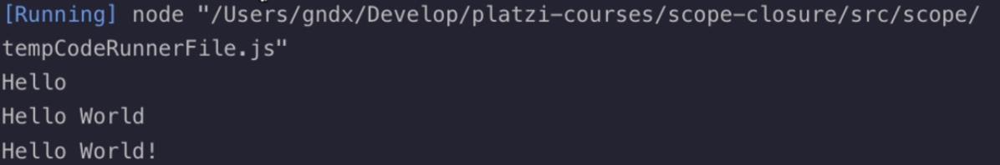

- Scope:
  - Alcance de la variable dentro del código
  - Decide a qué bloques de código accede una variable
  - tipos:
    - Scope local
    - Scope global
  - enfoque:
    - hacia la función
    - hacia un bloque
- Scope global: Se pueen acceder a las variables globales desde una función

  

  

- Con `let` y `const` no se pueden reasignar los valores de las variables, reasignar valores de variables globales es una mala práctica.

  

- Si no se especifica el tipo de variable (var, let, cosnt) se toma como variable global, crear variables de este tipo es una mala práctica. Esta variable puede ser reasignada así como las creadas usando `var`.
- La doble asignación de una variable también es una mala práctica

  

  

- Scope Local: Acceder a una varibale en un bloque de código
  - si se declara en un bloque de código, no puede ser accedido fuera de este.

    

    

    

  - La variable local es diferente a la variable global, en ningún momento se reasigna su valor.
  - **Ámbito léxico:**  se refiere a que una funcion puede acceder a una funcion o variable fuera de ella.Cada nivel interno puede acceder a sus niveles externos hasta poder alcanzarlas.

    

    

- Scope de una Función
  - Si se intenta acceder a una variable local desde afuera del código, genera error.
  - Si se intentara acceder a la variable `fruit` fuera de la función, generaría error.

    

- Block Scope:
  - Las variables declaradas con `let` y `const` solo pueden ser accedidas desde el bloque donde son declaradas
  - Las variables declaradas con `var` en un bloque, pueden ser accedidas fuera de este, ya que la asignación se hace sobre la función.

    

  - la variable `x` interna es diferente a la vairble `x` externa.

    

  - con `var` se transmite el valor asignado a `x` en el bloque, a la variable global.

    

  - En este ejemplo la variable `i` accede al último valor que recorre el bucle (10) y ejecuta el `for` 10 veces

    

    

  - Se soluciona cambiando `var` por `let`
- Closure:
  - Combinación de una función y el ámbito léxico en la cual ha sido declarada la función
  - Recuerda el ámbito en el cuál ha sido creado

    

    

    - Acá `saveCoins` recuerda el valor el valor anterior, recuerda la asignación del ámbito en el que estaba la variable

  

- Ámbito léxico en closures

  

  

  

- Variables privadas con closures
  - JS no fomenta el uso de datos privados, pero con los closures se pueden crear valores que solo pueden ser accedidos por medio de mètodos y que no van a estar disponibles fuera de la función.

    

    

- Loops

  - En este ejemplo la variable `i` tenía acceso al último valor asignado (10)

    

  - Se solucionaba usando `let`, que permitía manejar el scope de tipo bloque en la iteración.

    

- Hoisting
  - Levantamiento de declaraciones
  - La declaración es reubicada. Esto pasa cuando se compila el código antes de ser interpretado por el navegador.

    

    

  -  las arrow functions no tienen la caracteristica de hoisting.
- Debugging
  - La palabra reservada `debu` que permite pausar el código para entender qué está sucediendo.

    

  - El el navegador **Google Chrome** al colocar en el buscador `about:blank`, le permite utilizar todas las herrameintas que este ofrece.

    

    
