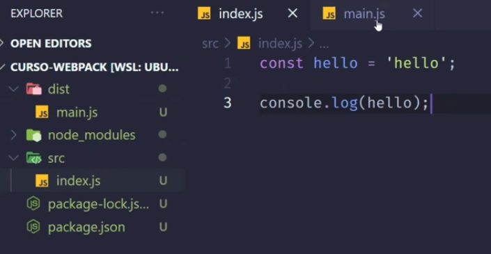
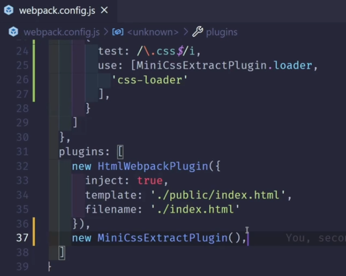
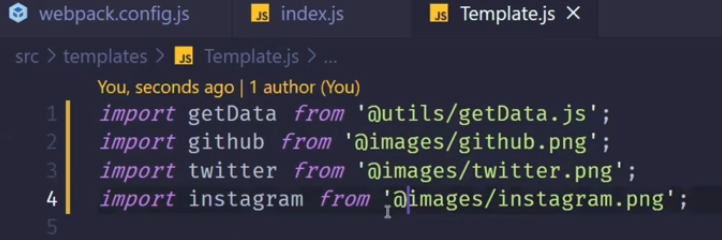
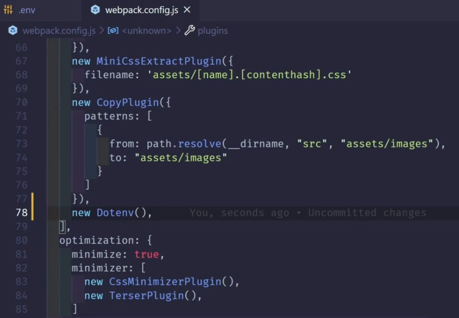
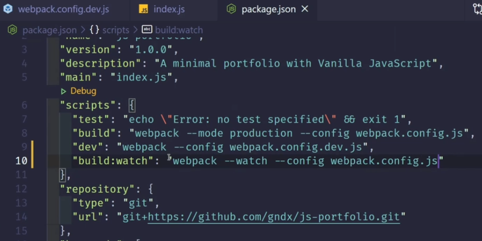
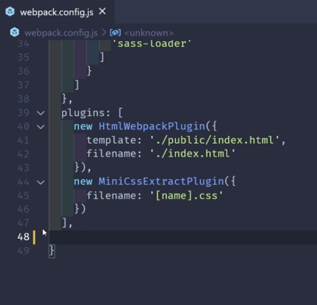

# Webpack

## Introducción

- Qué es?
  - Herramienta para preparar código a producción
  - permite trabajar con archivos estáticos
  - permite tener un modo de desarrollo
  - se origina en el 2012
  - Permite trabajar de forma modular
  - Garantiza que el código creado sea ejecutado en cualquier navegador
- Conceptos básicos
  - paquete de módulos estáticos
  - construye un grafico de dependencias que mapea cada módulo para convertirlo en uno o más módulos
  - **Entry (punto de entrada):** este le indica a webpack cual modulo de JavaScript debe de usar para empezar a crear una salida.
    - Ejemplo : index.js.
  - **Output (punto de salida):** Este archivo es el bundle o nuestro archivo de salida, seria nuestra caja donde empaquetamos toda nuestra aplicación, normalmente este archivo final se crea en una carpeta llamada dist.
  - **Loader (transformador):** Los loaders lo que hacen es decirle a webpack como tiene que transformar el código de un modulo en concreto. 
    - Ejemplo : Los loaders pueden transformar ficheros a JavaScript, o cargar CSS directamente en archivos JS
    - **Plugins (complementos):** Nos van a ayudar a extender las funcionalidades con los loaders, añadir otras configuraciones. 
      - Ejemplo : hay un modulo llamado HTMLWebpackPlugin que este se encarga de crear un HTML personalizado que le inyecta todos los bundles finales que compilamos.

## Proyecto Inicial

- Creamos una carpeta e ingresamos a esta.

  ```
  mkdir curso-webpack
  cd curso-webpack
  ```
- Inicializamos nuestro repositorio con git

  ```
  git init
  ```
- Inicializar nuestro proyecto con npm

  ```
  npm init -y
  ```
- La carpeta SRC es el source de todo el proyecto ( index.js , imágenes, utils, assets, helpers, database, etc).
- Instalar Webpack
  - npm

    ```
    npm i webpack webpack-cli -D
    ```
  - yarn

    ```
    yarn add webpack webpack-cli -D
    ```
- Y luego ejecutamos webpack. npx lo que hace es ejecutar paquetes directamente de npm, este viene instalado de npm

  ```
  npx webpack
  ```
- Al hacer esto webpack creo una carpeta llamada dist. Este optimiza el código de js de la app.

  

  

- Por defecto webpack al compilar nuestro proyecto setea el modo “production” implícitamente pero podemos definirle el modo explícitamente corriendo:

  ```
  npx webpack --mode production
  npx webpack --mode development
  ```
- La diferencia radica que el modo development deja el código mas legible para los desarrolladores pero con comentarios, el modo production deja el código comprimido y mas limpio para usarse.
- Configuración de `webpack.config.js`
  - entry: punto de entrada de la aplicación
  - output: Hacia dónde se va a enviar lo que va a preparar webpack
    - path
    - file: JS resultante
  - resolve
    - extensions

  

  - Ejecutar:

    ```
    npx webpack --mode production --config webpack.config.js
    ```

## Loaders y Plugins en Webpack

- Babel loader para JS

  Babel es un transcompilador de JavaScript gratuito y de código abierto que se utiliza principalmente para convertir el código ECMAScript 2015+ en una versión de JavaScript compatible con versiones anteriores que se puede ejecutar con motores JavaScript más antiguos.

  - Instalar paquetes:
    - `babel-loader` nos permite usar babel con webpack
    - `@babel/core` es babel en general
    - `@babel/preset-env` trae y te permite usar las ultimas características de JavaScript
    - `@babel/plugin-transform-runtime` te permite trabajar con todo el tema de asincronismo como ser async y await

    ```
    npm install -D babel-loader @babel/core @babel/preset-env @babel/plugin-transform-runtime
    ```
  - Configurar:
    - Crear un arhivo llamado `.babelrc`

      

  - Actualizar archivo `webpack.config.js`:
    - Se agrega un nuevo elemento llamado `module`, contiene:
      - **rules:** reglas para trabajar con archivos o elementos del proyecto
      - **test:** tipo de extensiones a usar

    
- HTML en Webpack
  - Instalar `html-webpack-plugin`: Es un plugin para inyectar javascript, css, favicons, y nos facilita la tarea de enlazar los bundles a nuestro template HTML.

    ```
    npm i html-webpack-plugin -D
    ```
  - Actualizar archivo `webpack.config.js`:

    

    

  - Modificar el archivo `html`, pues en este utiliza `<script>` porque el proyecto leía los recursos de forma directa, esto ya no se necesita porque webpack al preparar la aplicación, prepara el html para insertar el archivo `JS`

    


    

- Loaders para CSS y preprocesadores de CSS
  - Instalación de dependencias:
    - css-loader: loader para reconocer css
    - mini-css-extract-plugin: plugin para trabajar con css dividido en diferentes partes de la app y unirlo

    ```
    npm i mini-css-extract-plugin css-loader -D
    ```
  - Se elimina el llamado al archivo `css` del archivo `html`

    

    

  - Se modifica el archivo principal en `js`, importando directamente los estilos

    

  - Añadir configuración al archivo `webpack.config.js`
    - Agregar librerías necesarias.

      

    - Crear una nueva regla para reconocer `css`

      

    - Actualizar sección de pluggins

      

  - Agregar preprocesadores. Se trabajará con `stylus`

    Stylus es un lenguaje preprocesador de hojas de estilo dinámico que se compila en hojas de estilo en cascada. Su diseño está influenciado por Sass y LESS. Está considerado como la cuarta sintaxis de preprocesador CSS más utilizada.​

    - Instalación de loader, preprocesador de stylus

      ```
      npm install stylus stylus-loader -D
      ```
    - Agregar regla que reconozca la extención de stylus `.styl`

      

    - Importar directamente el archivo de `.styl` al archivo principal en javascript

      

- Copia de archivos con Webpack
  - Instalar paquete necesario

    ```
    npm install copy-webpack-plugin -D
    ```
  - Importar librería en el archivo `webpack.config.js`

    

  - Actualizar plugins

    

  - actualizar ruta de archivos en el proyecto.

    

    

- Loaders de imágenes. Optimizar imágenes.

  - Puedes usar una forma de importar las imágenes haciendo un import de las mismas y generando una variable
  - No es necesario instalar ninguna dependencia, webpack ya lo tiene incluido debemos agregar la siguiente configuración

    ```
    module.exports = {
      ...
      module: {
        rules: [
          {
            test: /\.png/,
            type: "asset/resource"
          }
        ]
      },
    }
    ```
  - Para empezar a usar esta configuración debemos importar la imagen de la siguiente forma

    ```
    import github from '../assets/images/github.png';
    ```

    

- Loaders de Fuentes. Se busca incorporar fuentes externas, en vez de realizar llamados.
  - Identificar fuentes utilizadas

    

  - [Descargar fuente](http://google-webfonts-helper.herokuapp.com/fonts/ubuntu?subsets=cyrillic,latin) en formato `.woff`, agregarlo a la carpeta de fuentes correspondiente.
  - En el archivo `.css` vincular la fuente indicando la ruta y el formato del archivo:

    

  - Se necesita copiar de la carpeta `assets` a la carpeta de `distribution` las fuentes, por lo que se instalarán recursos para leer y mover archivos

    ```
    npm install url-loader file-loader -D
    ```
  - Agregar una regla en el archivo `webpack.config.js` para que trabaje con las fuentes.

    

  - Se actualiza el **output** del archivo `webpack.config.js`

    

- Optimización: hashes, compresión y minificación de archivos
  - Instalación de paquetes para minimizar `css` y `js`

    ```
    npm i css-minimizer-webpack-plugin terser-webpack-plugin -D
    ```
  - Importar paquete al archivo ``webpack.config.js`

    

  - Crear una nueva sección en el archivo `webpack.config.js` llamada `optimization`. Terser es para JS.

    

  - Otra optimización que se puede hacer es añadir un hash a cada versión de la app. Esto lo hacemos con cada archivo que se genera en la build.

    

    

    

    

  - Cambiar la ubicación de los archivos css y agregar configuración de los hash

    

  - ¿Por qué es importante usar Hashes en nuestros archivos?
    - Los recursos que se guardan en memoria cache suceden cuando el navegador entra a un sitio por primera vez detecta los recursos y los guarda. Por ello la siguiente vez sera mucho más rápido porque estarán en memoria
    - La desventaja esta cuando sacamos una nueva versión, porque tendrán un mismo nombre evitando que se descargue los nuevos cambios, por lo tanto, el usuario no recibirá los nuevos cambios
    - Para que no haya conflictos con la cache una vez que tengamos nuestro proyecto en producción es importante darles un hash para cada nueva versión

- Webpack Alias
  - Facilita el manejo de la ruta de archivos
  - En el archivo `webpack.config.js`, se agregan los alias en la sección `resolve`

    

  - Actualizar la ruta de los archivos en el proyecto

    

    

    

    

## Deploy del proyecto

- Variables de entorno

  Las variables de entorno son variables externas a nuestra aplicación que residen en el sistema operativo o en el contenedor de la aplicación que se está ejecutando. Una variable de entorno es simplemente un nombre asignado a un valor.

  Por convención, el nombre se escribe con mayúscula y los valores son cadenas de texto, por ejemplo: PORT=8080.

  Normalmente, nuestras aplicaciones requieren que se establezcan muchas variables de entorno para que funcionen. Al confiar en configuraciones externas, su aplicación se puede implementar fácilmente en diferentes entornos. Estos cambios son independientes de los cambios en el código, por lo que no requieren que su aplicación sea reconstruida.

  Los datos que cambian según el entorno en el que se ejecuta su aplicación deben configurarse como variables de entorno. Algunos ejemplos comunes son:

      - Dirección y Puerto HTTP.
      - Credenciales de Base de Datos.
      - Ubicación de archivos y carpetas estáticos.
      - Credenciales de API's externas.

  - Instalar dependencia que permita trabajar con variables de entorno:

    ```
    npm i dotenv-webpack -D
    ```
  - En la raíz del proyecto crear un archivo `.env`, donde se almacenarán las variables de entorno.
    - este archivo **no** se sube al repositorio.
    - en un trabajo de equipo estas variables deben ser solicitadas

    

  - En la raíz del proyecto crear un archivo `.env-example`, donde se almacenarán los elementos ejemplo de qué variable necesita el proyecto
    - Este archivo **Sí** debe ser subido al repositorio
    - Se agregan las variables necesarias pero sin asignar

    

  - Actualizar el archivo `webpack.config.js`
    - LLamar paquete instalado

      

    - En la sección de los pluggins, agregar el nuevo plugin instalado `Dotenv`

      

  - Leer las variables de entorno desde los archivos del proyecto y no tenerlas allí explicitamente.

    


    

- Webpack en modo desarrollo
  - Crear un nuevo archivo de configuración, para separar las configuraciones que se tendrán en modo desarrollo y producción. Se copiará todo el contenido del archivo `webpack.config.js` en un nuevo archivo llamado `webpack.config.dev.js`
  - Se eliminia la sección `optimization` ya que no es necesaria en el modo desarrollo.
  - Eliminar la importación de paquetes para optimizar
    - CssMinimizerPlugin
    - TerserPlugin
  - Especificar que la configuración especificada es solo útil para el modo desarrollo, agregando `mode: 'development'`

    

  - Actualizar scripts del archivo `package.json`

    

    

- Webpack en modo producción
  - Actualmente tenemos el problema de tener varios archivos repetidos los cuales se fueron acumulando por compilaciones anteriores
  - Para ello puedes limpiar la carpeta cada vez que hacemos un build, usando `clean-webpack-plugin`

    ```
    npm i clean-webpack-plugin -D
    ```
  - Se realiza la configuración del nuevo plugin en el archivo `webpack.config.js`

    

  - Agregar plugin en la sección de plugins

    

  - Actualizar scripts del archivo `package.json`

    

  - también se puede hacer una configuración similar a la realizada con el modo desarrollo:

    

- Webpack Watch
  - El modo watch hace que nuestro proyecto se compile de forma automática, es decir que está atento a cambios
  - Se agrega en el archivo `webpack.config` la opción `watch: true`

    

  - Otra forma de hacerlo es crear un nuevos script en el archivo `package.json`, usando la bandera `--watch`

    

- Deploy a Netlify
  - Crear cuenta en Netlify
  - Vincular el proyecto a un repositorio
  - En la raíz del proyecto crear un nuevo archivo `netlify.toml`
    - El **publish** indica cuál es la carpeta que se publicará
    - El **command** indica cuál va a ser el comando a ejecutar para el despliegue de la aplicación

    

  - Agregar todos los cambios al repositorio.
  - Crear un nuevo sitio en `Netlify`

    

  - Elegir con cuál herramienta se desea conectar

    

  - Seleccionar usuario y repositorio

    

  - Agregar configuración básica de despliegue:
    - owner: nombre del dueño del proyecto
    - branch: rama
    - Build Command: comando de despliegue
    - Publish: Carpeta a publicar

    

  - Netlify habilita una máquina virtual en la nuve que descarga el repositorio y corre las instrucciones necesarias para tener una instancia completa, ejecuta el comando especificado y publica la carpeta determinada previamente.
  - Puesto que el archivo `.env` no está en el repositorio, se generará un error al intentar acceder a estas variables de entorno.
  - Para generar el archivo `.env` se creará un script que genere este archivo durante la ejecución del proyecto.
    - La ubicación de este será `scripts/create-env.js`

    

  - En Netlify, acceder a `Deploy settings` y agregar las variables de entorno necesarias

    

    

  - Se debe actualizar el script de despliegue en el `package.json` para que ejecute el script previamente creado.

    

  - Actualizar repositorio. Netlify escucha el cambio e intenta desplegarlo nuevamente de forma automática.

## Herramientas de Desarrollo

- Webpack Dev Server
  - Cuando trabajamos con webpack deseamos ver los cambios en tiempo real en un navegador, para tener esta característica esta `webpack-dev-server`

    ```
    npm i webpack-dev-server -D
    ```
  - En el archivo de desarrollo `webapck.config.dev.js` agregar la configuración necesaria para la utilización de esta herramienta, creando una nueva sección llamada ´devServer´
    - contentBase: director principal del proyecto donde se generan los archivos
    - compress: booleano que indica si se comprimirá
    - historyApiFallback: para tener un historial de lo que sucede en el navegador
    - port

    

  - Actualizar los scripts del archivo `package.json` para que corra este servidor local

    

- Webpack Bundle Analyzer
  - Cuando tenemos un proyecto es buena idea poder revisar su impacto en tamaño por ese motivo webpack nos ofrece un paquete para poder verificar y analizar el tamaño del bundle final. Esto ayuda a optimizar el modo de desarrollo ya que el de producción se optimiza de forma automática.

    ```
    npm i webpack-bundle-analyzer -D
    ```
  - En el archivo `webpack.config.dev.js` agregar recurso

    

  - Agregar configuración en la sección de plugins

    

  - Para generar un reporte de las dependencias y recursos usados, ejecutar

    ```
    npx webpack --profile --json > stats.json
    ```
  - Despues para poder verlo en un stitio web de forma mas ordenada usamos:

    ```
    npx webpack-bundle-analyzer stats.json
    ```

    

- Webpack DevTools
  - Con las devtools de webpack te permite crear un mapa de tu proyecto y con el leer a detalle cada una de las particularidades de lo que está compilando el proyecto.
  - Ir al archivo de configuración de desarrollo `webpack.config.dev.js` y crear una configuración específica para este recurso, agregando `devtool: 'source-map'`, el cual genera un mapa del código en formato json

    

  - Esto genera un archivo adicional el cual es identificado por las herramientas de chrome para debuggear, donde se puede seleccionar un fragmento específico de código a ser analizado

    

## Integración básica de React.js

- Instalación y configuración de React
  - Comandos para iniciar el proyecto

    ```
    # Descargar el repositorio de Github
    git clone https://github.com/platzi/curso-webpack-react.git
    # Movernos a la carpeta
    cd curso-webpack-react
    # Abrir VS Code
    code .
    # Inicializar npm
    npm init -y
    # instalar dependencias
    npm install react react-dom
    ```
  - Se crean los archivos básicos
    - Cada componente inicia con mayuscula
    - El archivo con terminal `.jsx` contiene html en el javascript

    

    - `src/index.js`

      

    - `src/components/App.jsx`

      

    - `public/index.html`

      

- Configuración de Webpack 5 para React.js
  - Instalación de dependencias

    ```
    npm install -D @babel/core @babel/preset-env @babel/preset-react babel-loader
    ```
  - Crear un archivo `.babelrc` en la raíz del proyecto

    

  - Instalación de webpack

    ```
    npm i webpack webpack-cli webpack-dev-server -D
    ```
  - Creación del archivo `webpack.config.js`

    

    

- Configuración de plugins y loaders para React
  - Instalación de paquetes

    ```
    npm install -D html-loader html-webpack-plugin
    ```
  - Actualizar `webpack.config.js`
    - Importar paquetes

      

    - Agregar reglas del loader

      

    - Agregar plugins

      

  - Actualizar scripts del `package.json`

    

- Configuración de Webpack para CSS en React
  - Instalación de dependencias

    ```
    npm install -D mini-css-extract-plugin css-loader style-loader sass sass-loader
    ```
  - Actualizar `webpack.config.js`
    - Importar paquete

      

    - Agregar regla para trabajar con los loaders de css o sass

      

    - Agregar Plugin

      

  - Agregar archivo de sass con terminal `scss`

    

  - Actualizar importación de archivos en `index.js`

    

- Optimización de Webpack para React
  - Instalación de dependencias

    ```
    npm install -D css-minimizer-webpack-plugin terser-webpack-plugin clean-webpack-plugin
    ```
  - Crear archivo de configuración para desarrollo `webpack.config.dev.js`
    - Se copia todo lo que se tenía en la configuración `webpack.config.js`
    - Se agrega el modo de desarrollo `mode: 'development'`
  - El archivo `webpack.config.js` será el utilizado para producción, por lo que será el que contenga las configuraciones para optimizar los archivos del proyeto
    - eliminar el `devServer`, ya que solo es útil para el modo de desarrollo

      

      

    - Importar paquetes

      

    - Agregar el `publicPath` a la sección `output` y los alias de los principales paths utilizados, en la sección `resolve{alias:{...}}`

      

    - Actualizar plugins y agregar la sección de `optimization`

      

  - Actualizar scripts del `package.json`

    

- Deploy del proyecto con React.js
  - Crear repositorio
  - Crear nuevo sitio en webpack siguiendo los pasos previamente descritos